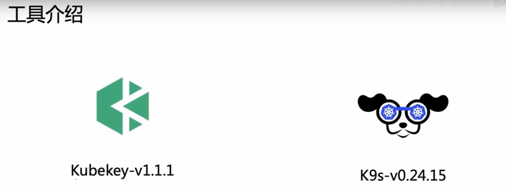

# k8s安装 

## 安装及管理工具

- Kubekey安装k8s
- k9s管理k8s

KubeSphere 作为开源的企业级全栈化容器平台，为用户提供了一个健壮、安全、功能丰富、具备极致体验的 Web 控制台。拥有企业级 Kubernetes 所需的最常见的功能，如工作负载管理，网络策略配置，微服务治理（基于 Istio），DevOps 项目 (CI/CD) ，安全管理，Source to Image/Binary to Image，多租户管理，多维度监控，日志查询和收集，告警通知，审计，应用程序管理和镜像管理、应用配置密钥管理等功能模块

它还支持各种开源存储和网络解决方案以及云存储服务。例如，KubeSphere 为用户提供了功能强大的云原生工具负载均衡器插件 OpenELB，这是为 Kubernetes 集群开发的 CNCF 认证的负载均衡插件

## 参考链接
1. kubekey官方连接：https://github.com/kubesphere/kubekey/blob/master/README_zh-CN.md

