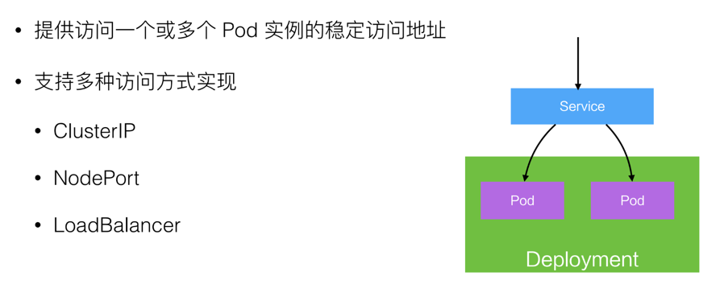

# Kubernetes架构


数据流转图


## 1. Master节点的组件
- apiServer : 提供资源操作的唯一入口，提供api注册、发现、认证、访问控制等功能
- etcd:
  - 一个key-value数据库
  - 保存整个机器的状态
- controller-manager: 
  - 负责维护机器状态，比如：自动扩容、故障检查、滚动更新
  - 实现集群自动化的关键组件
- scheduler
  - 负责资源调度
  - 将未分配节点的pod调度到合适的节点上 

## 2. Node节点的组件
- kubelet:
  - 负责容器生命周期管理，比如：创建、删除
  - 同时负责Volume，网络的管理

- kube-proxy
  - 负责为Service提供负载均衡、服务发现
- Container Runtime
  - 容器运行环境
  - 默认是Docker，同时还支持其他容器引擎

## Pod

- Pod是k8s中最重要最基本的资源
- pod是在容器之外又封装的一层概念
- pod是容器调度的基本单元（不是docker容器）
- 每个pod包含一个特殊的根容器：Pause容器，和一个或多个业务容器
- 每个pod有唯一的ip，pod内的容器可通过localhost通讯

## Volume


## deployment

- 实现Pod自动编排：创建、删除、扩容、缩容
- 通过replicas控制pod数量，template控制要创建的pod的模板
```yaml
apiVersion: extensions/v1beta1
kind: Deployment
metadata:
  name: k8s-demo
  namespace: spring-test
spec:
  replicas: 3
  template:
    metadata:
      labels:
        app: k8s-demo
    spec:
      containers:
      - name: k8s-demo
        image: k8s-demo:0.0.1-SNAPSHOT
        ports:
          - containerPort: 8080
```

## service

- k8s里最核心的资源之一，类似微服务架构中的“微服务”
- 前端应用通过入口地址访问服务，服务通过label对接到后端的pod，即使pod的ip变了
- kube-proxy负责把service请求转发到后端，并做负载均衡
- service整个生命周期内，ClusterIp不会变，对外提供的服务地址也就不会变
```yaml
apiVersion: v1
kind: Service
metadata:
  name: k8s-demo
  namespace: spring-test
spec:
  type: NodePort
  selector:
    app: k8s-demo
  ports:
   - protocol: TCP
     port: 8888
     targetPort: 8080
     nodePort: 30003
```

## namespace


## API/label


## Ingress
### 背景
service提供了ip:port的访问方式，即工作在tcp/ip层，而http服务需要将不同的url对应到不同的后端服务，service是无法实现这一功能的
```yaml
apiVersion: extensions/v1beta1
kind: Ingress
metadata:
  name: k8s-demo
  namespace: spring-test
spec:
  rules:
  - host: www.k8s-demo.com
    http:
      paths:
      - path: /hello
        backend:
          serviceName: k8s-demo
          servicePort: 8888
```
### 特点
- Ingress提供http层的负载分发功能
- Ingress可以实现不同的请求，分发到不同的后端服务
- Ingress定义后，需要结合Ingress Controller，才能形成完整的功能