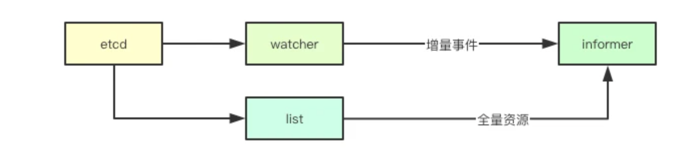
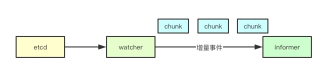

# Informer源码分析
源码参考地址：https://github.com/kubernetes/sample-controller

## 背景
informer是kubernetes非常重要的组件，负责各组件与apiserver的资源与事件同步。informer在许多组件中都有用到。
乍一看可能比较难理解，但深入之后就会对kubernetes的事件处理机制与未来可能的瓶颈有更深刻的认识。

简单的来说，informer监听某些资源，从apiserver中接受该类型资源的变化，由用户注册的回调函数对资源变化进行处理，并将变化之后的对象持久化到本地缓存中。

## informer的本质

基于chunk的消息通知

