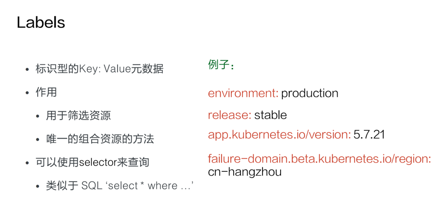
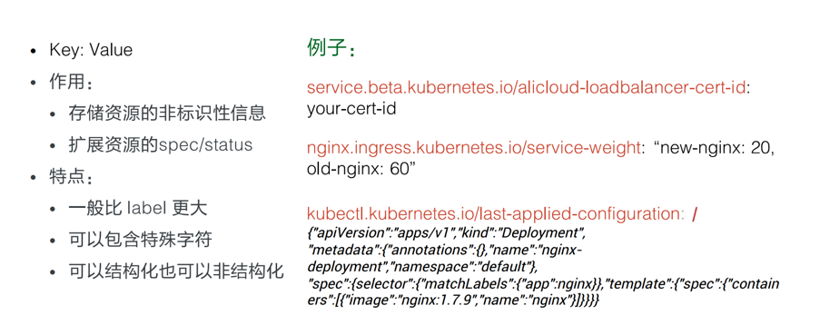
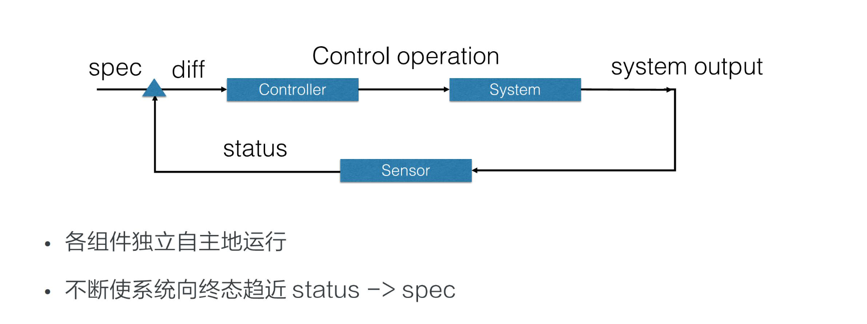
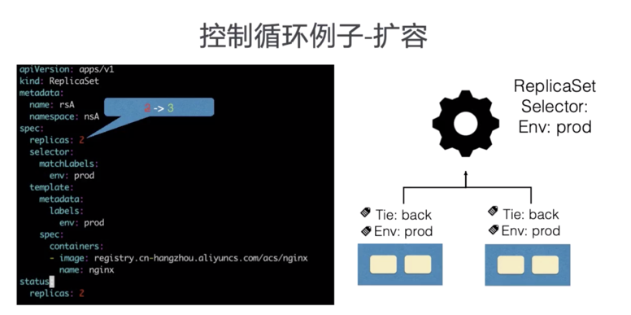
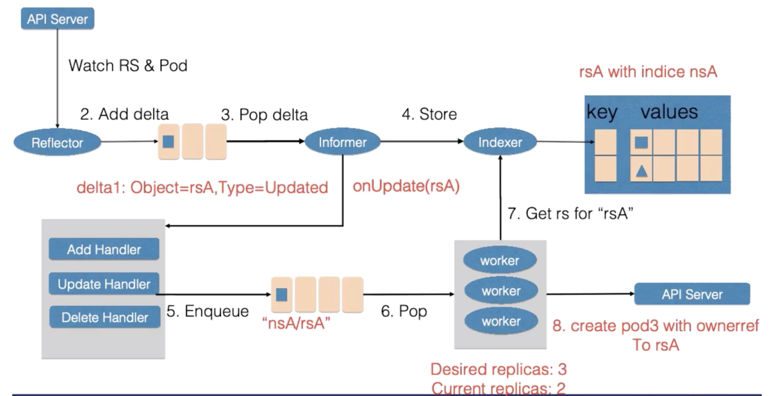

# K8s资源对象

在 Kubernetes 系统中，Kubernetes 对象 是持久化的实体。 

k8s中大部分概念，如Node，Pod，Service都可以看做一种资源对象

- 资源的描述：yaml文件或json文件
- 资源的操作：对象可以通过kubectl（或者api）执行增、删、改、查
- 资源的存储：信息在etcd中持久化
```yaml
Spec: 期望的状态
Status: 观测到的状态
Metadata:
    Labels
    Annotations
    OwnerReference
```
k8s通过对比资源的“实际状态”和etcd中的“期望状态”，实现自动化控制

- status 描述了对象的 当前状态（Current State），它是由 Kubernetes 系统和组件 设置并更新的。在任何时刻，Kubernetes 控制平面 都一直积极地管理着对象的实际状态，以使之与期望状态相匹配。
```yaml
# 创建该对象所使用的 Kubernetes API 的版本
apiVersion: apps/v1
# 想要创建的对象的类别
kind: Deployment
# 帮助唯一性标识对象的一些数据
metadata:
  name: nginx-deployment
# 你所期望的该对象的状态
spec:
  selector:
    matchLabels:
      app: nginx
  replicas: 2 # tells deployment to run 2 pods matching the template
  template:
    metadata:
      labels:
        app: nginx
    spec:
      containers:
      - name: nginx
        image: nginx:1.14.2
        ports:
        - containerPort: 80
```


## Labels

标签 是键值对.有效的标签键有两个段：可选的前缀和名称，用斜杠（/）分隔。
- 前缀是可选的。如果指定，前缀必须是 DNS 子域：由点（.）分隔的一系列 DNS 标签，总共不超过 253 个字符， 后跟斜杠（/）。
- 名称段是必需的，必须小于等于 63 个字符，以字母数字字符（[a-z0-9A-Z]）开头和结尾， 带有破折号（-），下划线（_），点（ .）和之间的字母数字。

### 标签选择算符

API 目前支持两种类型的选择算符：基于等值的 和 基于集合的。
- 基于等值 的标签选择算符 : kubectl get pods -l environment=production,tier=frontend
- 基于集合的 需求: kubectl get pods -l 'environment in (production),tier in (frontend)'


## annotations注解

注解为对象附加任意的非标识的元数据。客户端程序（例如工具和库）能够获取这些元数据信息。

### 为对象附加元数据
你可以使用标签或注解将元数据附加到 Kubernetes 对象。 标签可以用来选择对象和查找满足某些条件的对象集合。 相反，注解不用于标识和选择对象。 注解中的元数据，可以很小，也可以很大，可以是结构化的，也可以是非结构化的，能够包含标签不允许的字符。

## ownereference

在 Kubernetes 中，一些对象是其他对象的属主（Owner）。 例如，ReplicaSet 是一组 Pod 的属主。 具有属主的对象是属主的附属（Dependent）。

附属对象有一个 metadata.ownerReferences 字段，用于引用其属主对象。一个有效的属主引用，包含与附属对象同在一个命名空间下的对象名称和一个 UID。
Kubernetes 自动为一些对象的附属资源设置属主引用的值， 这些对象包含 ReplicaSet、DaemonSet、Deployment、Job、CronJob、ReplicationController 等。

附属对象还有一个 ownerReferences.blockOwnerDeletion 字段，该字段使用布尔值， 用于控制特定的附属对象是否可以阻止垃圾收集删除其属主对象。 
如果控制器（例如 Deployment 控制器） 设置了 metadata.ownerReferences 字段的值，Kubernetes 会自动设置 blockOwnerDeletion 的值为 true。

### 属主关系与 Finalizer
当你使用前台或孤立级联删除时， Kubernetes 也会向属主资源添加 Finalizer。
在前台删除中，会添加 foreground Finalizer，这样控制器必须在删除了拥有 ownerReferences.blockOwnerDeletion=true 的附属资源后，才能删除属主对象。 

如果你指定了孤立删除策略，Kubernetes 会添加 orphan Finalizer， 这样控制器在删除属主对象后，会忽略附属资源。


## namespace 
提供一种机制，将同一集群中的资源划分为相互隔离的组.Kubernetes 会创建四个初始名字空间
- default 没有指明使用其它名字空间的对象所使用的默认名字空间
- kube-system Kubernetes 系统创建对象所使用的名字空间
- kube-public 这个名字空间是自动创建的，所有用户（包括未经过身份验证的用户）都可以读取它。 这个名字空间主要用于集群使用，以防某些资源在整个集群中应该是可见和可读的。 这个名字空间的公共方面只是一种约定，而不是要求。
- kube-node-lease 此名字空间用于与各个节点相关的 租约（Lease）对象。 节点租期允许 kubelet 发送心跳，由此控制面能够检测到节点故障

### 设置名字空间偏好
```shell
kubectl config set-context --current --namespace=<名字空间名称>
```

### 名字空间和 DNS
当你创建一个服务 时， Kubernetes 会创建一个相应的 DNS 条目。
该条目的形式是 <服务名称>.<名字空间名称>.svc.cluster.local，这意味着如果容器只使用 <服务名称>，它将被解析到本地名字空间的服务。这对于跨多个名字空间（如开发、分级和生产） 使用相同的配置非常有用。

### 并非所有对象都在名字空间中
大多数 kubernetes 资源（例如 Pod、Service、副本控制器等）都位于某些名字空间中。 但是名字空间资源本身并不在名字空间中。而且底层资源，例如 节点 和持久化卷不属于任何名字空间。
```shell
# 位于名字空间中的资源
kubectl api-resources --namespaced=true

# 不在名字空间中的资源
kubectl api-resources --namespaced=false
```

## Finalizers
Finalizer 是带有命名空间的键，告诉 Kubernetes 等到特定的条件被满足后， 再完全删除被标记为删除的资源。 Finalizer 提醒控制器清理被删除的对象拥有的资源。


## 控制循环


控制型模式最核心的就是控制循环的概念。在控制循环中包括了控制器，被控制的系统，以及能够观测系统的传感器，三个逻辑组件。

当然这些组件都是逻辑的，外界通过修改资源 spec 来控制资源，控制器比较资源 spec 和 status，从而计算一个 diff，
diff 最后会用来决定执行对系统进行什么样的控制操作，控制操作会使得系统产生新的输出，并被传感器以资源 status 形式上报，
控制器的各个组件将都会是独立自主地运行，不断使系统向 spec 表示终态趋近

### Sensor 


控制循环中逻辑的传感器主要由 Reflector、Informer、Indexer 三个组件构成。

Reflector 通过 List 和 Watch K8s server 来获取资源的数据。List 用来在 Controller 重启以及 Watch 中断的情况下，进行系统资源的全量更新；
而 Watch 则在多次 List 之间进行增量的资源更新；Reflector 在获取新的资源数据后，会在 Delta 队列中塞入一个包括资源对象信息本身以及资源对象事件类型的 Delta 记录，
Delta 队列中可以保证同一个对象在队列中仅有一条记录，从而避免 Reflector 重新 List 和 Watch 的时候产生重复的记录。

Informer 组件不断地从 Delta 队列中弹出 delta 记录，然后把资源对象交给 indexer，让 indexer 把资源记录在一个缓存中，缓存在默认设置下是用资源的命名空间来做索引的，
并且可以被 Controller Manager 或多个 Controller 所共享。之后，再把这个事件交给事件的回调函数

控制循环中的控制器组件主要由事件处理函数以及 worker 组成，事件处理函数之间会相互关注资源的新增、更新、删除的事件，并根据控制器的逻辑去决定是否需要处理。
对需要处理的事件，会把事件关联资源的命名空间以及名字塞入一个工作队列中，并且由后续的 worker 池中的一个 Worker 来处理，工作队列会对存储的对象进行去重，
从而避免多个 Woker 处理同一个资源的情况。

Worker 在处理资源对象时，一般需要用资源的名字来重新获得最新的资源数据，用来创建或者更新资源对象，或者调用其他的外部服务，Worker 如果处理失败的时候，
一般情况下会把资源的名字重新加入到工作队列中，从而方便之后进行重试

### 控制循环案例-扩容


    ReplicaSet 是一个用来描述无状态应用的扩缩容行为的资源， ReplicaSet controler 通过监听 ReplicaSet 资源来维持应用希望的状态数量，
    ReplicaSet 中通过 selector 来匹配所关联的 Pod，在这里考虑 ReplicaSet rsA 的，replicas 从 2 被改到 3 的场景


    首先，Reflector 会 watch 到 ReplicaSet 和 Pod 两种资源的变化，为什么我们还会 watch pod 资源的变化稍后会讲到。
    发现 ReplicaSet 发生变化后，在 delta 队列中塞入了对象是 rsA，而且类型是更新的记录。
    
    Informer 一方面把新的 ReplicaSet 更新到缓存中，并与 Namespace nsA 作为索引。
    另外一方面，调用 Update 的回调函数，ReplicaSet 控制器发现 ReplicaSet 发生变化后会把字符串的 nsA/rsA 字符串塞入到工作队列中，
    工作队列后的一个 Worker 从工作队列中取到了 nsA/rsA 这个字符串的 key，并且从缓存中取到了最新的 ReplicaSet 数据。
    
    Worker 通过比较 ReplicaSet 中 spec 和 status 里的数值，发现需要对这个 ReplicaSet 进行扩容，
    因此 ReplicaSet 的 Worker 创建了一个 Pod，这个 pod 中的 Ownereference 取向了 ReplicaSet rsA。
    
    然后 Reflector Watch 到的 Pod 新增事件，在 delta 队列中额外加入了 Add 类型的 deta 记录，
    一方面把新的 Pod 记录通过 Indexer 存储到了缓存中，另一方面调用了 ReplicaSet 控制器的 Add 回调函数，
    Add 回调函数通过检查 pod ownerReferences 找到了对应的 ReplicaSet，并把包括 ReplicaSet 命名空间和字符串塞入到了工作队列中
