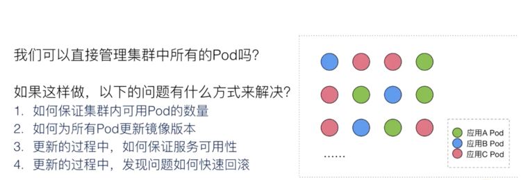
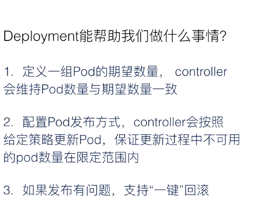
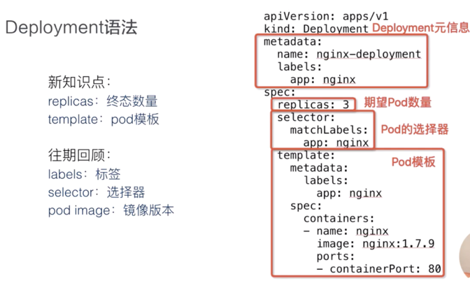
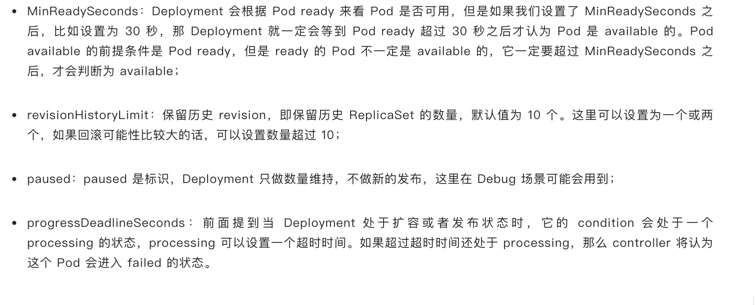
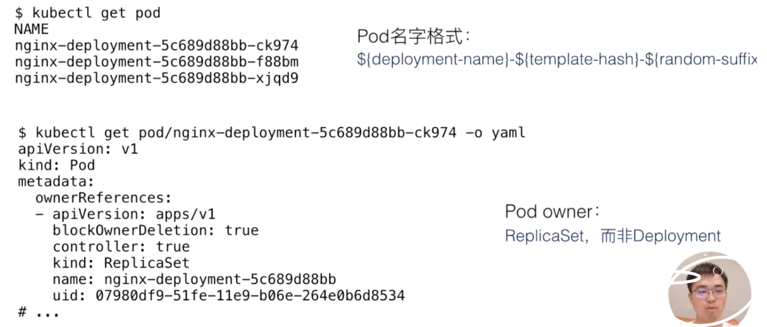
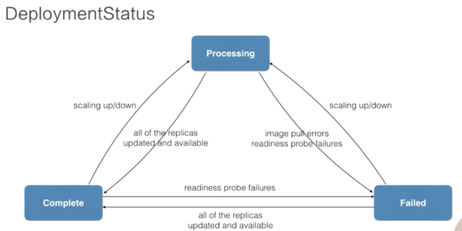
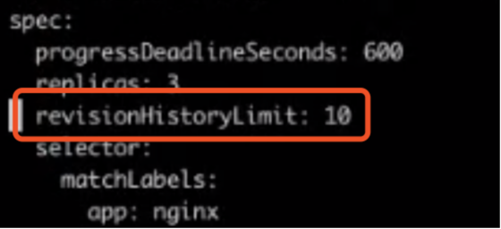
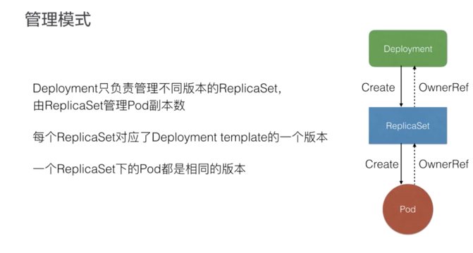
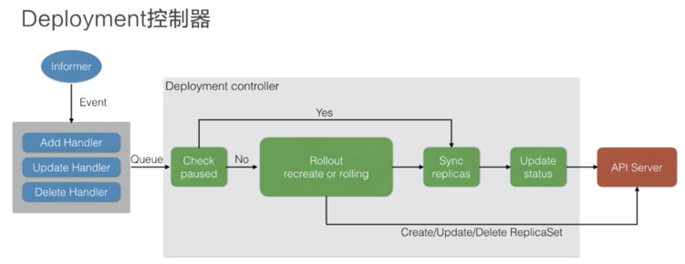
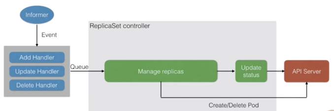

#Deployment

## 问题

    首先，如何保证集群内可用 Pod 的数量？也就是说我们应用 A 四个 Pod 如果出现了一些宿主机故障，或者一些网络问题，如何能保证它可用的数量？
    如何为所有 Pod 更新镜像版本？我们是否要某一个 Pod 去重建新版本的 Pod？
    然后在更新过程中，如何保证服务的可用性？
    以及更新过程中，如果发现了问题，如何快速回滚到上一个版本

## 解决方式
Deployment控制器可以解决的事

可以看到我们通过 Deployment 将应用 A、B、C 分别规划到不同的 Deployment 中，每个 Deployment 其实是管理的一组相同的应用 Pod，
这组 Pod 我们认为它是相同的一个副本，那么 Deployment 能帮我们做什么事情呢？

    首先，Deployment 定义了一种 Pod 期望数量，比如说应用 A，我们期望 Pod 数量是四个，那么这样的话，controller 就会持续维持 Pod 数量为期望的数量。
    当我们与 Pod 出现了网络问题或者宿主机问题的话，controller 能帮我们恢复，也就是新扩出来对应的 Pod，来保证可用的 Pod 数量与期望数量一致

    配置 Pod 发布方式，也就是说 controller 会按照用户给定的策略来更新 Pod，而且更新过程中，也可以设定不可用 Pod 数量在多少范围内；

    如果更新过程中发生问题的话，即所谓“一键”回滚，也就是说你通过一条命令或者一行修改能够将 Deployment 下面所有 Pod 更新为某一个旧版本 。

## 语法解读

“apiVersion：apps/v1”，也就是说 Deployment 当前所属的组是 apps，版本是 v1。“metadata”是我们看到的 Deployment 元信息，

Deployment 作为一个 K8s 资源，它有自己的 metadata 元信息，这里我们定义的 Deployment.name 是 nginx.Deployment。
Deployment.spec 中首先要有一个核心的字段，即 replicas，这里定义期望的 Pod 数量为三个；selector 其实是 Pod 选择器，
那么所有扩容出来的 Pod，它的 Labels 必须匹配 selector 层上的 image.labels，也就是 app.nginx

### spec 字段解析

升级策略解析
Deployment 在 RollingUpdate 中主要提供了两个策略，一个是 MaxUnavailable，另一个是 MaxSurge。这两个字段解析的意思，可以看下图中详细的 comment，或者简单解释一下：

MaxUnavailable：滚动过程中最多有多少个 Pod 不可用；
MaxSurge：滚动过程中最多存在多少个 Pod 超过预期 replicas 数量。

上文提到，ReplicaSet 为 3 的 Deployment 在发布的时候可能存在一种情况：新版本的 ReplicaSet 和旧版本的 ReplicaSet 都可能有两个 replicas，加在一起就是 4 个，
超过了我们期望的数量三个。这是因为我们默认的 MaxUnavailable 和 MaxSurge 都是 25%，默认 Deployment 在发布的过程中，
可能有 25% 的 replica 是不可用的，也可能超过 replica 数量 25% 是可用的，最高可以达到 125% 的 replica 数量。

这里其实可以根据用户实际场景来做设置。比如当用户的资源足够，且更注重发布过程中的可用性，可设置 MaxUnavailable 较小、MaxSurge 较大。
但如果用户的资源比较紧张，可以设置 MaxSurge 较小，甚至设置为 0，这里要注意的是 MaxSurge 和 MaxUnavailable 不能同时为 0。

理由不难理解，当 MaxSurge 为 0 的时候，必须要删除 Pod，才能扩容 Pod；如果不删除 Pod 是不能新扩 Pod 的，因为新扩出来的话，总共的 Pod 数量就会超过期望数量。
而两者同时为 0 的话，MaxSurge 保证不能新扩 Pod，而 MaxUnavailable 不能保证 ReplicaSet 中有 Pod 是 available 的，这样就会产生问题。
所以说这两个值不能同时为 0。用户可以根据自己的实际场景来设置对应的、合适的值

### 查看pod

最前面一段：nginx-deployment，其实是 Pod 所属 Deployment.name；中间一段：template-hash，这里三个 Pod 是一样的，因为这三个 Pod 其实都是同一个 template 中创建出来的。

最后一段，是一个 random 的字符串，我们通过 get.pod 可以看到，Pod 的 ownerReferences 即 Pod 所属的 controller 资源，并不是 Deployment，而是一个 ReplicaSet。
这个 ReplicaSet 的 name，其实是 nginx-deployment 加上 pod.template-hash，后面会提到。
所有的 Pod 都是 ReplicaSet 创建出来的，而 ReplicaSet 它对应的某一个具体的 Deployment.template 版本

### Deployment状态

### 历史版本保留 revisionHistoryLimit

## 架构设计
### 管理模式

首先简单看一下管理模式：Deployment 只负责管理不同版本的 ReplicaSet，由 ReplicaSet 来管理具体的 Pod 副本数，每个 ReplicaSet 对应 Deployment template 的一个版本。
在上文的例子中可以看到，每一次修改 template，都会生成一个新的 ReplicaSet，这个 ReplicaSet 底下的 Pod 其实都是相同的版本。

如上图所示：Deployment 创建 ReplicaSet，而 ReplicaSet 创建 Pod。他们的 OwnerRef 其实都对应了其控制器的资源

### Deployment 控制器

首先，我们所有的控制器都是通过 Informer 中的 Event 做一些 Handler 和 Watch。这个地方 Deployment 控制器，其实是关注 Deployment 和 ReplicaSet 中的 event，收到事件后会加入到队列中。
而 Deployment controller 从队列中取出来之后，它的逻辑会判断 Check Paused，这个 Paused 其实是 Deployment 是否需要新的发布，
如果 Paused 设置为 true 的话，就表示这个 Deployment 只会做一个数量上的维持，不会做新的发布

如上图，可以看到如果 Check paused 为 Yes 也就是 true 的话，那么只会做 Sync replicas。也就是说把 replicas sync 同步到对应的 ReplicaSet 中，
最后再 Update Deployment status，那么 controller 这一次的 ReplicaSet 就结束了。

那么如果 paused 为 false 的话，它就会做 Rollout，也就是通过 Create 或者是 Rolling 的方式来做更新，
更新的方式其实也是通过 Create/Update/Delete 这种 ReplicaSet 来做实现的

### ReplicaSet 控制器

当 Deployment 分配 ReplicaSet 之后，ReplicaSet 控制器本身也是从 Informer 中 watch 一些事件，这些事件包含了 ReplicaSet 和 Pod 的事件。
从队列中取出之后，ReplicaSet controller 的逻辑很简单，就只管理副本数。
也就是说如果 controller 发现 replicas 比 Pod 数量大的话，就会扩容，而如果发现实际数量超过期望数量的话，就会删除 Pod。

上面 Deployment 控制器的图中可以看到，Deployment 控制器其实做了更复杂的事情，包含了版本管理，而它把每一个版本下的数量维持工作交给 ReplicaSet 来做