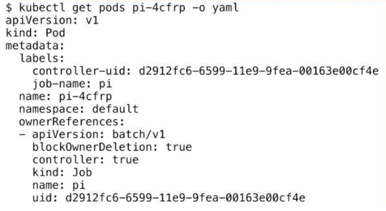
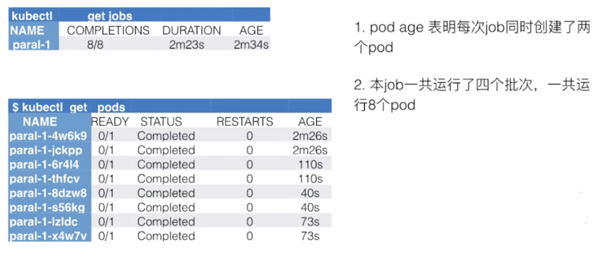
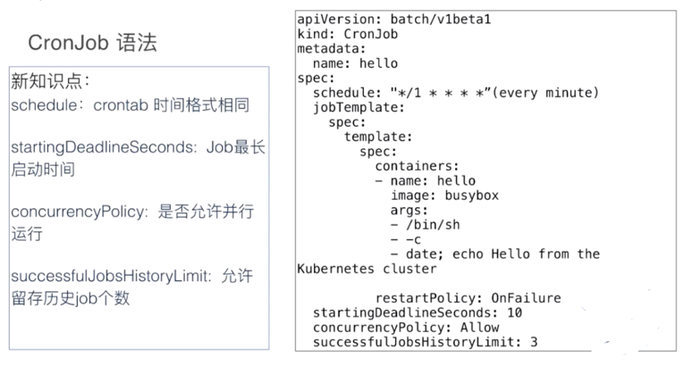
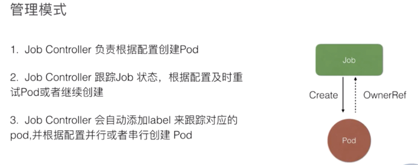
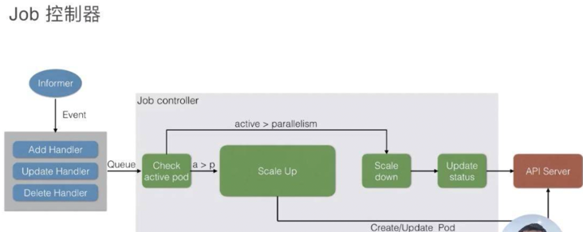
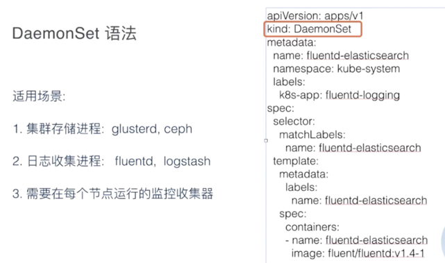
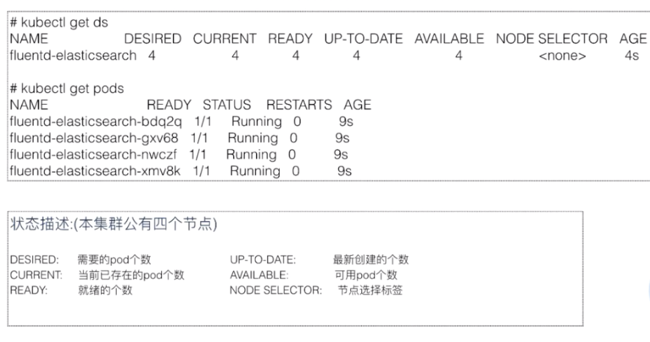
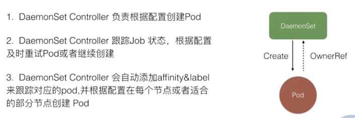
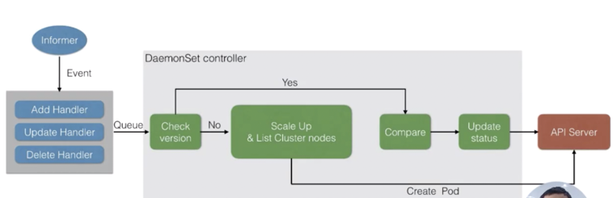

# Job

## 背景
我们知道 K8s 里面，最小的调度单元是 Pod，我们可以直接通过 Pod 来运行任务进程。这样做将会产生以下几种问题：
    
    * 我们如何保证 Pod 内进程正确的结束？
    * 如何保证进程运行失败后重试？
    * 如何管理多个任务，且任务之间有依赖关系？
    * 如何并行地运行任务，并管理任务的队列大小
    
## Job的功能
    * 首先 kubernetes 的 Job 是一个管理任务的控制器，它可以创建一个或多个 Pod 来指定 Pod 的数量，并可以监控它是否成功地运行或终止；
    * 我们可以根据 Pod 的状态来给 Job 设置重置的方式及重试的次数；
    * 我们还可以根据依赖关系，保证上一个任务运行完成之后再运行下一个任务；
    * 同时还可以控制任务的并行度，根据并行度来确保 Pod 运行过程中的并行次数和总体完成大小
    
## 语法分析
job.yaml  

    上图是 Job 最简单的一个 yaml 格式，这里主要新引入了一个 kind 叫 Job，这个 Job 其实就是 job-controller 里面的一种类型。 
    然后 metadata 里面的 name 来指定这个 Job 的名称，下面 spec.template 里面其实就是 pod 的 spec。
    
    这里面的内容都是一样的，唯一多了两个点：
    
    
    第一个是 restartPolicy，在 Job 里面我们可以设置 Never、OnFailure、Always 这三种重试策略。
    在希望 Job 需要重新运行的时候，我们可以用 Never；希望在失败的时候再运行，再重试可以用 OnFailure；或者不论什么情况下都重新运行时 Alway；
    另外，Job 在运行的时候不可能去无限的重试，所以我们需要一个参数来控制重试的次数。这个 backoffLimit 就是来保证一个 Job 到底能重试多少次

所以在 Job 里面，我们主要重点关注的一个是 restartPolicy 重启策略和 backoffLimit 重试次数限制。

### 查看pod

下面我们来看一下 Pod，其实 Job 最后的执行单元还是 Pod。我们刚才创建的 Job 会创建出来一个叫“pi”的一个 Pod，这个任务就是来计算这个圆周率，
Pod 的名称会以“${job-name}-${random-suffix}”，我们可以看一下下面 Pod 的 yaml 格式
    
    它比普通的 Pod 多了一个叫 ownerReferences，这个东西来声明此 pod 是归哪个上一层 controller 来管理。
    可以看到这里的 ownerReferences 是归 batch/v1，也就是上一个 Job 来管理的。
    这里就声明了它的 controller 是谁，然后可以通过 pod 返查到它的控制器是谁，同时也能根据 Job 来查一下它下属有哪些 Pod。

## 并行运行Job

我们有时候有些需求：希望 Job 运行的时候可以最大化的并行，并行出 n 个 Pod 去快速地执行。
同时，由于我们的节点数有限制，可能也不希望同时并行的 Pod 数过多，有那么一个管道的概念，我们可以希望最大的并行度是多少，Job 控制器都可以帮我们来做到。

这里主要看两个参数：一个是 completions，一个是 parallelism。

首先第一个参数是用来指定本 Pod 队列执行次数。可能这个不是很好理解，其实可以把它认为是这个 Job 指定的可以运行的总次数。比如这里设置成 8，即这个任务一共会被执行 8 次；
第二个参数代表这个并行执行的个数。所谓并行执行的次数，其实就是一个管道或者缓冲器中缓冲队列的大小，把它设置成 2，
也就是说这个 Job 一定要执行 8 次，每次并行 2 个 Pod，这样的话，一共会执行 4 个批次

## CronJob
### 语法分析

concurrencyPolicy：就是说是否允许并行运行。所谓的并行运行就是，比如说我每分钟执行一次，但是这个 Job 可能运行的时间特别长，
假如两分钟才能运行成功，也就是第二个 Job 要到时间需要去运行的时候，上一个 Job 还没完成。
如果这个 policy 设置为 true 的话，那么不管你前面的 Job 是否运行完成，每分钟都会去执行；
如果是 false，它就会等上一个 Job 运行完成之后才会运行下一个

## 架构设计

所有的 job 都是一个 controller，它会 watch 这个 API Server，我们每次提交一个 Job 的 yaml 都会经过 api-server 传到 ETCD 里面去，
然后 Job Controller 会注册几个 Handler，每当有添加、更新、删除等操作的时候，它会通过一个内存级的消息队列，发到 controller 里面。

通过 Job Controller 检查当前是否有运行的 pod，如果没有的话，通过 Scale up 把这个 pod 创建出来；
如果有的话，或者如果大于这个数，对它进行 Scale down，如果这时 pod 发生了变化，需要及时 Update 它的状态。

同时要去检查它是否是并行的 job，或者是串行的 job，根据设置的配置并行度、串行度，及时地把 pod 的数量给创建出来。
最后，它会把 job 的整个的状态更新到 API Server 里面去，这样我们就能看到呈现出来的最终效果了

# DaemonSet
## 背景
    * 首先如果希望每个节点都运行同样一个 pod 怎么办？
    * 如果新节点加入集群的时候，想要立刻感知到它，然后去部署一个 pod，帮助我们初始化一些东西，这个需求如何做？
    * 如果有节点退出的时候，希望对应的 pod 会被删除掉，应该怎么操作？
    * 如果 pod 状态异常的时候，我们需要及时地监控这个节点异常，然后做一些监控或者汇报的一些动作，那么这些东西运用什么控制器来做？
    
## DaemonSet功能
    * 首先能保证集群内的每一个节点都运行一组相同的 pod；
    * 同时还能根据节点的状态保证新加入的节点自动创建对应的 pod；
    * 在移除节点的时候，能删除对应的 pod；
    * 而且它会跟踪每个 pod 的状态，当这个 pod 出现异常、Crash 掉了，会及时地去 recovery 这个状态
    
## 语法分析

    首先是存储，GlusterFS 或者 Ceph 之类的东西，需要每台节点上都运行一个类似于 Agent 的东西，DaemonSet 就能很好地满足这个诉求；
     
    另外，对于日志收集，比如说 logstash 或者 fluentd，这些都是同样的需求，需要每台节点都运行一个 Agent，
    这样的话，我们可以很容易搜集到它的状态，把各个节点里面的信息及时地汇报到上面；
     
    还有一个就是，需要每个节点去运行一些监控的事情，也需要每个节点去运行同样的事情，比如说 Promethues 这些东西，也需要 DaemonSet 的支持

更新策略

    RollingUpdate 其实比较好理解，就是会一个一个的更新。先更新第一个 pod，然后老的 pod 被移除，
    通过健康检查之后再去见第二个 pod，这样对于业务上来说会比较平滑地升级，不会中断；：DaemonSet 默认这个是 RollingUpdate
     
    OnDelete 其实也是一个很好的更新策略，就是模板更新之后，pod 不会有任何变化，需要我们手动控制。
    我们去删除某一个节点对应的 pod，它就会重建，不删除的话它就不会重建，这样的话对于一些我们需要手动控制的特殊需求也会有特别好的作用
    
## 架构设计

DaemonSet 其实和 Job controller 做的差不多：两者都需要根据 watch 这个 API Server 的状态。
现在 DaemonSet 和 Job controller 唯一的不同点在于，DaemonsetSet Controller需要去 watch node 的状态，但其实这个 node 的状态还是通过 API Server 传递到 ETCD 上。

当有 node 状态节点发生变化时，它会通过一个内存消息队列发进来，然后DaemonSet controller 会去 watch 这个状态，看一下各个节点上是都有对应的 Pod，如果没有的话就去创建。
当然它会去做一个对比，如果有的话，它会比较一下版本，然后加上刚才提到的是否去做 RollingUpdate？如果没有的话就会重新创建，Ondelete 删除 pod 的时候也会去做 check 它做一遍检查，是否去更新，或者去创建对应的 pod。

当然最后的时候，如果全部更新完了之后，它会把整个 DaemonSet 的状态去更新到 API Server 上，完成最后全部的更新