#配置管理
##背景
    * 第一，比如说一些可变的配置。因为我们不可能把一些可变的配置写到镜像里面，当这个配置需要变化的时候，可能需要我们重新编译一次镜像，这个肯定是不能接受的；
    * 第二就是一些敏感信息的存储和使用。比如说应用需要使用一些密码，或者用一些 token；
    * 第三就是我们容器要访问集群自身。比如我要访问 kube-apiserver，那么本身就有一个身份认证的问题；
    * 第四就是容器在节点上运行之后，它的资源需求；
    * 第五个就是容器在节点上，它们是共享内核的，那么它的一个安全管控怎么办？
    * 最后一点我们说一下容器启动之前的一个前置条件检验。比如说，一个容器启动之前，我可能要确认一下 DNS 服务是不是好用？
    又或者确认一下网络是不是联通的？那么这些其实就是一些前置的校验。
    
##Pod的配置管理

##ConfigMap
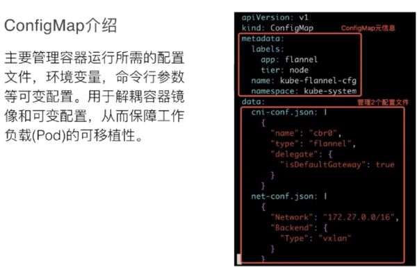
主要是管理一些可变配置信息，比如说我们应用的一些配置文件，或者说它里面的一些环境变量，或者一些命令行参数。

好处在于它可以让一些可变配置和容器镜像进行解耦，这样也保证了容器的可移植性。

###configMap使用
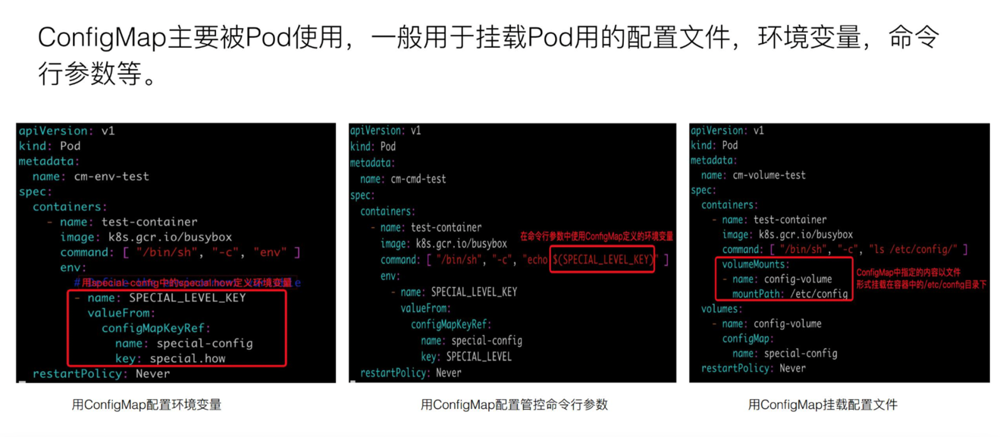
    
    *第一种是环境变量。环境变量的话通过 valueFrom，然后 ConfigMapKeyRef 这个字段，下面的 name 是指定 ConfigMap 名，key 是 ConfigMap.data 里面的 key。
    这样的话，在 busybox 容器启动后容器中执行 env 将看到一个 SPECIAL_LEVEL_KEY 环境变量；
    
    *第二个是命令行参数。命令行参数其实是第一行的环境变量直接拿到 cmd 这个字段里面来用；
    
    *最后一个是通过 volume 挂载的方式直接挂到容器的某一个目录下面去。
    上面的例子是把 special-config 这个 ConfigMap 里面的内容挂到容器里面的 /etc/config 目录下，这个也是使用的一种方式。
注意点⚠️

    * ConfigMap 文件的大小。虽然说 ConfigMap 文件没有大小限制，但是在 ETCD 里面，数据的写入是有大小限制的，现在是限制在 1MB 以内；
    
    * 第二个注意点是 pod 引入 ConfigMap 的时候，必须是相同的 Namespace 中的 ConfigMap，前面其实可以看到，ConfigMap.metadata 里面是有 namespace 字段的；
    
    * 第三个是 pod 引用的 ConfigMap。假如这个 ConfigMap 不存在，那么这个 pod 是无法创建成功的，其实这也表示在创建 pod 前，必须先把要引用的 ConfigMap 创建好；
    
    * 第四点就是使用 envFrom 的方式。把 ConfigMap 里面所有的信息导入成环境变量时，如果 ConfigMap 里有些 key 是无效的，
    比如 key 的名字里面带有数字，那么这个环境变量其实是不会注入容器的，它会被忽略。但是这个 pod 本身是可以创建的。
    这个和第三点是不一样的方式，是 ConfigMap 文件存在基础上，整体导入成环境变量的一种形式；
    
    * 最后一点是：什么样的 pod 才能使用 ConfigMap？这里只有通过 K8s api 创建的 pod 才能使用 ConfigMap，
    比如说通过用命令行 kubectl 来创建的 pod，肯定是可以使用 ConfigMap 的，但其他方式创建的 pod，比如说 kubelet 通过 manifest 创建的 static pod，它是不能使用 ConfigMap 的

##Secret
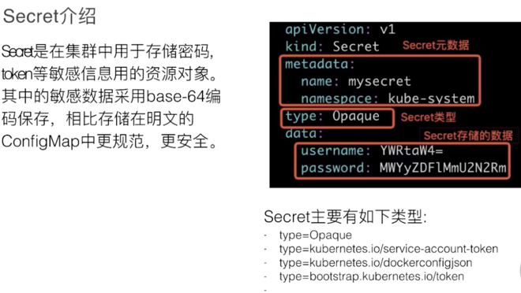
Secret 是一个主要用来存储密码 token 等一些敏感信息的资源对象。其中，敏感信息是采用 base-64 编码保存起来的.
Secret 类型种类比较多，下面列了常用的四种类型：

    第一种是 Opaque，它是普通的 Secret 文件；
    第二种是 service-account-token，是用于 service-account 身份认证用的 Secret；
    第三种是 dockerconfigjson，这是拉取私有仓库镜像的用的一种 Secret；
    第四种是 bootstrap.token，是用于节点接入集群校验用的 Secret

###创建
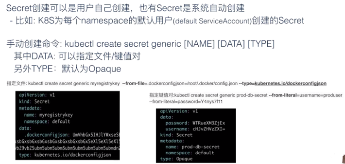
有两种创建方式：

系统创建：比如 K8s 为每一个 namespace 的默认用户（default ServiceAccount）创建 Secret；

用户手动创建：手动创建命令，推荐 kubectl 这个命令行工具，它相对 ConfigMap 会多一个 type 参数。
其中 data 也是一样，它也是可以指定文件和键值对的。type 的话，要是你不指定的话，默认是 Opaque 类型。
 
上图中两个例子。第一个是通过指定文件，创建了一个拉取私有仓库镜像的 Secret，指定的文件是 /root/.docker/config.json。type 的话指定的是 dockerconfigjson，
另外一个我们指定键值对，我们 type 没有指定，默认是 Opaque。键值对是 key:value 的形式，其中对 value 内容进行 base64 加密。创建 Secret 就是这么一个情况。

###secret使用
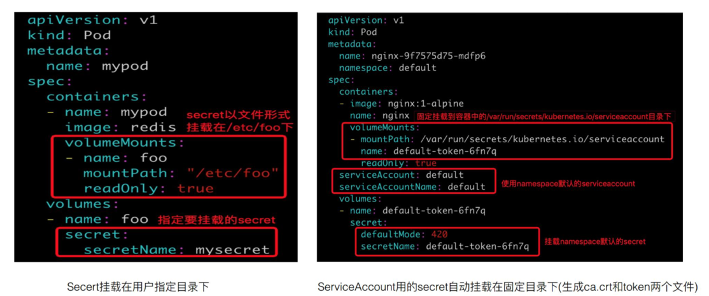
它主要是被 pod 来使用，一般是通过 volume 形式挂载到容器里指定的目录，然后容器里的业务进程再到目录下读取 Secret 来进行使用。另外在需要访问私有镜像仓库时，也是通过引用 Secret 来实现。
####使用私有镜像
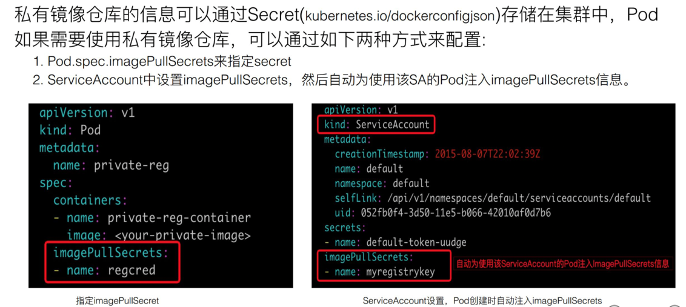

注意⚠️

    第一个是 Secret 的文件大小限制。这个跟 ConfigMap 一样，也是 1MB；
         
    第二个是 Secret 采用了 base-64 编码，但是它跟明文也没有太大区别。所以说，如果有一些机密信息要用 Secret 来存储的话，还是要很慎重考虑。
    也就是说谁会来访问你这个集群，谁会来用你这个 Secret，还是要慎重考虑，因为它如果能够访问这个集群，就能拿到这个 Secret。

    如果是对 Secret 敏感信息要求很高，对加密这块有很强的需求，推荐可以使用 Kubernetes 和开源的 vault做一个解决方案，来解决敏感信息的加密和权限管理。    
     
    第三个就是 Secret 读取的最佳实践，建议不要用 list/watch，如果用 list/watch 操作的话，会把 namespace 下的所有 Secret 全部拉取下来，这样其实暴露了更多的信息。
    推荐使用 GET 的方法，这样只获取你自己需要的那个 Secret。

##ServiceAccount
ServiceAccount 首先是用于解决 pod 在集群里面的身份认证问题，身份认证信息是存在于 Secret 里面。
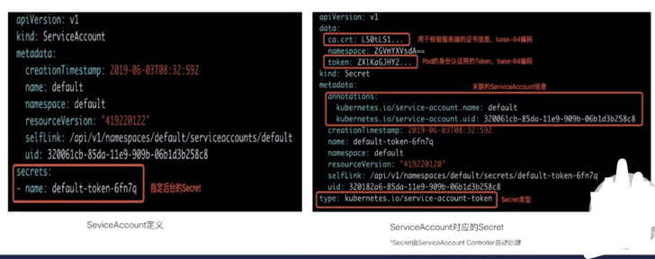

    先看一下上面的左侧截图，可以看到最下面的红框里，有一个 Secret 字段，它指定 ServiceAccount 用哪一个 Secret，这个是 K8s 自动为 ServiceAccount 加上的。
    然后再来看一下上图中的右侧截图，它对应的 Secret 的 data 里有两块数据，一个是 ca.crt，一个是 token。ca.crt 用于对服务端的校验，token 用于 Pod 的身份认证，它们都是用 base64 编码过的。
    然后可以看到 metadata 即元信息里，其实是有关联 ServiceAccount 信息的（这个 secret 被哪个 ServiceAccount 使用）。最后我们注意一下 type，这个就是 service-account-token 这种类型
实现原理
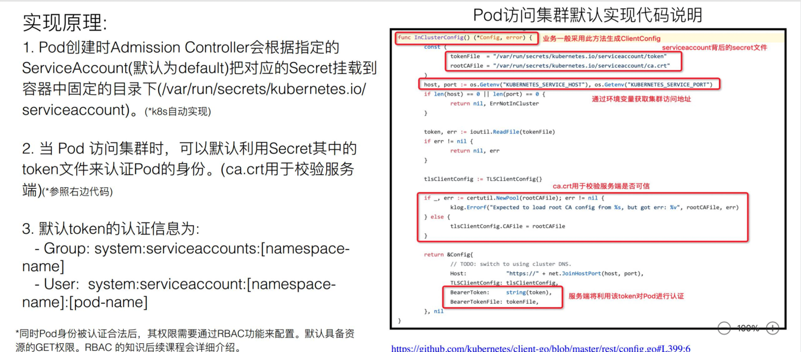

##资源配置管理
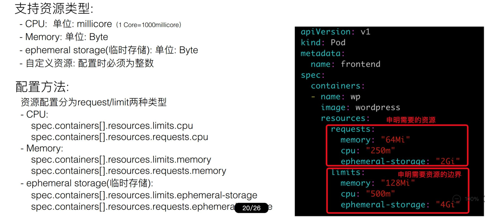
Pod 服务质量 (QoS) 配置
    
    根据 CPU 对容器内存资源的需求，我们对 pod 的服务质量进行一个分类，分别是 Guaranteed、Burstable 和 BestEffort。
    
    Guaranteed ：pod 里面每个容器都必须有内存和 CPU 的 request 以及 limit 的一个声明，且 request 和 limit 必须是一样的，这就是 Guaranteed；
    Burstable：Burstable 至少有一个容器存在内存和 CPU 的一个 request；
    BestEffort：只要不是 Guaranteed 和 Burstable，那就是 BestEffort。

##SecurityContext

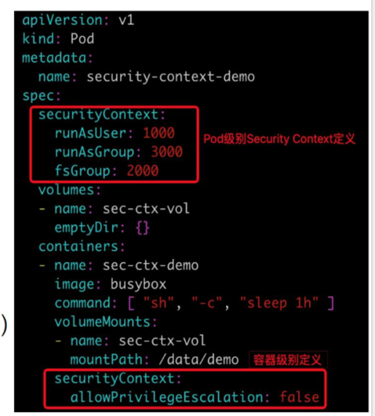
SecurityContext 主要是用于限制容器的一个行为，它能保证系统和其他容器的安全。
这一块的能力不是 Kubernetes 或者容器 runtime 本身的能力，而是 Kubernetes 和 runtime 通过用户的配置，最后下传到内核里，
再通过内核的机制让 SecurityContext 来生效。所以这里讲的内容，会比较简单或者说比较抽象一点。

SecurityContext 主要分为三个级别：

    第一个是容器级别，仅对容器生效；
    第二个是 pod 级别，对 pod 里所有容器生效；
    第三个是集群级别，就是 PSP，对集群内所有 pod 生效。
     
权限和访问控制设置项，现在一共列有七项（这个数量后续可能会变化）：

    第一个就是通过用户 ID 和组 ID 来控制文件访问权限；
    第二个是 SELinux，它是通过策略配置来控制用户或者进程对文件的访问控制；
    第三个是特权容器；
    第四个是 Capabilities，它也是给特定进程来配置一个 privileged 能力；
    第五个是 AppArmor，它也是通过一些配置文件来控制可执行文件的一个访问控制权限，比如说一些端口的读写；
    第六个是一个对系统调用的控制；
    第七个是对子进程能否获取比父亲更多的权限的一个限制
最后其实都是落到内核来控制它的一些权限

##initContainer
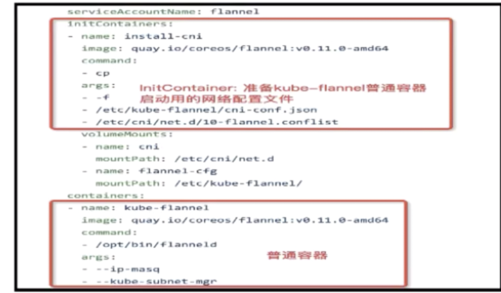
首先介绍 InitContainer 和普通 container 的区别，有以下三点内容：

    * InitContainer 首先会比普通 container 先启动，并且直到所有的 InitContainer 执行成功后，普通 container 才会被启动；
    * InitContainer 之间是按定义的次序去启动执行的，执行成功一个之后再执行第二个，而普通的 container 是并发启动的；
    * InitContainer 执行成功后就结束退出，而普通容器可能会一直在执行。它可能是一个 longtime 的，或者说失败了会重启，这个也是 InitContainer 和普通 container 不同的地方