#数据卷

##Volumes   
###背景

场景一：如果 pod 中的某一个容器在运行时异常退出，被 kubelet 重新拉起之后，如何保证之前容器产生的重要数据没有丢失？
场景二：如果同一个 pod 中的多个容器想要共享数据，应该如何去做？

###pod volume
常见类型

    * 本地存储，常用的有 emptydir/hostpath；
    * 网络存储：网络存储当前的实现方式有两种，一种是 in-tree，它的实现的代码是放在 K8s 代码仓库中的，随着k8s对存储类型支持的增多，这种方式会给k8s本身的维护和发展带来很大的负担；而第二种实现方式是 out-of-tree，它的实现其实是给 K8s 本身解耦的，通过抽象接口将不同存储的driver实现从k8s代码仓库中剥离，因此out-of-tree 是后面社区主推的一种实现网络存储插件的方式；
    * Projected Volumes：它其实是将一些配置信息，如 secret/configmap 用卷的形式挂载在容器中，让容器中的程序可以通过POSIX接口来访问配置数据；
####Persistent Volumes（PV）
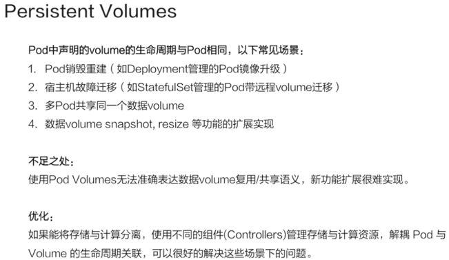
既然已经有了 Pod Volumes，为什么又要引入 PV 呢？我们知道 pod 中声明的 volume 生命周期与 pod 是相同的，以下有几种常见的场景：

    场景一：pod 重建销毁，如用 Deployment 管理的 pod，在做镜像升级的过程中，会产生新的 pod并且删除旧的 pod ，那新旧 pod 之间如何复用数据？
    场景二：宿主机宕机的时候，要把上面的 pod 迁移，这个时候 StatefulSet 管理的 pod，其实已经实现了带卷迁移的语义。
    这时通过 Pod Volumes 显然是做不到的；
    场景三：多个 pod 之间，如果想要共享数据，应该如何去声明呢？我们知道，同一个 pod 中多个容器想共享数据，可以借助 Pod Volumes 来解决；
    当多个 pod 想共享数据时，Pod Volumes 就很难去表达这种语义；
    场景四：如果要想对数据卷做一些功能扩展性，如：snapshot、resize 这些功能，又应该如何去做呢？
    
通过 Pod Volumes 很难准确地表达它的复用/共享语义，对它的扩展也比较困难。因此 K8s 中又引入了 Persistent Volumes 概念，它可以将存储和计算分离，
通过不同的组件来管理存储资源和计算资源，然后解耦 pod 和 Volume 之间生命周期的关联。
这样，当把 pod 删除之后，它使用的PV仍然存在，还可以被新建的 pod 复用。

####Persistent Volume Claim(PVC)
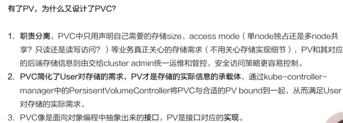
通过 PVC 和 PV 的概念，将用户需求和实现细节解耦开，用户只用通过 PVC 声明自己的存储需求。
PV是有集群管理员和存储相关团队来统一运维和管控，这样的话，就简化了用户使用存储的方式。可以看到，PV 和 PVC 的设计其实有点像面向对象的接口与实现的关系。
用户在使用功能时，只需关心用户接口，不需关心它内部复杂的实现细节

#####PV 这个对象是怎么产生的
######静态产生方式 - 静态 Provisioning
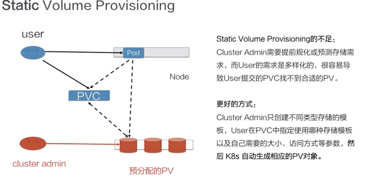
静态 Provisioning：由集群管理员事先去规划这个集群中的用户会怎样使用存储，它会先预分配一些存储，也就是预先创建一些 PV；
然后用户在提交自己的存储需求（也就是 PVC）的时候，K8s 内部相关组件会帮助它把 PVC 和 PV 做绑定；
之后用户再通过 pod 去使用存储的时候，就可以通过 PVC 找到相应的 PV，它就可以使用了。

静态产生方式有什么不足呢？可以看到，首先需要集群管理员预分配，预分配其实是很难预测用户真实需求的。
举一个最简单的例子：如果用户需要的是 20G，然而集群管理员在分配的时候可能有 80G 、100G 的，但没有 20G 的，这样就很难满足用户的真实需求，也会造成资源浪费。
######动态 Dynamic Provisioning
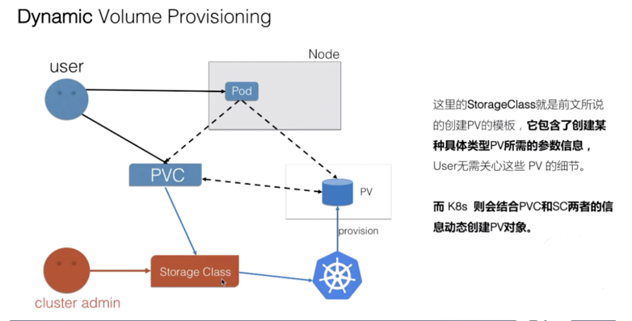
动态供给是什么意思呢？就是说现在集群管理员不预分配 PV，他写了一个模板文件，这个模板文件是用来表示创建某一类型存储（块存储，文件存储等）所需的一些参数，
这些参数是用户不关心的，给存储本身实现有关的参数。用户只需要提交自身的存储需求，也就是PVC文件，并在 PVC 中指定使用的存储模板（StorageClass）。

K8s 集群中的管控组件，会结合 PVC 和 StorageClass 的信息动态，生成用户所需要的存储（PV），将 PVC 和 PV 进行绑定后，pod 就可以使用 PV 了。
通过 StorageClass 配置生成存储所需要的存储模板，再结合用户的需求动态创建 PV 对象，做到按需分配，在没有增加用户使用难度的同时也解放了集群管理员的运维工作
####使用

#####Pod Volumes 的使用
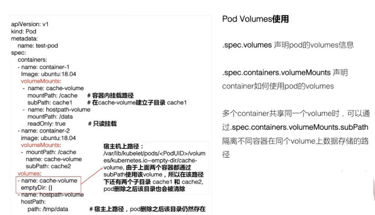
如上图左侧所示，我们可以在 pod yaml 文件中的 Volumes 字段中，声明我们卷的名字以及卷的类型。
声明的两个卷，一个是用的是 emptyDir，另外一个用的是 hostPath，这两种都是本地卷。在容器中应该怎么去使用这个卷呢？
它其实可以通过 volumeMounts 这个字段，volumeMounts 字段里面指定的 name 其实就是它使用的哪个卷，mountPath 就是容器中的挂载路径。

这里还有个 subPath，subPath 是什么？

先看一下，这两个容器都指定使用了同一个卷，就是这个 cache-volume。那么，在多个容器共享同一个卷的时候，为了隔离数据，我们可以通过 subPath 来完成这个操作。
它会在卷里面建立两个子目录，然后容器 1 往 cache 下面写的数据其实都写在子目录 cache1 了，容器 2 往 cache 写的目录，其数据最终会落在这个卷里子目录下面的 cache2 下。

还有一个 readOnly 字段，readOnly 的意思其实就是只读挂载，这个挂载你往挂载点下面实际上是没有办法去写数据的。

另外emptyDir、hostPath 都是本地存储，它们之间有什么细微的差别呢？emptyDir 其实是在 pod 创建的过程中会临时创建的一个目录，这个目录随着 pod 删除也会被删除，里面的数据会被清空掉；
hostPath 顾名思义，其实就是宿主机上的一个路径，在 pod 删除之后，这个目录还是存在的，它的数据也不会被丢失。这就是它们两者之间一个细微的差别。
#####静态PV使用
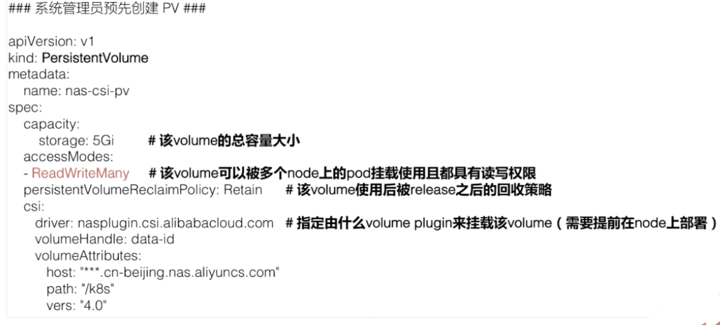
静态 PV 的话，首先是由管理员来创建的，管理员我们这里以 NAS，就是阿里云文件存储为例。我需要先在阿里云的文件存储控制台上去创建 NAS 存储
，然后把 NAS 存储的相关信息要填到 PV 对象中，这个 PV 对象预创建出来后，用户可以通过 PVC 来声明自己的存储需求，
然后再去创建 pod。创建 pod 还是通过我们刚才讲解的字段把存储挂载到某一个容器中的某一个挂载点下面。

刚刚创建的阿里云 NAS 文件存储对应的PV，有个比较重要的字段：capacity，即创建的这个存储的大小，accessModes，创建出来的这个存储它的访问方式，我们后面会讲解总共有几种访问方式。

然后有个 ReclaimPolicy，ReclaimPolicy 的意思就是：这块存储在被使用后，等它的使用方 pod 以及 PVC 被删除之后，这个 PV 是应该被删掉还是被保留呢？其实就是PV的回收策略。
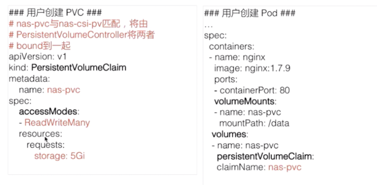
PVC 对象里面，只需要指定存储需求，不用关心存储本身的具体实现细节。存储需求包括哪些呢？首先是需要的大小，也就是 resources.requests.storage；然后是它的访问方式，即需要这个存储的访问方式

上图中左侧，可以看到这个声明：它的 size 和它的access mode，跟我们刚才静态创建这块 PV 其实是匹配的。这样的话，当用户在提交 PVC 的时候，K8s 集群相关的组件就会把 PV 的 PVC bound 到一起。
之后，用户在提交 pod yaml 的时候，可以在卷里面写上 PVC声明，在 PVC声明里面可以通过 claimName 来声明要用哪个 PVC。这时，挂载方式其实跟前面讲的一样，
当提交完 yaml 的时候，它可以通过 PVC 找到 bound 着的那个 PV，然后就可以用那块存储了。这是静态 Provisioning到被pod使用的一个过程

#####动态PV使用
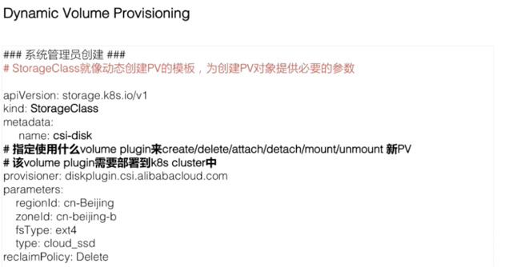

    这个模板文件叫 StorageClass，在StorageClass里面，我们需要填的重要信息：第一个是 provisioner，provisioner 是什么？
    它其实就是说我当时创建 PV 和对应的存储的时候，应该用哪个存储插件来去创建。
    
    
    这些参数是通过k8s创建存储的时候，需要指定的一些细节参数。对于这些参数，用户是不需要关心的，像这里 regionld、zoneld、fsType 和它的类型。
    ReclaimPolicy跟我们刚才讲解的 PV 里的意思是一样的，就是说动态创建出来的这块 PV,当使用方使用结束、Pod 及 PVC 被删除后，这块 PV 应该怎么处理，
    我们这个地方写的是 delete，意思就是说当使用方 pod 和 PVC 被删除之后，这个 PV 也会被删除掉。
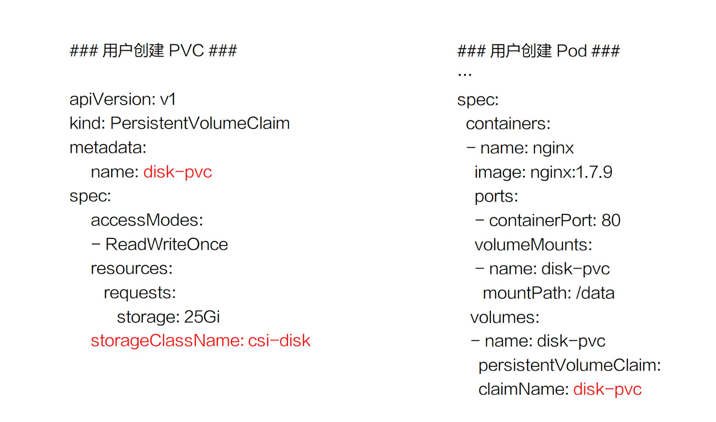
    PVC 的文件里存储的大小、访问模式是不变的。现在需要新加一个字段，叫 StorageClassName，它的意思是指定动态创建PV的模板文件的名字，这里StorageClassName填的就是上面声明的csi-disk。
    
    在提交完 PVC之后，K8s 集群中的相关组件就会根据 PVC 以及对应的 StorageClass 动态生成这块 PV 给这个 PVC 做一个绑定，之后用户在提交自己的 yaml 时，
    用法和接下来的流程和前面的静态使用方式是一样的，通过 PVC 找到我们动态创建的 PV，然后把它挂载到相应的容器中就可以使用了

字段解析

    Capacity：这个很好理解，就是存储对象的大小；
    AccessModes：也是用户需要关心的，就是说我使用这个 PV 的方式。它有三种使用方式。
        一种是单 node 读写访问；
        第二种是多个 node 只读访问，是常见的一种数据的共享方式；
        第三种是多个 node 上读写访问。
    用户在提交 PVC 的时候，最重要的两个字段 —— Capacity 和 AccessModes。在提交 PVC 后，k8s 集群中的相关组件是如何去找到合适的 PV 呢？首先它是通过为 PV 建立的 AccessModes 索引找到所有能够满足用户的 PVC 里面的 AccessModes 要求的 PV list，然后根据PVC的 Capacity，StorageClassName, Label Selector 进一步筛选 PV，如果满足条件的 PV 有多个，选择 PV 的 size 最小的，accessmodes 列表最短的 PV，也即最小适合原则。
    
    ReclaimPolicy：这个就是刚才提到的，我的用户方 PV 的 PVC 在删除之后，我的 PV 应该做如何处理？常见的有三种方式。
        第一种方式我们就不说了，现在 K8s 中已经不推荐使用了；
        第二种方式 delete，也就是说 PVC 被删除之后，PV 也会被删除；
        第三种方式 Retain，就是保留，保留之后，后面这个 PV 需要管理员来手动处理。
    StorageClassName：StorageClassName 这个我们刚才说了，我们动态 Provisioning 时必须指定的一个字段，就是说我们要指定到底用哪一个模板文件来生成 PV ；
    NodeAffinity：就是说我创建出来的 PV，它能被哪些 node 去挂载使用，其实是有限制的。然后通过 NodeAffinity 来声明对node的限制，这样其实对 使用该PV的pod调度也有限制，就是说 pod 必须要调度到这些能访问 PV 的 node 上，才能使用这块 PV，这个字段在我们下一讲讲解存储拓扑调度时在细说。
PV状态流转
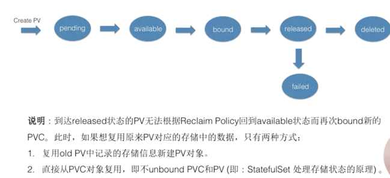

    available 状态意思就是可以使用的状态，用户在提交 PVC 之后，被 K8s 相关组件做完 bound（即：找到相应的 PV），这个时候 PV 和 PVC 就结合到一起了，此时两者都处在 bound 状态。
    当用户在使用完 PVC，将其删除后，这个 PV 就处在 released 状态，之后它应该被删除还是被保留呢？这个就会依赖我们刚才说的 ReclaimPolicy。
    
  
    这里有一个点需要特别说明一下：当 PV 已经处在 released 状态下，它是没有办法直接回到 available 状态，也就是说接下来无法被一个新的 PVC 去做绑定。
    如果我们想把已经 released 的 PV 复用，我们这个时候通常应该怎么去做呢？
    
    第一种方式：我们可以新建一个 PV 对象，然后把之前的 released 的 PV 的相关字段的信息填到新的 PV 对象里面，这样的话，这个 PV 就可以结合新的 PVC 了；
    第二种是我们在删除 pod 之后，不要去删除 PVC 对象，这样给 PV 绑定的 PVC 还是存在的，下次 pod 使用的时候，就可以直接通过 PVC 去复用。
    K8s中的 StatefulSet 管理的 Pod 带存储的迁移就是通过这种方式。
    
#####操作演示
静态provisioning

    
    静态 Provisioning 主要用的是阿里云的 NAS 文件存储；动态 Provisioning 主要用了阿里云的云盘。它们需要相应存储插件，
    插件我已经提前部署在我的 K8s 集群中了(csi-nasplugin*是为了在k8s中使用阿里云NAS所需的插件，csi-disk*是为了在k8s中使用阿里云云盘所需要的插件)
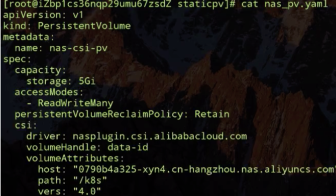
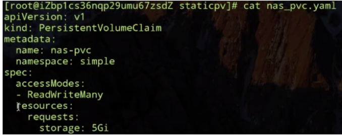
    

    volumeAttributes是我在阿里云nas控制台预先创建的 NAS 文件系统的相关信息，我们主要需要关心的有 capacity 为5Gi; accessModes 为多node读写访问; 
    reclaimPolicy：Retain，也就是当我使用方的 PVC 被删除之后，我这个 PV 是要保留下来的；以及在使用这个卷的过程中使用的driver。
    
    pod yaml 里面声明了刚才我们创建出来的 PVC 对象，然后把它挂载到 nas-container 容器中的 /data 下面。我们这个 pod 是通过前面课程中讲解 deployment 创建两个副本，
    通过反亲和性，将两个副本调度在不同的 node 上面
    