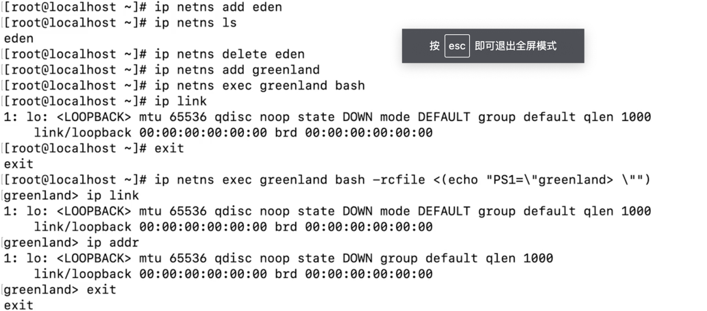
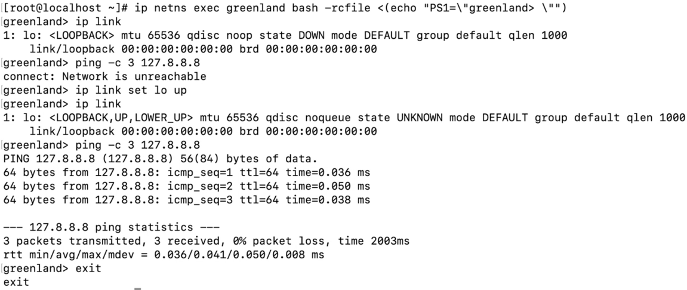
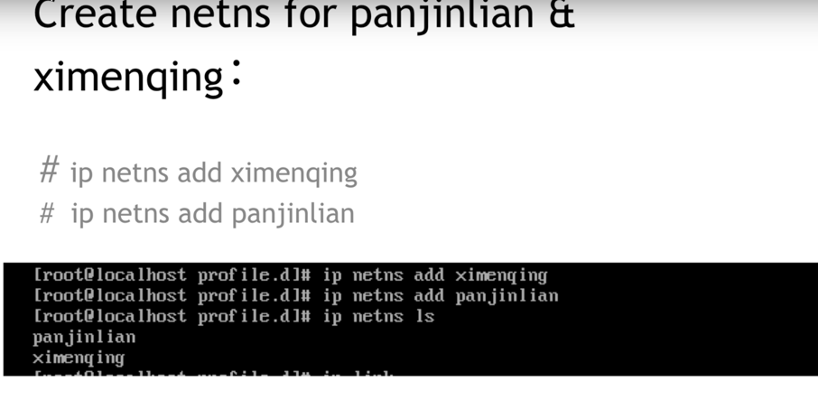
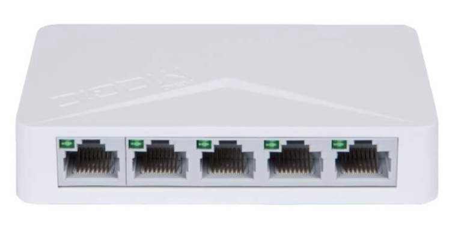
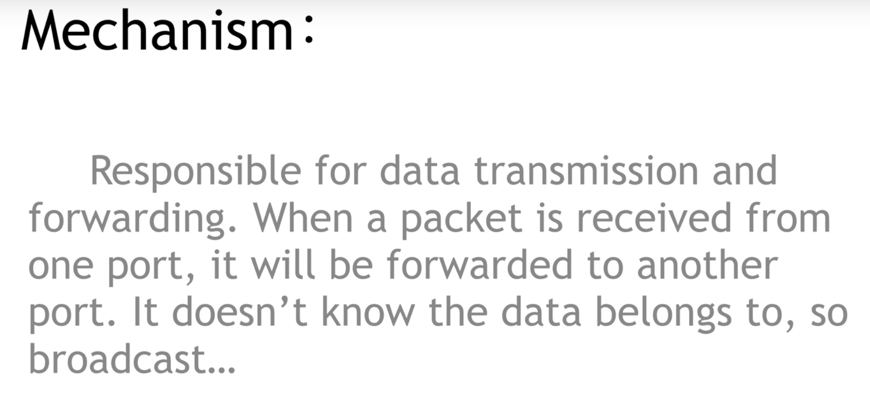
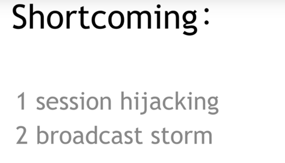
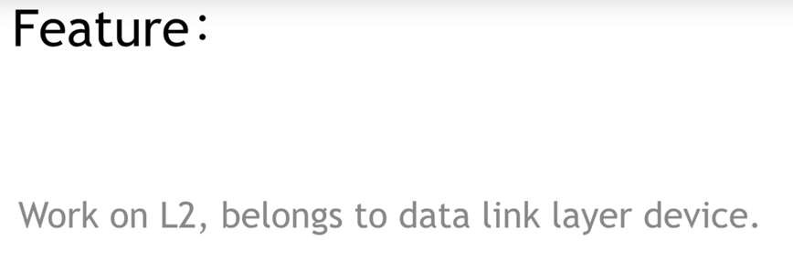
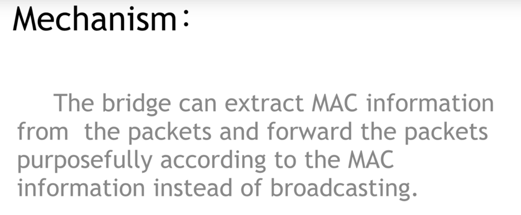
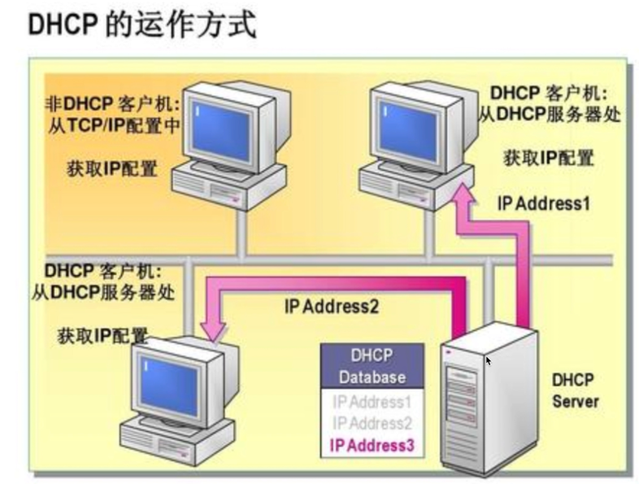
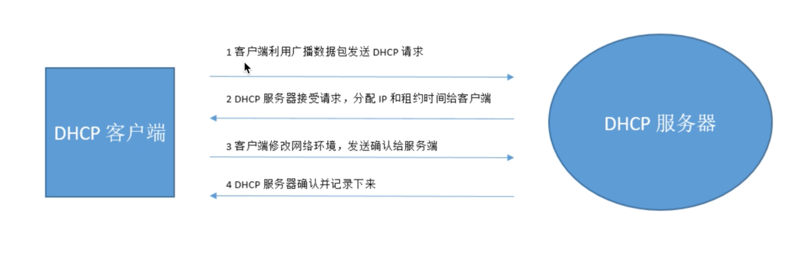

# k8s基本网络模型

分类：根据是否寄生在 Host 网络之上可以把容器网络方案大体分为 Underlay/Overlay 两大派别
    
* Underlay 的标准是它与 Host 网络是同层的，从外在可见的一个特征就是它是不是使用了 Host 网络同样的网段、输入输出基础设备、容器的 IP 地址是不是需要与 Host 网络取得协同（来自同一个中心分配或统一划分）。这就是 Underlay；

* Overlay 不一样的地方就在于它并不需要从 Host 网络的 IPM 的管理的组件去申请IP，一般来说，它只需要跟 Host 网络不冲突，这个 IP 可以自由分配的。

## docker的网络方案
docker官方并没有提供多主机的容器通信方案，单机网络的模式主要有host，container，bridge，none。
- none
- host，与宿主机共享，占用宿主机资源
- container，使用某容器的namespace，例如k8s的同一pod内的各个容器
- bridge，挂到网桥docker0上，走iptables做NAT

## Netns(network namespace)

需要了解的内容

### 定义

网络接口，iptables,路由表

1. 网卡

2. iptables

3. 路由表

### 使用

1. 自己创建netns

与docker,k8s对比

2. 两个netns交流
方式一：veth

开始搭建梯子🪜，一边一半

构造梯子veth

放梯子到各自家里

固定梯子

启动设备

开始拍手

方式二：桥

建立桥

建立梯子到王婆

放梯子到各自家里:注意王婆是master,不是单独的namespace 

查看master王婆的信息

固定西门庆家的梯子就行

激活设备(包括王婆的设备ip link set wangpo up)

同理去panjinlian家配置

### Pod 与 Netns 的关系

## 网络设备

1. hub 集线器

特点

2. bridge 网桥

注意是第二层：mac地址

3. switch 交换机

这里：可以指二层，有些到三层。

与网桥对比

4. DHCP(动态主机配置协议) Server

5. NAT Device
路由器

类型:最常用napt

## 主流网络方案
我们可以把云计算理解成一栋大楼，而这栋楼又可以分为顶楼、中间、低层三大块。那么我们就可以把Iass(基础设施)、Pass(平台)、Sass(软件)理解成这栋楼的三部分

### Flannel

它首先要解决的是 container 的包如何到达 Host，这里采用的是加一个 Bridge 的方式。
它的 backend 其实是独立的，也就是说这个包如何离开 Host，是采用哪种封装方式，还是不需要封装，都是可选择的

三种主要的 backend：

* 一种是用户态的 udp，这种是最早期的实现；
* 然后是内核的 Vxlan，这两种都算是 overlay 的方案。Vxlan 的性能会比较好一点，但是它对内核的版本是有要求的，需要内核支持 Vxlan 的特性功能；
* 如果你的集群规模不够大，又处于同一个二层域，也可以选择采用 host-gw 的方式。这种方式的 backend 基本上是由一段广播路由规则来启动的，性能比较高

#### Flannel的大致流程
1. flannel利用Kubernetes API或者etcd用于存储整个集群的网络配置，其中最主要的内容为设置集群的网络地址空间。例如，设定整个集群内所有容器的IP都取自网段“10.1.0.0/16”。
2. flannel在每个主机中运行flanneld作为agent，它会为所在主机从集群的网络地址空间中，获取一个小的网段subnet，本主机内所有容器的IP地址都将从中分配。
3. flanneld再将本主机获取的subnet以及用于主机间通信的Public IP，同样通过kubernetes API或者etcd存储起来。
4. flannel利用各种backend ，例如udp，vxlan，host-gw等等，跨主机转发容器间的网络流量，完成容器间的跨主机通信。

#### Flannel的设置方式
Flanneld是Flannel守护程序，通常作为守护程序安装在kubernetes集群上，并以install-cni作为初始化容器。
install-cni容器在每个节点上创建CNI配置文件-/etc/cni/net.d/10-flannel.conflist。
Flanneld创建一个vxlan设备，从apiserver获取网络元数据，并监视pod上的更新。
创建Pod时，它将为整个集群中的所有Pod分配路由，这些路由允许Pod通过其IP地址相互连接。

kubelet调用Containered CRI插件以创建容器，而Containered CRI插件调用CNI插件为容器配置网络。
网络提供商CNI插件调用其他基本CNI插件来配置网络。

## Network Policy
定义：提供了基于策略的网络控制，用于隔离应用并减少攻击面。他使用标签选择器模拟传统的分段网络，并通过策略控制他们之间的流量和外部的流量。
注意：在使用network policy之前
    
* apiserver需要开启extensions/v1beta1/networkpolicies
* 网络插件需要支持networkpolicy

Configuration

    