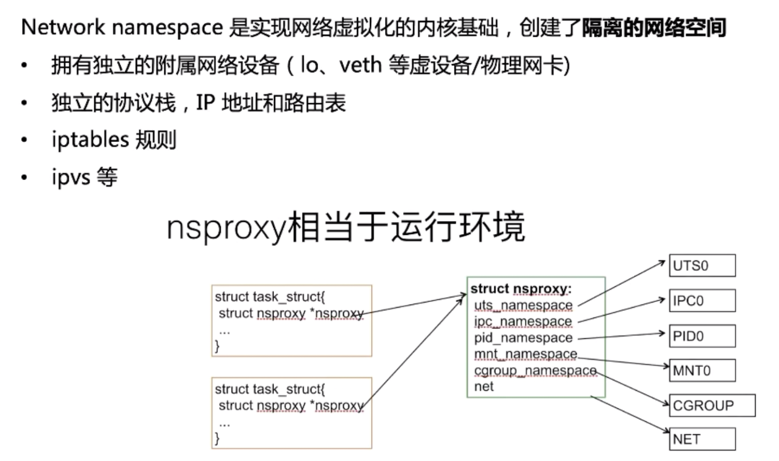

# k8s基本网络模型

分类：根据是否寄生在 Host 网络之上可以把容器网络方案大体分为 Underlay/Overlay 两大派别
    
    * Underlay 的标准是它与 Host 网络是同层的，从外在可见的一个特征就是它是不是使用了 Host 网络同样的网段、输入输出基础设备、容器的 IP 地址是不是需要与 Host 网络取得协同（来自同一个中心分配或统一划分）。这就是 Underlay；
    
    * Overlay 不一样的地方就在于它并不需要从 Host 网络的 IPM 的管理的组件去申请IP，一般来说，它只需要跟 Host 网络不冲突，这个 IP 可以自由分配的。

## Netns(network namespace)

Pod 与 Netns 的关系

## 主流网络方案
我们可以把云计算理解成一栋大楼，而这栋楼又可以分为顶楼、中间、低层三大块。那么我们就可以把Iass(基础设施)、Pass(平台)、Sass(软件)理解成这栋楼的三部分

### Flannel

它首先要解决的是 container 的包如何到达 Host，这里采用的是加一个 Bridge 的方式。
它的 backend 其实是独立的，也就是说这个包如何离开 Host，是采用哪种封装方式，还是不需要封装，都是可选择的

三种主要的 backend：

    * 一种是用户态的 udp，这种是最早期的实现；
    * 然后是内核的 Vxlan，这两种都算是 overlay 的方案。Vxlan 的性能会比较好一点，但是它对内核的版本是有要求的，需要内核支持 Vxlan 的特性功能；
    * 如果你的集群规模不够大，又处于同一个二层域，也可以选择采用 host-gw 的方式。这种方式的 backend 基本上是由一段广播路由规则来启动的，性能比较高

## Network Policy
定义：提供了基于策略的网络控制，用于隔离应用并减少攻击面。他使用标签选择器模拟传统的分段网络，并通过策略控制他们之间的流量和外部的流量。
注意：在使用network policy之前
    
    * apiserver需要开启extensions/v1beta1/networkpolicies
    * 网络插件需要支持networkpolicy
Configuration

    