# Service

## 为什么需要service

Kubernetes可以方便的为容器应用提供了一个持续运行且方便扩展的环境，但是，应用最终是要被用户或其他应用访问、调用的。要访问应用pod，就会有以下两个问题：

1. pod是有生命周期的。它会根据集群的期望状态不断的在创建、删除、更新，所以pod的ip也在不断变化，如何访问到不断变化的pod？
2. 通常一个应用不会单只有一个pod，而是由多个相同功能的pod共同提供服务的。那么对这个应用的访问，如何在多个pod中负载均衡？


service主要就是用来解决这两个问题的。简单来说，它是一个抽象的api对象，用来表示一组提供相同服务的pod及对这组pod的访问方式。

## Service：Kubernetes 中的服务返现与负载均衡
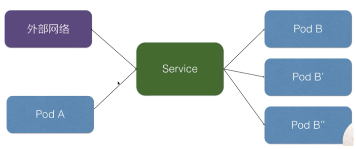
K8s 对接了另外一组 pod，即可以通过 K8s Service 的方式去负载均衡到一组 pod 上面去，这样相当于解决了前面所说的复发性问题，
或者提供了统一的访问入口去做服务发现，然后又可以给外部网络访问，解决不同的 pod 之间的访问，提供统一的访问地址


## 使用yaml格式
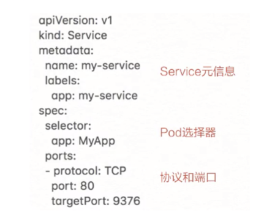

- 声明了一个名叫 my-service 的一个 K8s Service，它有一个 app:my-service 的 label，它选择了 app:MyApp 这样一个 label 的 pod 作为它的后端

- 最后是定义的服务发现的协议以及端口，这个示例中我们定义的是 TCP 协议，端口是 80，目的端口是 9376，效果是访问到这个 service 80 端口会被路由到后端的 targetPort，
就是只要访问到这个 service 80 端口的都会负载均衡到后端 app：MyApp 这种 label 的 pod 的 9376 端口

创建后查看service
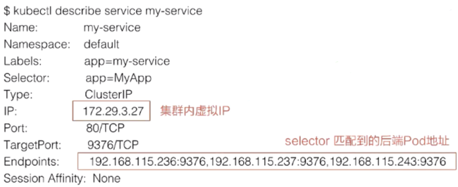

这个 IP 地址就是 service 的 IP 地址，这个 IP 地址在集群里面可以被其它 pod 所访问，相当于通过这个 IP 地址提供了统一的一个 pod 的访问入口，以及服务发现

Endpoints 的属性，就是我们通过 Endpoints 可以看到：通过前面所声明的 selector 去选择了哪些 pod？
以及这些 pod 都是什么样一个状态？比如说通过 selector，我们看到它选择了这些 pod 的一个 IP，以及这些 pod 所声明的 targetPort 的一个端口。

ClusterIP是svc的默认类型

## 请求代理的三种方式

### Userspace 模式
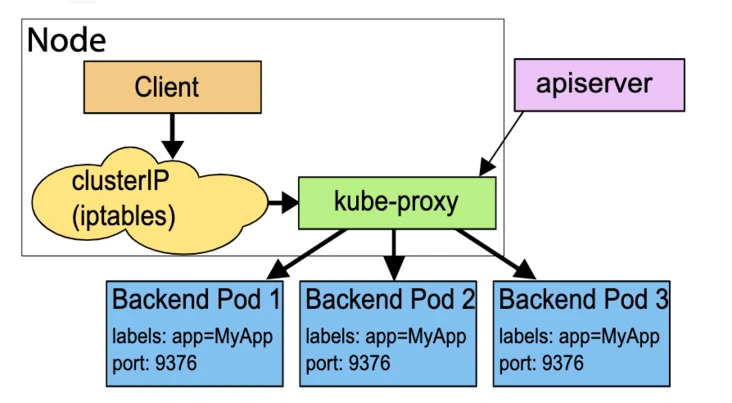
在这种模式下，kube-proxy为每个服务都打开一个随机的端口，所有访问这个端口的请求都会被转发到服务对应endpoints指定的后端。
最后，kube-proxy还会生成一条iptables规则，把访问cluster-ip的请求重定向到上面说的随机端口，最终转发到后端pod。

Userspace模式的代理转发主要依靠kube-proxy实现，工作在用户态。所以，转发效率不高。较为不推荐用该种模式

### iptables 模式
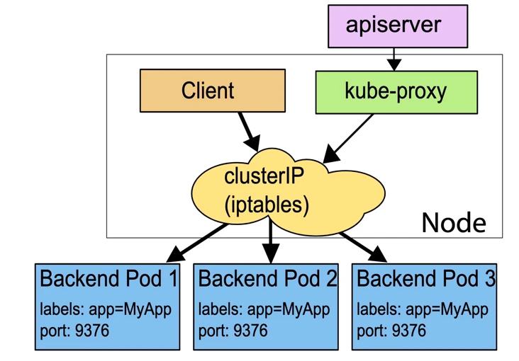

kube-proxy只动态地维护iptables，而转发完全靠iptables实现。由于iptables工作在内核态，不用在用户态与内核态切换，所以相比userspace模式更高效也更可靠。
但是每个服务都会生成若干条iptables规则，大型集群iptables规则数会非常多，造成性能下降也不易排查问题。

### ipvs 模式
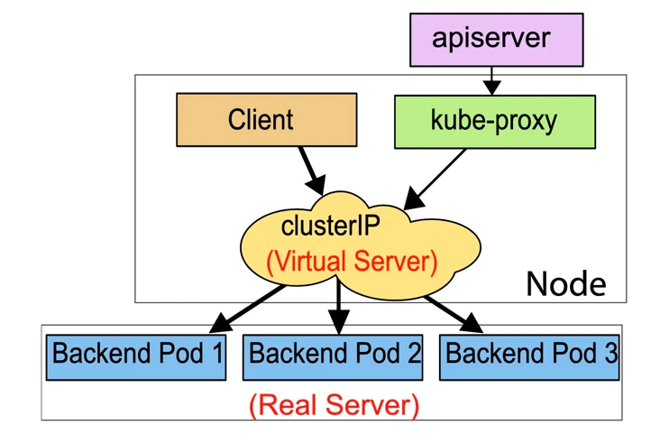
kube-proxy同样只动态跟踪后端endpoints的情况，然后调用netlink接口来生成ipvs规则。通过ipvs来转发请求.

ipvs同样工作在内核态，而且底层转发是依靠hash表实现，所以性能比iptables还要好的多，同步新规则也比iptables快。
同时，负载均衡的方式除了简单rr还有多种选择，所以很适合在大型集群使用。而缺点就是带来了额外的配置维护操作。


## 集群内访问 Service
三种方式

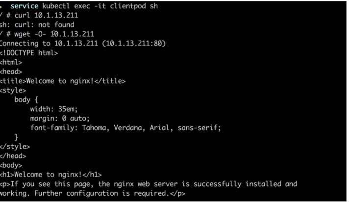

1. 首先我们可以通过 service 的虚拟 IP 去访问，比如说刚创建的 my-service 这个服务，通过 kubectl get svc 或者 kubectl describe service 都可以看到它的虚拟 IP 地址是 10.1.13.211，端口是 80，
然后就可以通过这个虚拟 IP 及端口在 pod 里面直接访问到这个 service 的地址。
     

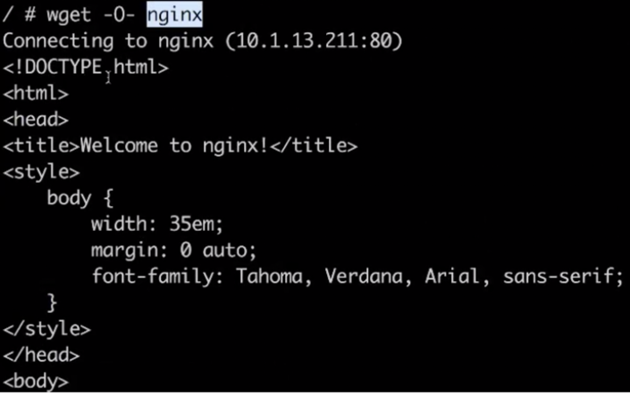
2. 第二种方式直接访问服务名，依靠 DNS 解析，就是同一个 namespace 里 pod 可以直接通过 service 的名字去访问到刚才所声明的这个 service。
    不同的 namespace 里面，我们可以通过 service 名字加“.”，然后加 service 所在的哪个 namespace 去访问这个 service，
    例如我们直接用 curl 去访问，就是 my-service:80 就可以访问到这个 service。
     

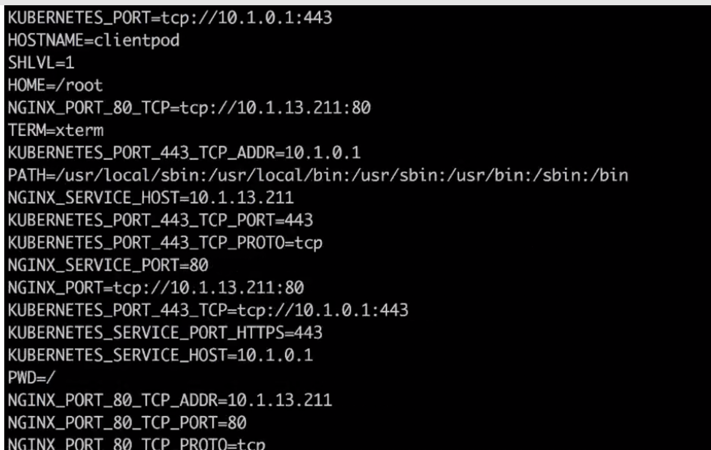
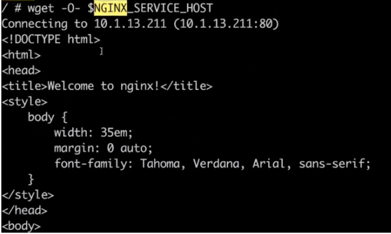
3. 第三种是通过环境变量访问，在同一个 namespace 里的 pod 启动时，K8s 会把 service 的一些 IP 地址、端口，以及一些简单的配置，
通过环境变量的方式放到 K8s 的 pod 里面。在 K8s pod 的容器启动之后，通过读取系统的环境变量比读取到 namespace 里面其他 service 配置的一个地址，
或者是它的端口号等等。比如在集群的某一个 pod 里面，可以直接通过 curl $ 取到一个环境变量的值，比如取到 MY_SERVICE_SERVICE_HOST 就是它的一个 IP 地址，
MY_SERVICE 就是刚才我们声明的 MY_SERVICE，SERVICE_PORT 就是它的端口号，这样也可以请求到集群里面的 MY_SERVICE 这个 service
    
## 几种特殊的service

### 1. service可以配置不止一个端口
```yaml
apiVersion: v1
kind: Service
metadata:
  name: my-service
spec:
  selector:
    app: MyApp
  ports:
  - name: http
    protocol: TCP
    port: 80
    targetPort: 9376
  - name: https
    protocol: TCP
    port: 443
    targetPort: 9377
```
这个service保留了80与443端口，分别对应pod的9376与9377端口。这里需要注意的是，pod的每个端口一定指定name字段（默认是default）

### 2. Headless Service
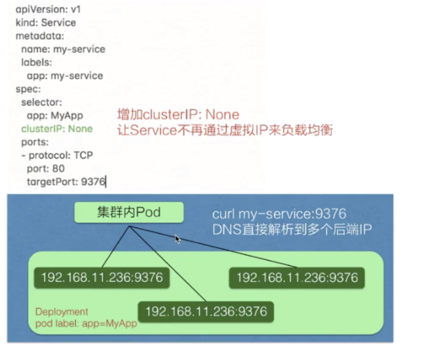  

service 有一个特别的形态就是 Headless Service。service 创建的时候可以指定 clusterIP:None，告诉 K8s 说我不需要 clusterIP（就是刚才所说的集群里面的一个虚拟 IP），
然后 K8s 就不会分配给这个 service 一个虚拟 IP 地址，它没有虚拟 IP 地址怎么做到负载均衡以及统一的访问入口呢？

交予DNS完成。具体又分为2种情况
- 有配置selector： 这时候，endpoint控制器会为服务生成对应pod的endpoint对象。service对应的DNS返回的是endpoint对应后端的集合。
- 没有配置selector：这时候，endpoint控制器不会自动为服务生成对应pod的endpoint对象。若服务有配置了externalname，则生成一套cnmae记录，指向externalname。如果没有配置，就需要手动创建一个同名的endpoint对象。dns服务会创建一条A记录指向endpoint对应后端

### 3. External IPs
如果有个非node本地的IP地址，可以通过比如外部负载均衡的vip等方式被路由到任意一台node节点，那就可以通过配置service的externalIPs字段，通过这个IP地址访问到服务。
集群以这个IP为目的IP的请求时，会把请求转发到对应服务。
```yaml
apiVersion: v1
kind: Service
metadata:
  name: my-service
spec:
  selector:
    app: MyApp
  ports:
  - name: http
    protocol: TCP
    port: 80
    targetPort: 9376
  externalIPs:
  - 80.11.12.10
```

这里的80.11.12.10就是一个不由kubernetes维护的公网IP地址，通过80.11.12.10:80就可以访问到服务对应的pod。


## 向集群外暴露 Service

### 1. NodePort
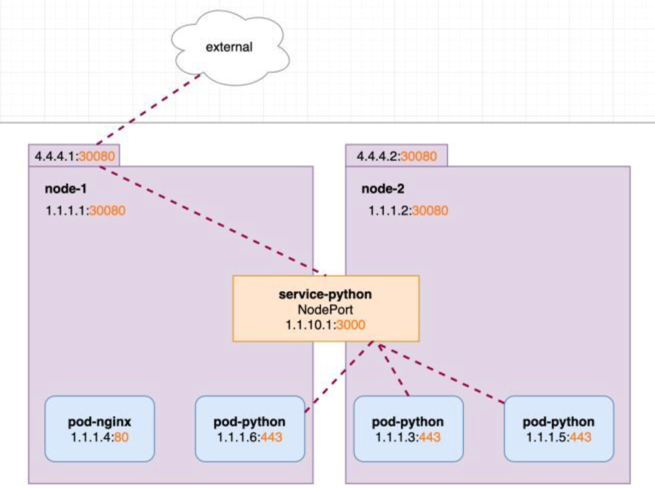
```yaml
apiVersion: v1
kind: Service
metadata:
  name: service-python
spec:
  ports:
  - port: 3000
    protocol: TCP
    targetPort: 443
    nodePort: 30080
  selector:
    run: pod-python
  type: NodePort
```
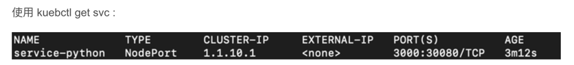
NodePort 的方式就是在集群的 node 上面（即集群的节点的宿主机上面）去暴露节点上的一个端口，这样相当于在节点的一个端口上面访问到之后就会再去做一层转发，
转发到虚拟的 IP 地址上面，就是刚刚宿主机上面 service 虚拟 IP 地址。此时我们可以通过http://4.4.4.1:30080或http://4.4.4.2:30080 对pod-python访问。该端口有一定的范围，比如默认Kubernetes 控制平面将在--service-node-port-range标志指定的范围内分配端口（默认值：30000-32767）。
  


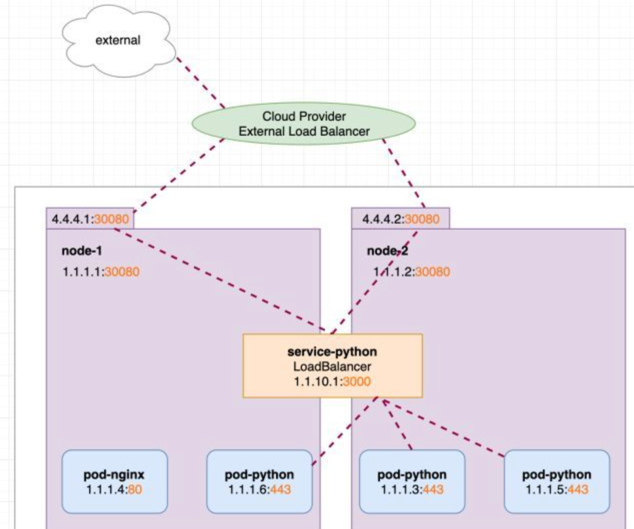

### 2. LoadBalance
LoadBalancer 类型就是在 NodePort 上面又做了一层转换，刚才所说的 NodePort 其实是集群里面每个节点上面一个端口，LoadBalancer 是在所有的节点前又挂一个负载均衡。
    比如在阿里云上挂一个 SLB，这个负载均衡会提供一个统一的入口，并把所有它接触到的流量负载均衡到每一个集群节点的 node pod 上面去。然后 node pod 再转化成 ClusterIP，去访问到实际的 pod 上面。
   LoadBalancer类型的service 是可以实现集群外部访问服务的另外一种解决方案。不过并不是所有的k8s集群都会支持，大多是在公有云托管集群中会支持该类型。
```yaml
apiVersion: v1
kind: Service
metadata:
  name: service-python
spec:
  ports:
  - port: 3000
    protocol: TCP
    targetPort: 443
    nodePort: 30080
  selector:
    run: pod-python
  type: LoadBalancer
```    
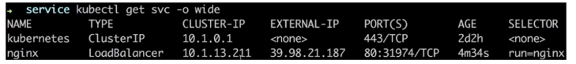
  
  
### 3. ExternalName
当ServiceType被配置为这种方式时，该服务的目的就不是为了外部访问了，而是为了方便集群内部访问外部资源。
举个例子，假如目前集群的pod要访问一组DB资源，而DB是部署在集群外部的物理机，还没有容器化，可以配置这么一个服务
```yaml
apiVersion: v1
kind: Service
metadata:
  name: dbserver
  namespace: default
spec:
  type: ExternalName
  externalName: database.abc.com
```


##  架构设计
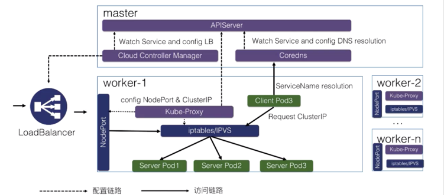

k8s 分为 master 节点和 worker 节点：
     
- master 里面主要是 K8s 管控的内容；
- worker 节点里面是实际跑用户应用的一个地方

最关键的有三个组件

一个是 Cloud Controller Manager，负责去配置 LoadBalancer 的一个负载均衡器给外部去访问；
另外一个就是 Coredns，就是通过 Coredns 去观测 APIServer 里面的 service 后端 pod 的一个变化，去配置 service 的 DNS 解析，实现可以通过 service 的名字直接访问到 service 的虚拟 IP，或者是 Headless 类型的 Service 中的 IP 列表的解析；
然后在每个 node 里面会有 kube-proxy 这个组件，它通过监听 service 以及 pod 变化，然后实际去配置集群里面的 node pod 或者是虚拟 IP 地址的一个访问。

实际访问链路？

比如说从集群内部的一个 Client Pod3 去访问 Service，就类似于刚才所演示的一个效果。
Client Pod3 首先通过 Coredns 这里去解析出 ServiceIP，Coredns 会返回给它 ServiceName 所对应的 service IP 是什么，这个 Client Pod3 就会拿这个 Service IP 去做请求，
它的请求到宿主机的网络之后，就会被 kube-proxy 所配置的 iptables 或者 IPVS 去做一层拦截处理，之后去负载均衡到每一个实际的后端 pod 上面去，这样就实现了一个负载均衡以及服务发现。


对于外部的流量，比如说刚才通过公网访问的一个请求。它是通过外部的一个负载均衡器 Cloud Controller Manager 去监听 service 的变化之后，
去配置的一个负载均衡器，然后转发到节点上的一个 NodePort 上面去，NodePort 也会经过 kube-proxy 的一个配置的一个 iptables，
把 NodePort 的流量转换成 ClusterIP，紧接着转换成后端的一个 pod 的 IP 地址，去做负载均衡以及服务发现。这就是整个 K8s 服务发现以及 K8s Service 整体的结构