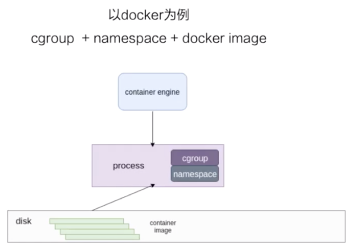
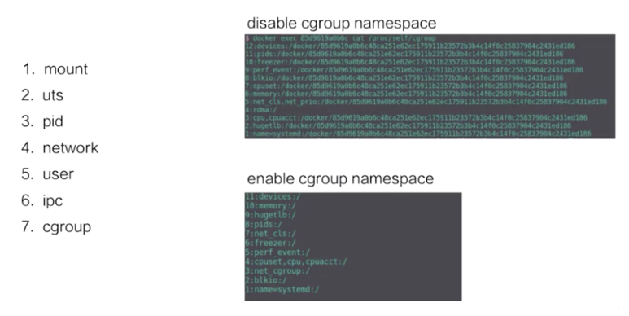
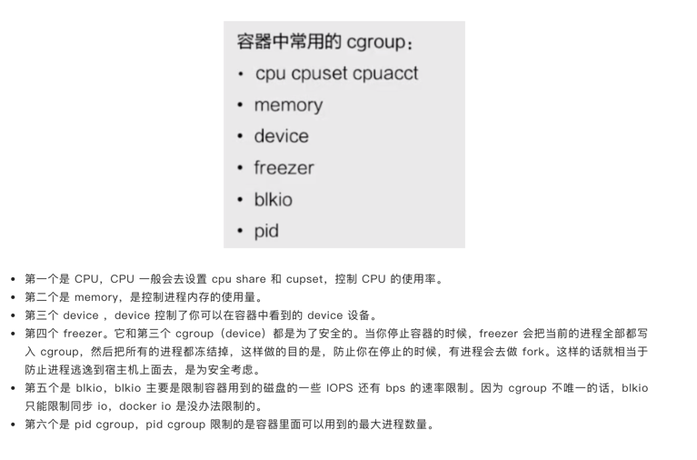
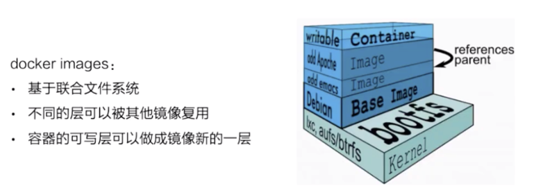
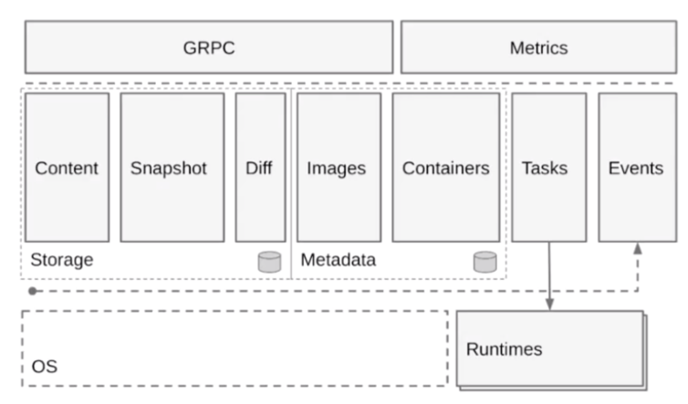
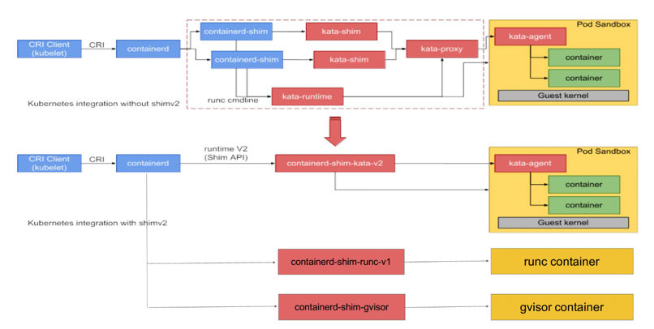
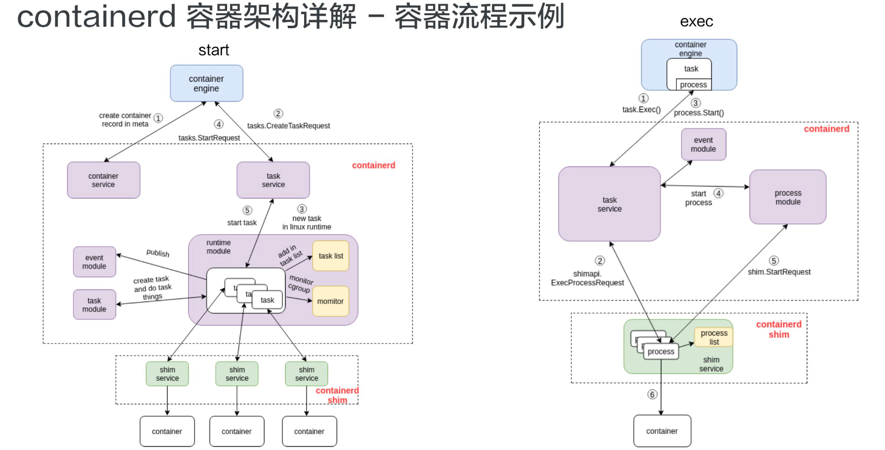

# Linux容器
容器是一种轻量级的虚拟化技术，因为它跟虚拟机比起来，它少了一层 hypervisor 层。先看一下下面这张图，这张图简单描述了一个容器的启动过程.

    
    最下面是一个磁盘，容器的镜像是存储在磁盘上面的。上层是一个容器引擎，容器引擎可以是 docker，也可以是其它的容器引擎。
    引擎向下发一个请求，比如说创建容器，然后这时候它就把磁盘上面的容器镜像，运行成在宿主机上的一个进程。
    
    对于容器来说，最重要的是怎么保证这个进程所用到的资源是被隔离和被限制住的，在 Linux 内核上面是由 cgroup 和 namespace 这两个技术来保证的
## 资源隔离和限制

namespace 是用来做资源隔离的，在 Linux 内核上有七种 namespace，docker 中用到了前六种。
第七种 cgroup namespace 在 docker 本身并没有用到，但是在 runC 实现中实现了 cgroup namespace

    第一个是 mout namespace。mout namespace 就是保证容器看到的文件系统的视图，是容器镜像提供的一个文件系统，也就是说它看不见宿主机上的其他文件，
    除了通过 -v 参数 bound 的那种模式，是可以把宿主机上面的一些目录和文件，让它在容器里面可见的。

    第二个是 uts namespace，这个 namespace 主要是隔离了 hostname 和 domain。

    第三个是 pid namespace，这个 namespace 是保证了容器的 init 进程是以 1 号进程来启动的。

    第四个是网络 namespace，除了容器用 host 网络这种模式之外，其他所有的网络模式都有一个自己的 network namespace 的文件。

    第五个是 user namespace，这个 namespace 是控制用户 UID 和 GID 在容器内部和宿主机上的一个映射，不过这个 namespace 用的比较少。

    第六个是 IPC namespace，这个 namespace 是控制了进程兼通信的一些东西，比方说信号量。

    第七个是 cgroup namespace，上图右边有两张示意图，分别是表示开启和关闭 cgroup namespace。
    用 cgroup namespace 带来的一个好处是容器中看到的 cgroup 视图是以根的形式来呈现的，这样的话就和宿主机上面进程看到的 cgroup namespace 的一个视图方式是相同的。
    另外一个好处是让容器内部使用 cgroup 会变得更安全。
两种 cgroup 驱动

    cgroup 主要是做资源限制的，docker 容器有两种 cgroup 驱动：一种是 systemd 的，另外一种是 cgroupfs 的
    cgroupfs 比较好理解。比如说要限制内存是多少，要用 CPU share 为多少，其实直接把 pid 写入对应的一个 cgroup 文件，
    然后把对应需要限制的资源也写入相应的 memory cgroup 文件和 CPU 的 cgroup 文件就可以了。

    另外一个是 systemd 的一个 cgroup 驱动。这个驱动是因为 systemd 本身可以提供一个 cgroup 管理方式。所以如果用 systemd 做 cgroup 驱动的话，
    所有的写 cgroup 操作都必须通过 systemd 的接口来完成，不能手动更改 cgroup 的文件
## 容器镜像的构成

docker 镜像是基于联合文件系统的。简单描述一下联合文件系统：大概的意思就是说，它允许文件是存放在不同的层级上面的，但是最终是可以通过一个统一的视图，看到这些层级上面的所有文件

这张图非常形象的表明了 docker 的存储，docker 存储也就是基于联合文件系统，是分层的。每一层是一个 Layer，这些 Layer 由不同的文件组成，它是可以被其他镜像所复用的。
可以看一下，当镜像被运行成一个容器的时候，最上层就会是一个容器的读写层。这个容器的读写层也可以通过 commit 把它变成一个镜像顶层最新的一层
### 以 overlay 为例

    最下层是一个 lower 层，也就是镜像层，它是一个只读层。右上层是一个 upper 层，upper 是容器的读写层，upper 层采用了写实复制的机制，
    也就是说只有对某些文件需要进行修改的时候才会从 lower 层把这个文件拷贝上来，之后所有的修改操作都会对 upper 层的副本进行修改。

    upper 并列的有一个 workdir，它的作用是充当一个中间层的作用。也就是说，当对 upper 层里面的副本进行修改时，会先放到 workdir，
    然后再从 workdir 移到 upper 里面去，这个是 overlay 的工作机制。

    最上面的是 mergedir，是一个统一视图层。从 mergedir 里面可以看到 upper 和 lower 中所有数据的整合，然后我们 docker exec 到容器里面，
    看到一个文件系统其实就是 mergedir 统一视图层

### containerd容器引擎的构成

按照水平层次来看的话:
    
    1.第一层是 GRPC，containerd 对于上层来说是通过 GRPC serve 的形式来对上层提供服务的。Metrics 这个部分主要是提供 cgroup Metrics 的一些内容。

    2.下面这层的左边是容器镜像的一个存储，中线 images、containers 下面是 Metadata，这部分 Matadata 是通过 bootfs 存储在磁盘上面的。
    右边的 Tasks 是管理容器的容器结构，Events 是对容器的一些操作都会有一个 Event 向上层发出，然后上层可以去订阅这个 Event，由此知道容器状态发生什么变化。

    3.最下层是 Runtimes 层，这个 Runtimes 可以从类型区分，比如说 runC 或者是安全容器之类的。

### shim v1/v2

### 容器流程start和exec
