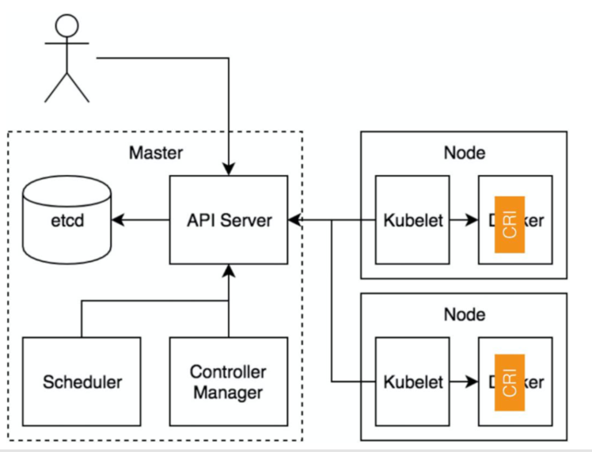

# Container Runtime Interface (CRI)

跟容器最相关的一个 Manager 是 Generic Runtime Manager，就是一个通用的运行时管理器。
我们可以看到目前 dockershim 还是存在于 Kubelet 的代码中的，它是当前性能最稳定的一个容器运行时的实现。
remote 指的就是 CRI 接口。CRI 接口主要包含两个部分
* 一个是 CRI Server，即通用的比如说创建、删除容器这样的接口；
* 另外一个是流式数据的接口 Streaming Server，比如 exec、port-forward 这些流式数据的接口

## 通过 CRI 操作容器的生命周期

流程
1. 首先调用 RunPodSandbox 接口来创建一个 Pod 容器，Pod 容器是用来持有容器的相关资源的，比如说网络空间、PID空间、进程空间等资源；
2. 然后调用 CreatContainer 接口在 Pod 容器的空间创建业务容器；
3. 再调用 StartContainer 接口启动容器，相对应的销毁容器的接口为 StopContainer 与 RemoveContaine

## CRI streaming 接口
举例流式接口 exec：

它可以用来在容器内部执行一个命令，又或者说可以 attach 到容器的 IO 流中做各种交互式的命令。
它的特别之处在于，一个是节省资源，另一个是连接的可靠性

首先 exec 操作会发送到 apiserver，经过鉴权，apiserver 将对 Kubelet Server 发起 exec 的请求，
然后 Kubelet 会调用 CRI 的 exec 接口将具体的请求发至容器的运行时。这个时候，容器运行时不是直接地在 exec 接口上来服务这次请求，而是通过我们的 streaming server 来异步地返回每一次执行的结果。
也就是说 apiserver 其实实际上是跟 streaming server 交互来获取我们的流式数据的。这样一来让我们的整个 CRI Server 接口更轻量、更可靠

### 目前 CRI 的一些实现

* CRI-containerd
* CRI-O  ：红帽公司
* CouchContainer @alibaba

docker由 docker-client ,dockerd,containerd,docker-shim,runc组成，所以containerd是docker的基础组件之一，
docker 对容器的管理和操作基本都是通过 containerd 完成的。 那么，containerd 是什么呢？

Containerd 是一个工业级标准的容器运行时（Container Runtime Interface），它强调简单性、健壮性和可移植性。Containerd 可以在宿主机中管理完整的容器生命周期：容器镜像的传输和存储、容器的执行和管理、存储和网络等。
详细点说，Containerd 负责干下面这些事情：

* 管理容器的生命周期(从创建容器到销毁容器)
* 拉取/推送容器镜像
* 存储管理(管理镜像及容器数据的存储)
* 调用 runC 运行容器(与 runC 等容器运行时交互)
* 管理容器网络接口及网络

### Containerd结构

这里的 Meta services、Runtime service 与 Storage service 都是 containerd 提供的接口。
它们是通用的容器相关的接口，包括镜像管理、容器运行时管理等。CRI 在这之上包装了一个 gRPC 的服务。
右侧就是具体的容器的实现，比如说，创建容器时就要创建具体的 runtime 和它的 shim，它们和 Container 一起组成了一个 Pod Sandbox。

CRI-containerd 的一个好处是，containerd 还额外实现了更丰富的容器接口，所以它可以用 containerd 提供的 ctr 工具来调用这些丰富的容器运行时接口，而不只是 CRI 接口