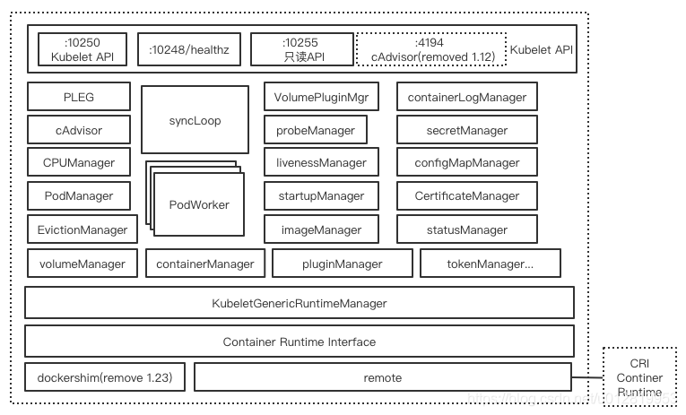

# kubelet
在k8s集群中的每个节点上都运行着一个kubelet服务进程，其主要负责向apiserver注册节点、管理pod及pod中的容器，并通过 cAdvisor 监控节点和容器的资源。

- 节点管理：节点注册、节点状态更新(定期心跳)
- pod管理：接受来自apiserver、file、http等PodSpec，并确保这些 PodSpec 中描述的容器处于运行状态且运行状况良好
- 容器健康检查：通过ReadinessProbe、LivenessProbe两种探针检查容器健康状态
- 资源监控：通过 cAdvisor 获取其所在节点及容器的监控数据

## kubelet组件模块

- Pleg(Pod Lifecycle Event Generator) 是kubelet 的核心模块，PLEG周期性调用container runtime获取本节点containers/sandboxes的信息(像docker ps)，并与自身维护的pods cache信息进行对比，生成对应的 PodLifecycleEvent并发送到plegCh中，在kubelet syncLoop中对plegCh进行消费处理，最终达到用户的期望状态
- podManager提供存储、访问Pod信息的接口，维护static pod和mirror pod的映射关系
- containerManager 管理容器的各种资源，比如 CGroups、QoS、cpuset、device 等
- KubeletGenericRuntimeManager是容器运行时的管理者，负责于 CRI 交互，完成容器和镜像的管理； 
- statusManager负责维护pod状态信息并负责同步到apiserver
- probeManager负责探测pod状态，依赖statusManager、statusManager、livenessManager、startupManager
- cAdvisor是google开源的容器监控工具，集成在kubelet中，收集节点与容器的监控信息，对外提供查询接口
- volumeManager 管理容器的存储卷，比如格式化资盘、挂载到 Node 本地、最后再将挂载路径传给容器

## 深入kubelet工作原理