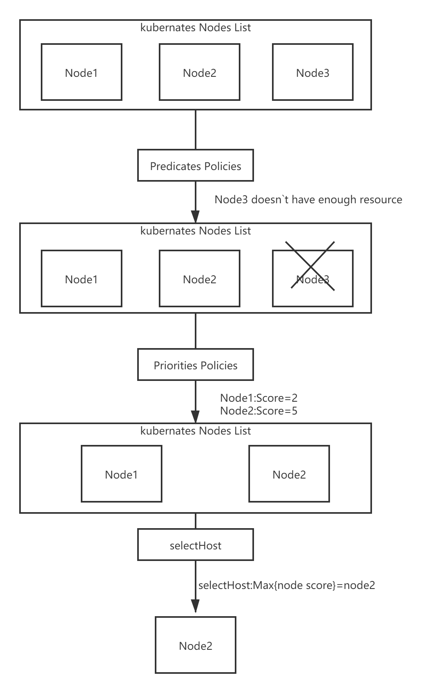

# 调度器

调度器的主要职责，就是为一个新创建出来的 Pod，寻找一个最合适的节点（Node）。kube-scheduler 就是 Kubernetes 集群的默认调度器

默认调度器会首先调用一组Filter过滤器，也就是使用相应的Predicates的调度算法来进行过滤。然后，再调用一组叫作 Priority 的调度算法，来给上一步得到的结果里的每个 Node 打分，然后根据打分来对Node进行排序，找出最优节点，如果多个节点都有最高的优先级分数，那么则循环分配，确保平均分配给pod。

调度算法执行完成后，调度器就需要将 Pod 对象的 nodeName 字段的值，修改为上述 Node 的名字。

Filter过滤器的作用主要是从当前集群的所有节点中，“过滤”出一系列符合条件的节点，有如下几种调度策略：

1. GeneralPredicates

这一组过滤规则，负责的是最基础的调度策略。比如，计算宿主机的 CPU 和内存资源等是否够用； ，等等。

2. Volume过滤规则

这一组过滤规则，负责的是跟容器持久化 Volume 相关的调度策略。如：检查多个 Pod 声明挂载的持久化 Volume 是否有冲突；检查一个节点上某种类型的持久化 Volume 是不是已经超过了一定数目；检查Pod 对应的 PV 的 nodeAffinity 字段，是否跟某个节点的标签相匹配等等。

3. 检查调度 Pod 是否满足 Node 本身的某些条件

如PodToleratesNodeTaints负责检查的就是我们前面经常用到的 Node 的“污点”机制。NodeMemoryPressurePredicate，检查的是当前节点的内存是不是已经不够充足。

4. 检查亲密与反亲密关系

检查待调度 Pod 与 Node 上的已有 Pod 之间的亲密（affinity）和反亲密（anti-affinity）关系。

在调用Filter过滤器的时候需要关注整个集群的信息，Kubernetes 调度器会在为每个待调度 Pod 执行该调度算法之前，先将算法需要的集群信息初步计算一遍，然后缓存起来。这样也可以加快执行速度。

而Priorities里的打分规则包含如：空闲资源（CPU 和 Memory）多的宿主机可以得高权重；CPU和Memory使用都比较均衡则可以得高权重；为了避免这个算法引发调度堆叠如果大镜像分布的节点数目很少，那么这些节点的权重就会被调低等