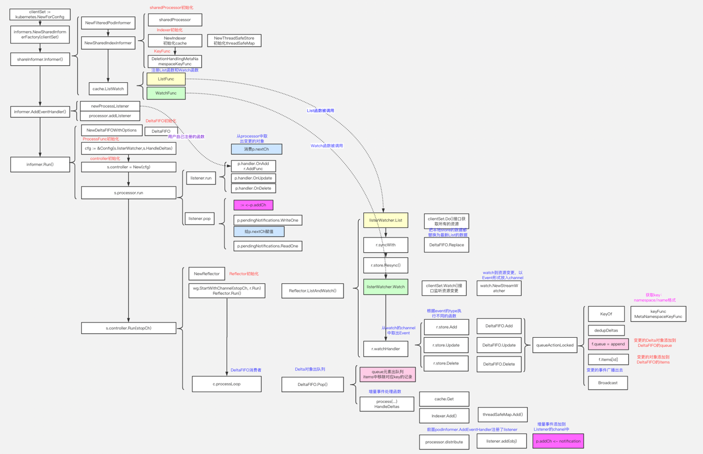
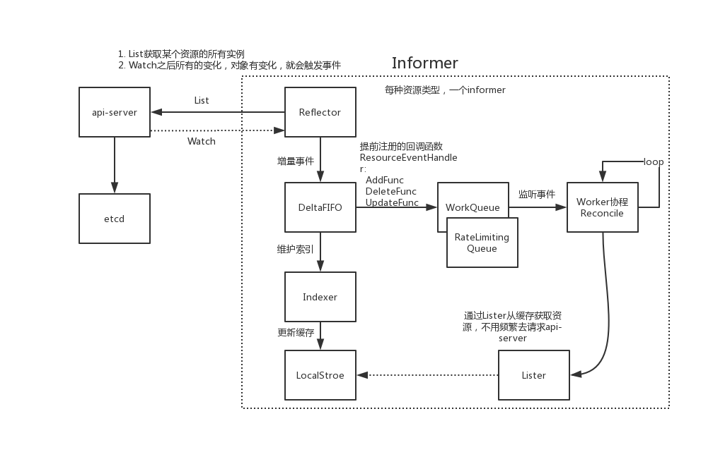
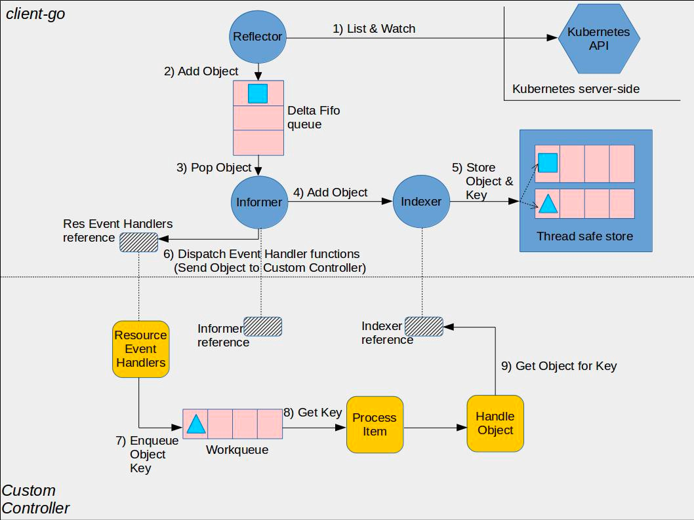
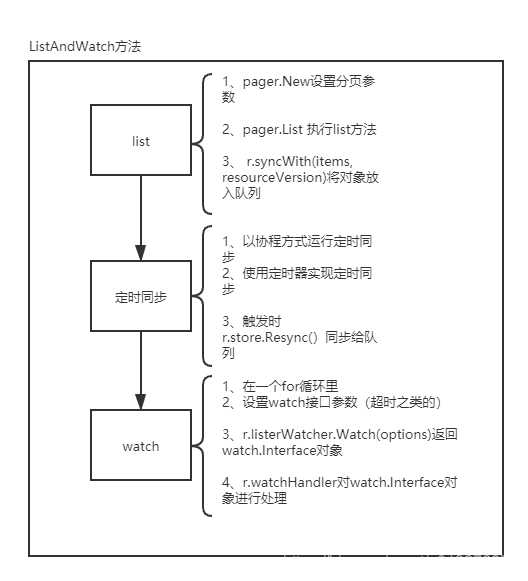
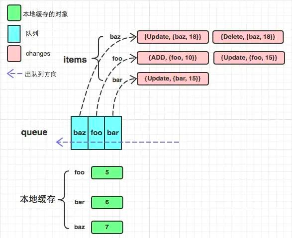
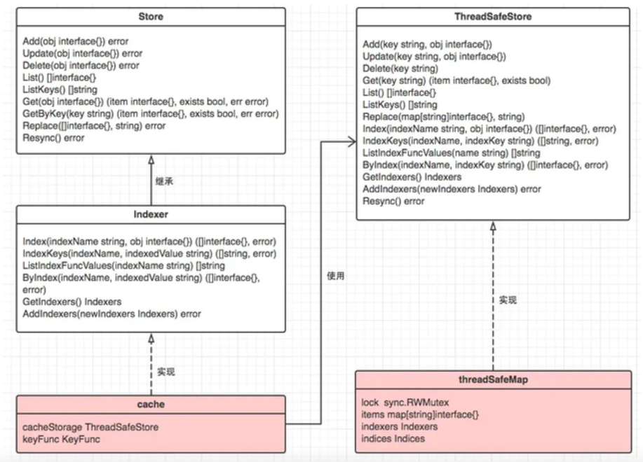

# Informer机制

参考高清图：https://www.processon.com/view/link/5f55f3f3e401fd60bde48d31


Informer 是 client-go 中的核心工具包，已经被 kubernetes 中众多组件所使用。
所谓 Informer，其实就是一个带有本地缓存和索引机制的、可以注册 EventHandler 的 client，本地缓存被称为 Store，索引被称为 Index。
使用 informer 的目的是为了减轻 apiserver 数据交互的压力而抽象出来的一个 cache 层, 客户端对 apiserver 数据的 "读取" 和 "监听" 操作都通过本地 informer 进行

## 为什么需要 Informer 机制？
我们知道Kubernetes各个组件都是通过REST API跟API Server交互通信的，而如果每次每一个组件都直接跟API Server交互去读取/写入到后端的etcd的话，会对API Server以及etcd造成非常大的负担。
而Informer机制是为了保证各个组件之间通信的实时性、可靠性，并且减缓对API Server和etcd的负担

## Informer 的主要功能：

- 同步数据到本地缓存
- 根据对应的事件类型，触发事先注册好的 ResourceEventHandle


## Informer 需要满足哪些要求？

- 消息可靠性
- 消息实时性
- 消息顺序性
- 高性能

## Informer运行原理

各个组件包括：

- Reflector：用于监控（watch）指定的资源，当监控的资源发生变化时，触发相应的变更事件,例如Add事件、Update事件和Delete事件。并将资源对象存放到本地缓存DeltaFIFO中
- DeltaFIFO：对资源对象的的操作类型进行队列的基本操作
  - FIFO：先进先出队列，提供资源对象的增删改查等操作
  - Delta：资源对象存储，可以保存资源对象的操作类型。如：添加操作类型、更新操作类型、删除操作类型、同步操作类型
- Indexer：存储资源对象，并自带索引功能的本地存储。
  - Reflect从DeltaFIFO中将消费出来的资源对象存储至Indexer
  - Indexer中的数据与Etcd完全一致，client-go可以从本地读取，减轻etcd和api-server的压力

## Informer的工作流程

黄色的部分是controller相关的框架，包括workqueue。蓝色部分是client-go的相关内容，包括informer, reflector(其实就是informer的封装), indexer。

1. Informer 首先会 list/watch apiserver，Informer 所使用的 Reflector 包负责与 apiserver 建立连接，Reflector 使用 ListAndWatch 的方法，
会先从 apiserver 中 list 该资源的所有实例，list 会拿到该对象最新的 resourceVersion，然后使用 watch 方法监听该 resourceVersion 之后的所有变化，
若中途出现异常，reflector 则会从断开的 resourceVersion 处重现尝试监听所有变化，一旦该对象的实例有创建、删除、更新动作，Reflector 都会收到"事件通知"，
这时，该事件及它对应的 API 对象这个组合，被称为增量（Delta），它会被放进 DeltaFIFO 中。

2. Informer 会不断地从这个 DeltaFIFO 中读取增量，每拿出一个对象，Informer 就会判断这个增量的时间类型，然后创建或更新本地的缓存，也就是 store。

3. 如果事件类型是 Added（添加对象），那么 Informer 会通过 Indexer 的库把这个增量里的 API 对象保存到本地的缓存中，并为它创建索引，若为删除操作，则在本地缓存中删除该对象。

4. DeltaFIFO 再 pop 这个事件到 controller 中，controller 会调用事先注册的 ResourceEventHandler 回调函数进行处理。

5. 在 ResourceEventHandler 回调函数中，其实只是做了一些很简单的过滤，然后将关心变更的 Object 放到 workqueue 里面。

6. Controller 从 workqueue 里面取出 Object，启动一个 worker 来执行自己的业务逻辑，业务逻辑通常是计算目前集群的状态和用户希望达到的状态有多大的区别，
然后孜孜不倦地让 apiserver 将状态演化到用户希望达到的状态，比如为 deployment 创建新的 pods，或者是扩容/缩容 deployment。

7. 在worker中就可以使用 lister 来获取 resource，而不用频繁的访问 apiserver，因为 apiserver 中 resource 的变更都会反映到本地的 cache 中。


### List & Watch


List所做的，就是向API Server发送一个http短链接请求，罗列所有目标资源的对象。而Watch所做的是实际的“监听”工作，通过http长链接的方式，其与API Server能够建立一个持久的监听关系，当目标资源发生了变化时，API Server会返回一个对应的事件，从而完成一次成功的监听，之后的事情便交给后面的handler来做。

这样一个List & Watch机制，带来了如下几个优势：
- 事件响应的实时性：通过Watch的调用，当API Server中的目标资源产生变化时，能够及时的收到事件的返回，从而保证了事件响应的实时性。而倘若是一个轮询的机制，其实时性将受限于轮询的时间间隔。

- 事件响应的可靠性：倘若仅调用Watch，则如果在某个时间点连接被断开，就可能导致事件被丢失。List的调用带来了查询资源期望状态的能力，客户端通过期望状态与实际状态的对比，可以纠正状态的不一致。二者结合保证了事件响应的可靠性。

- 高性能：倘若仅周期性地调用List，轮询地获取资源的期望状态并在与当前状态不一致时执行更新，自然也可以do the job。但是高频的轮询会大大增加API Server的负担，低频的轮询也会影响事件响应的实时性。Watch这一异步消息机制的结合，在保证了实时性的基础上也减少了API Server的负担，保证了高性能。

- 事件处理的顺序性：我们知道，每个资源对象都有一个递增的ResourceVersion，唯一地标识它当前的状态是“第几个版本”，每当这个资源内容发生变化时，对应产生的事件的ResourceVersion也会相应增加。在并发场景下，K8s可能获得同一资源的多个事件，由于K8s只关心资源的最终状态，因此只需要确保执行事件的ResourceVersion是最新的，即可确保事件处理的顺序性。


### 二级缓存
二级缓存属于 Informer 的底层缓存机制，这两级缓存分别是 DeltaFIFO 和 LocalStore。这两级缓存的用途各不相同。DeltaFIFO 用来存储 Watch API 返回的各种事件 ，LocalStore 只会被 Lister 的 List/Get 方法访问 。

如果K8s每次想查看资源对象的状态，都要经历一遍List调用，显然对 API Server 也是一个不小的负担，对此，一个容易想到的方法是使用一个cache作保存，需要获取资源状态时直接调cache，当事件来临时除了响应事件外，也对cache进行刷新。

虽然 Informer 和 Kubernetes 之间没有 resync 机制，但 Informer 内部的这两级缓存之间存在 resync 机制。


### Resync

Resync 机制会将 Indexer 的本地缓存重新同步到 DeltaFIFO 队列中。一般我们会设置一个时间周期，让 Indexer 周期性地将缓存同步到队列中。
直接 list/watch API Server 就已经能拿到集群中资源对象变化的 event 了

## 源码
client-go 中提供了几种不同的 Informer：

- 通过调用 NewInformer 函数创建一个简单的不带 indexer 的 Informer。

- 通过调用 NewIndexerInformer 函数创建一个简单的带 indexer 的 Informer。

- 通过调用 NewSharedIndexInformer 函数创建一个 Shared 的 Informer。

- 通过调用 NewDynamicSharedInformerFactory 函数创建一个为 Dynamic 客户端的 Shared 的 Informer


这里的 Shared 的 Informer 引入，其实是因为随着 K8S 中，相同资源的监听者在不断地增加，
从而导致很多调用者通过 Watch API 对 API Server 建立一个长连接去监听事件的变化，这将严重增加了 API Server 的工作负载，及资源的浪费。


### SharedInformer
我们平时说的 Informer 其实就是 SharedInformer，它是可以共享使用的。如果同一个资源的 Informer 被实例化多次，那么就会运行多个 ListAndWatch 操作，这会加大 APIServer 的压力。而 SharedInformer 通过一个 map 来让同一类资源的 Informer 实现共享一个 Refelctor，这样就不会出现上面这个问题了。

Informer通过Local Store缓存目标资源对象，且仅为自己所用。但是在K8s中，一个Controller可以关心不止一种资源，使得多个Controller所关心的资源彼此会存在交集。如果几个Controller都用自己的Informer来缓存同一个目标资源，显然会导致不小的空间开销，因此K8s引入了SharedInformer来解决这个问题。

SharedInformer拥有为多个Controller提供一个共享cache的能力，从而避免资源缓存的重复、减小空间开销。除此之外，一个SharedInformer对一种资源只建立一个与API Server的Watch监听，且能够将监听得到的事件分发给下游所有感兴趣的Controller，这也显著地减少了API Server的负载压力。实际上，K8s中广泛使用的都是SharedInformer，Informer则出场甚少。

```go
type SharedInformer interface {
	// AddEventHandler adds an event handler to the shared informer using the shared informer's resync
	// period.  Events to a single handler are delivered sequentially, but there is no coordination
	// between different handlers.
	AddEventHandler(handler ResourceEventHandler)
	// AddEventHandlerWithResyncPeriod adds an event handler to the
	// shared informer with the requested resync period; zero means
	// this handler does not care about resyncs.  The resync operation
	// consists of delivering to the handler an update notification
	// for every object in the informer's local cache; it does not add
	// any interactions with the authoritative storage.  Some
	// informers do no resyncs at all, not even for handlers added
	// with a non-zero resyncPeriod.  For an informer that does
	// resyncs, and for each handler that requests resyncs, that
	// informer develops a nominal resync period that is no shorter
	// than the requested period but may be longer.  The actual time
	// between any two resyncs may be longer than the nominal period
	// because the implementation takes time to do work and there may
	// be competing load and scheduling noise.
	AddEventHandlerWithResyncPeriod(handler ResourceEventHandler, resyncPeriod time.Duration)
	// GetStore returns the informer's local cache as a Store.
	GetStore() Store
	// GetController is deprecated, it does nothing useful
	GetController() Controller
	// Run starts and runs the shared informer, returning after it stops.
	// The informer will be stopped when stopCh is closed.
	Run(stopCh <-chan struct{})
	// HasSynced returns true if the shared informer's store has been
	// informed by at least one full LIST of the authoritative state
	// of the informer's object collection.  This is unrelated to "resync".
	HasSynced() bool
	// LastSyncResourceVersion is the resource version observed when last synced with the underlying
	// store. The value returned is not synchronized with access to the underlying store and is not
	// thread-safe.
	LastSyncResourceVersion() string

	// The WatchErrorHandler is called whenever ListAndWatch drops the
	// connection with an error. After calling this handler, the informer
	// will backoff and retry.
	//
	// The default implementation looks at the error type and tries to log
	// the error message at an appropriate level.
	//
	// There's only one handler, so if you call this multiple times, last one
	// wins; calling after the informer has been started returns an error.
	//
	// The handler is intended for visibility, not to e.g. pause the consumers.
	// The handler should return quickly - any expensive processing should be
	// offloaded.
	SetWatchErrorHandler(handler WatchErrorHandler) error
}
```

### SharedIndexInformer
SharedIndexInformer 扩展了 SharedInformer 接口，提供了构建索引的能力。
```go
type SharedIndexInformer interface {
	SharedInformer
	// AddIndexers add indexers to the informer before it starts.
	AddIndexers(indexers Indexers) error
	GetIndexer() Indexer
}
```

### ListerWatcher
ListerWatcher 是 Informer 机制中的核心对象之一，其功能是通过 List() 方法从 API Server 中获取某一类型的全量数据，再通过 Watch() 方法监听 API Server 中数据的增量更新。

ListerWatcher 继承自 Lister 和 Watcher 接口，从而使其既能获取全量数据，又能监听增量数据更新。

```go
//staging/src/k8s.io/client-go/tools/cache/listwatch.go
type ListerWatcher interface {
	Lister
	Watcher
}
```

```go
// Lister 接口用于完成全量数据的初始化。
type Lister interface {
	// List should return a list type object; the Items field will be extracted, and the
	// ResourceVersion field will be used to start the watch in the right place.
	List(options metav1.ListOptions) (runtime.Object, error)
}

// Watcher 接口用于监听数据的增量更新。
type Watcher interface {
	// Watch should begin a watch at the specified version.
	Watch(options metav1.ListOptions) (watch.Interface, error)
}


```
## Reflector 映射/对称
将api-server中对象数据获取到并实时的更新进本地，使得本地数据和etcd数据的完全一样，我觉得本地对象数据可以称为k8s资源数据的一份快照。
reflector实际的作用是监控指定资源的Kubernetes资源，当监控的资源发生变化时触发相应的变更事件，例如Added（资源添加）事件、Updated（资源更新）事件、Deleted（资源删除）事件，并将其资源对象存放到本地缓存DeltaFIFO中。
```go
type Reflector struct {
	// 名称. By default it will be a file:line if possible.
	name string

	// The name of the type we expect to place in the store. The name
	// will be the stringification of expectedGVK if provided, and the
	// stringification of expectedType otherwise. It is for display
	// only, and should not be used for parsing or comparison.
	//  期待的事件类型名称，用于判断和监控到的事件是否一致
	expectedTypeName string
	// An example object of the type we expect to place in the store.
	// Only the type needs to be right, except that when that is
	// `unstructured.Unstructured` the object's `"apiVersion"` and
	// `"kind"` must also be right.
	// 期待事件类型，用于判断和监控到的事件是否一致
	expectedType reflect.Type
	// The GVK of the object we expect to place in the store if unstructured.
	expectedGVK *schema.GroupVersionKind
	// /deltalFIFO队列还是Indexer
	store Store
	// 封装list 和 watch接口的实例
	listerWatcher ListerWatcher

	// 退避管理器
	backoffManager wait.BackoffManager

	// 重新同步的间隔
	resyncPeriod time.Duration
	//  标记是否开启重新同步
	ShouldResync func() bool
	// clock allows tests to manipulate time
	clock clock.Clock
	// list的时候是否需要分页
	paginatedResult bool
	// 上一次同步的资源版本
	lastSyncResourceVersion string
	// 上一次同步资源不可用状态
	isLastSyncResourceVersionUnavailable bool
	// 上一次同步资源版本的读写锁
	lastSyncResourceVersionMutex sync.RWMutex
	// 页大小
	WatchListPageSize int64
	//  watch接口的错误处理
	watchErrorHandler WatchErrorHandler
}

```
## reflector的初始化
有三种方式:NewReflector,NewNamedReflector和NewNamespaceKeyedIndexerAndReflector
```go
// 传入listwatcher对象，期待类型，deltafifo，重新同步周期
func NewReflector(lw ListerWatcher, expectedType interface{}, store Store, resyncPeriod time.Duration) *Reflector {
    // 调用的下面的新建方法
	return NewNamedReflector(naming.GetNameFromCallsite(internalPackages...), lw, expectedType, store, resyncPeriod)
}

// 与上一个初始化的区别在于可以摄入Name
func NewNamedReflector(name string, lw ListerWatcher, expectedType interface{}, store Store, resyncPeriod time.Duration) *Reflector {
	realClock := &clock.RealClock{}
	r := &Reflector{
		name:          name, // 设置名字
		listerWatcher: lw, // listWatcher
		store:         store, // 本地存储
		backoffManager:    wait.NewExponentialBackoffManager(800*time.Millisecond, 30*time.Second, 2*time.Minute, 2.0, 1.0, realClock), // 退避管理器
		resyncPeriod:      resyncPeriod, // 重新同步周期
		clock:             realClock, // 时钟
		watchErrorHandler: WatchErrorHandler(DefaultWatchErrorHandler), // 错误处理器
	}
	r.setExpectedType(expectedType) // 设置期待类型
	return r
}

// 新建Indexer和reflector。
func NewNamespaceKeyedIndexerAndReflector(lw ListerWatcher, expectedType interface{}, resyncPeriod time.Duration) (indexer Indexer, reflector *Reflector) {
    // index指定KeyFunc
	indexer = NewIndexer(MetaNamespaceKeyFunc, Indexers{NamespaceIndex: MetaNamespaceIndexFunc})
	reflector = NewReflector(lw, expectedType, indexer, resyncPeriod) // 调用第一个函数
	return indexer, reflector
}

```

核心方法：ListAndWatch方法,主要分为list、定时同步和watch三个部分；

- List部分逻辑：设置分页参数；执行list方法；将list结果同步进DeltaFIFO队列中；

- 定时同步：定时同步以协程的方式运行，使用定时器实现定期同步；

- Watch部分逻辑：在for循环里；执行watch函数获取resultchan；监听resultchan中数据并处理
```go
func (r *Reflector) ListAndWatch(stopCh <-chan struct{}) error {
	klog.V(3).Infof("Listing and watching %v from %s", r.expectedTypeName, r.name)
	var resourceVersion string

	options := metav1.ListOptions{ResourceVersion: r.relistResourceVersion()}// list接口的参数，设置lastSyncResourceVersion上一同步版本

	if err := func() error {// 匿名函数
		initTrace := trace.New("Reflector ListAndWatch", trace.Field{"name", r.name})
		defer initTrace.LogIfLong(10 * time.Second)
		var list runtime.Object
		var paginatedResult bool
		var err error
		listCh := make(chan struct{}, 1) // list通到
		panicCh := make(chan interface{}, 1) // panic错误通道
		go func() { // 以协程方式运行
			defer func() {
				if r := recover(); r != nil {
					panicCh <- r
				}
			}()
			// 新建pager，放入list方法作为处理函数
			pager := pager.New(pager.SimplePageFunc(func(opts metav1.ListOptions) (runtime.Object, error) {
				return r.listerWatcher.List(opts) // 该方法返回list结果
			}))
			switch {
			case r.WatchListPageSize != 0:// 设置分页大小
				pager.PageSize = r.WatchListPageSize
			case r.paginatedResult:
			case options.ResourceVersion != "" && options.ResourceVersion != "0": // 资源版本已经有了
				pager.PageSize = 0
			}

			list, paginatedResult, err = pager.List(context.Background(), options) // list的结果放在list变量中
			if isExpiredError(err) || isTooLargeResourceVersionError(err) {
				r.setIsLastSyncResourceVersionUnavailable(true)
				list, paginatedResult, err = pager.List(context.Background(), metav1.ListOptions{ResourceVersion: r.relistResourceVersion()}) // 尝试重新获取List结果
			}
			close(listCh) // 关闭通道
		}()
		// 检查三项类似检查开关的配置，都没问题才继续
		select {
		case <-stopCh: // 是否被停止
			return nil
		case r := <-panicCh: // 是否发生无法弥补的错误
			panic(r)
		case <-listCh:// 收到list通道的关闭信息，说明list的记过已经有了，就在list变量中
		}
		if err != nil {
			return fmt.Errorf("failed to list %v: %v", r.expectedTypeName, err)
		}
		if options.ResourceVersion == "0" && paginatedResult {
			r.paginatedResult = true
		}

		r.setIsLastSyncResourceVersionUnavailable(false) // list was successful
		initTrace.Step("Objects listed")
		listMetaInterface, err := meta.ListAccessor(list) // 解析List
		if err != nil {
			return fmt.Errorf("unable to understand list result %#v: %v", list, err)
		}
		resourceVersion = listMetaInterface.GetResourceVersion()// 获取资源版本
		initTrace.Step("Resource version extracted")
		items, err := meta.ExtractList(list)// 从list对象中获取对象数组
		if err != nil {
			return fmt.Errorf("unable to understand list result %#v (%v)", list, err)
		}
		initTrace.Step("Objects extracted")
		// 将数据塞入deltaFIFO中
		if err := r.syncWith(items, resourceVersion); err != nil { // 这边将list的结果items的数据放入detalFIFO中
			return fmt.Errorf("unable to sync list result: %v", err)
		}
		initTrace.Step("SyncWith done")
		r.setLastSyncResourceVersion(resourceVersion)
		initTrace.Step("Resource version updated")
		return nil
	}(); err != nil {
		return err
	}

	resyncerrc := make(chan error, 1) // 重新同步错误通道
	cancelCh := make(chan struct{}) // 取消通道
	defer close(cancelCh)
	go func() { // 协程，一直再跑
		resyncCh, cleanup := r.resyncChan() // 返回重新同步的定时通道，里面有计时器， cleanup是定时器关闭函数
		defer func() {
			cleanup() // Call the last one written into cleanup
		}()
		for {
			select {
			case <-resyncCh: // 定时器 阻塞式， 定时时间到，就跳出阻塞
			case <-stopCh: // 是否被停止
				return
			case <-cancelCh: // 是否被取消
				return
			}
			// 下面是定时重新同步流程
			if r.ShouldResync == nil || r.ShouldResync() { // 判断是否应该同步
				klog.V(4).Infof("%s: forcing resync", r.name)
				// 开始同步，将indexer的数据和deltafifo进行同步
				if err := r.store.Resync(); err != nil { // 同步出错
					resyncerrc <- err
					return // 退出
				}
			}
			cleanup() // 当前定时器停止
			resyncCh, cleanup = r.resyncChan() // 重新启用定时器定时 触发 设置
		}
	}()

	// 开始watch 循环
	for {
		// give the stopCh a chance to stop the loop, even in case of continue statements further down on errors
		select {
		case <-stopCh:
			return nil
		default:
		}

		timeoutSeconds := int64(minWatchTimeout.Seconds() * (rand.Float64() + 1.0)) // 超时时间设定，避免夯住
		options = metav1.ListOptions{ // watch接口的参数
			ResourceVersion: resourceVersion,
			TimeoutSeconds: &timeoutSeconds,
			AllowWatchBookmarks: true,
		}
		start := r.clock.Now()
		w, err := r.listerWatcher.Watch(options) // 执行watch，返回结果中有resultChan，就是w
		if err != nil {
			if utilnet.IsConnectionRefused(err) { // 拒绝连接的话，需要重试
				time.Sleep(time.Second)
				continue
			}
			return err
		}
		// 调用watch长连接，从通道中获取值，要是通道关闭就退出， watch的处理函数
		if err := r.watchHandler(start, w, &resourceVersion, resyncerrc, stopCh); err != nil {
			if err != errorStopRequested {
				switch {
				case isExpiredError(err): // 超时错误
					klog.V(4).Infof("%s: watch of %v closed with: %v", r.name, r.expectedTypeName, err)
				default:
					klog.Warningf("%s: watch of %v ended with: %v", r.name, r.expectedTypeName, err)
				}
			}
			return nil
		}
	}
}

```

syncWith:将从apiserver list的资源对象结果同步进DeltaFIFO队列中，调用队列的Replace方法实现
```go
func (r *Reflector) syncWith(items []runtime.Object, resourceVersion string) error {
	found := make([]interface{}, 0, len(items))
	for _, item := range items {
		found = append(found, item)
	}
	return r.store.Replace(found, resourceVersion)
}

```
watch的处理：接收watch的接口作为参数，watch接口对外方法是Stop和Resultchan,前者关闭结果通道，后者获取通道。
```go
func (r *Reflector) watchHandler(start time.Time, w watch.Interface, resourceVersion *string, errc chan error, stopCh <-chan struct{}) error {
	eventCount := 0
	defer w.Stop() // 关闭watch通道

loop:
	for {
		select {
		case <-stopCh:
			return errorStopRequested // 收到停止通道的
		case err := <-errc: // 错误通道
			return err
		case event, ok := <-w.ResultChan(): // 从resultChan通道中获取事件
			if !ok { // 通道被关闭
				break loop // 跳出循环
			}
			if event.Type == watch.Error { // 事件类型是ERROR
				return apierrors.FromObject(event.Object)
			}
			if r.expectedType != nil { // 查看reflector是设置了期望获取的资源类型
				// 这是在判断期待的类型和监听到的事件类型是否一致
				if e, a := r.expectedType, reflect.TypeOf(event.Object); e != a {
					utilruntime.HandleError(fmt.Errorf("%s: expected type %v, but watch event object had type %v", r.name, e, a))
					continue
				}
			}
			if r.expectedGVK != nil {
				// GVK是否一致
				if e, a := *r.expectedGVK, event.Object.GetObjectKind().GroupVersionKind(); e != a {
					utilruntime.HandleError(fmt.Errorf("%s: expected gvk %v, but watch event object had gvk %v", r.name, e, a))
					continue
				}
			}
			meta, err := meta.Accessor(event.Object)
			if err != nil {
				utilruntime.HandleError(fmt.Errorf("%s: unable to understand watch event %#v", r.name, event))
				continue
			}
			newResourceVersion := meta.GetResourceVersion()
			switch event.Type { // 根据事件类型，对delta队列进行增删改操作
			case watch.Added: // 创建事件
				err := r.store.Add(event.Object) // 将该事件放入deltalFIFO
				if err != nil {
					utilruntime.HandleError(fmt.Errorf("%s: unable to add watch event object (%#v) to store: %v", r.name, event.Object, err))
				}
			case watch.Modified:
				err := r.store.Update(event.Object) // 将该事件放入deltalFIFO
				if err != nil {
					utilruntime.HandleError(fmt.Errorf("%s: unable to update watch event object (%#v) to store: %v", r.name, event.Object, err))
				}
			case watch.Deleted:
				err := r.store.Delete(event.Object) // 将该事件放入deltalFIFO
				if err != nil {
					utilruntime.HandleError(fmt.Errorf("%s: unable to delete watch event object (%#v) from store: %v", r.name, event.Object, err))
				}
			case watch.Bookmark: // 意思是”表示监听已在此处同步，只需更新
			default:
				utilruntime.HandleError(fmt.Errorf("%s: unable to understand watch event %#v", r.name, event))
			}
			*resourceVersion = newResourceVersion
			r.setLastSyncResourceVersion(newResourceVersion)
			eventCount++
		}
	}

	watchDuration := r.clock.Since(start)
	if watchDuration < 1*time.Second && eventCount == 0 {
		return fmt.Errorf("very short watch: %s: Unexpected watch close - watch lasted less than a second and no items received", r.name)
	}
	klog.V(4).Infof("%s: Watch close - %v total %v items received", r.name, r.expectedTypeName, eventCount)
	return nil
}

```

### DeltaFIFO

DeltaFIFO 是一个生产者-消费者的队列，生产者是 Reflector，消费者是 Pop 函数，
从架构图上可以看出 DeltaFIFO 的数据来源为 Reflector，通过 Pop 操作消费数据，
消费的数据一方面存储到 Indexer 中，另一方面可以通过 Informer 的 handler 进行处理，Informer 的 handler 处理的数据需要与存储在 Indexer 中的数据匹配。

设计FIFO队列:首先有2个Interface接口叫Store和Queue，Queue中包含了Store，而DeltaFIFO和FIFO都是queue接口的实现
```go
// Store接口
type Store interface {
	Add(obj interface{}) error
	Update(obj interface{}) error
	Delete(obj interface{}) error
	List() []interface{}
	ListKeys() []string
	Get(obj interface{}) (item interface{}, exists bool, err error)
	GetByKey(key string) (item interface{}, exists bool, err error)
	Replace([]interface{}, string) error // 用于在List-watch机制中，从api-server那边list完后，要将对象数据放入DeltaFIFO队列
	Resync() error // 用于定时同步，以免数据不一致
}

//Queue接口
type Queue interface {
	Store
	Pop(PopProcessFunc) (interface{}, error)
	AddIfNotPresent(interface{}) error
	HasSynced() bool
	Close()
}
```

结构体FIFO实现
```go
type FIFO struct { // store 接口的实现
	lock sync.RWMutex // 读写锁 针对整个对象
	cond sync.Cond // 条件变量
	items map[string]interface{} // 存储key到元素对象的Map 
	queue []string // 队列索引，是个数组 保证有序
	// 如果已经填充了Replace（）插入的第一批项目，或者首先调用了Delete / Add / Update，则populated为true。
	populated bool
	// 是第一次调用Replace（）插入的项目数
	initialPopulationCount int
	keyFunc KeyFunc //keyFunc是个对 对象的hash函数，获取对象Id
	closed bool // 队列是否关闭
}
```
初始化
```go
func NewFIFO(keyFunc KeyFunc) *FIFO { // 新建FIFO队列时，只需传入keyFunc就行了，keyFunc就是对象的Hash函数，计算对象唯一的对象键用的
	f := &FIFO{
		items:   map[string]interface{}{},
		queue:   []string{},
		keyFunc: keyFunc,
	}
	f.cond.L = &f.lock
	return f
}

```
数据操作
```go
// 增加
func (f *FIFO) Add(obj interface{}) error {
	id, err := f.keyFunc(obj) // 拿到对象ID
	if err != nil {
		return KeyError{obj, err}
	}
	f.lock.Lock() // 加锁
	defer f.lock.Unlock()
	f.populated = true // 设置标志位
	if _, exists := f.items[id]; !exists { // 判断是否已存在
		f.queue = append(f.queue, id) // 不存在，就放入queue数组的最后
	}
	f.items[id] = obj // 放入Map.，万一是重复的就是直接替换了
	f.cond.Broadcast() // 广播元素入队了，等在在pop操作的协程可以取元素了
	return nil
}

// 更新
func (f *FIFO) Update(obj interface{}) error {
  return f.Add(obj)
}

// 删除
func (f *FIFO) Delete(obj interface{}) error {
	id, err := f.keyFunc(obj)// 获取对象的Key
	if err != nil {
		return KeyError{obj, err}
	}
	f.lock.Lock() // 加锁
	defer f.lock.Unlock()
	f.populated = true
	delete(f.items, id) // 直接从map中删除元素，那数组中的索引怎么办，pop取元素的时候有额外处理
	return err
}

// 获取对象
func (f *FIFO) Get(obj interface{}) (item interface{}, exists bool, err error) {
	key, err := f.keyFunc(obj) // 获取对象Key
	if err != nil {
		return nil, false, KeyError{obj, err}
	}
	return f.GetByKey(key)// 通过Key检查对象存不存在队列
}
func (f *FIFO) GetByKey(key string) (item interface{}, exists bool, err error) {
	f.lock.RLock()
	defer f.lock.RUnlock()
	item, exists = f.items[key] // 从items中拿数据
	return item, exists, nil
}

```
Pop元素
```go
func (f *FIFO) Pop(process PopProcessFunc) (interface{}, error) {
	f.lock.Lock()
	defer f.lock.Unlock()
	for { // 一个循环，只在取到元素或者队列关闭时退出
		for len(f.queue) == 0 {// 队列为空时，就一直等待
			if f.closed { // 队列关闭，就退出循环
				return nil, ErrFIFOClosed
			}

			f.cond.Wait() // 否则一直等待，直到广播通知队列有元素了；阻塞
		}
		id := f.queue[0] // 拿出队列首位
		f.queue = f.queue[1:] // 队首元素出队后修正有序数组
		if f.initialPopulationCount > 0 {
			f.initialPopulationCount-- // 队列元素总数计数
		}
		item, ok := f.items[id]
		if !ok {// 有可能已经被删除了，请见delete 函数，之前被删除的，就不管了
			continue
		}
		delete(f.items, id) // 从Map中删除
		err := process(item) // 用传进来处理函数process来处理出队的元素，要是处理失败，就再塞回队列
		if e, ok := err.(ErrRequeue); ok {
			f.addIfNotPresent(id, item)
			err = e.Err
		}
		return item, err
	}
}

```

需要注意的是，Pop 的单位是一个 Deltas，而不是 Delta。


替换队列元素Replace :传入参数是list和资源版本
```go
func (f *FIFO) Replace(list []interface{}, resourceVersion string) error {
	items := make(map[string]interface{}, len(list)) // 初始化一个map充当之后的队列
	for _, item := range list { // 遍历list
		key, err := f.keyFunc(item) // 获取对象的Key
		if err != nil {
			return KeyError{item, err}
		}
		items[key] = item // 放入items中
	}

	f.lock.Lock() // 获取锁
	defer f.lock.Unlock()

	if !f.populated { // 未进行replace/add/update等操作
		f.populated = true
		f.initialPopulationCount = len(items)
	}

	f.items = items // 替换队列的所有元素
	f.queue = f.queue[:0] // 删除队列的之前的排序
	for id := range items {
		f.queue = append(f.queue, id) // 重新录入排序
	}
	if len(f.queue) > 0 {// 排序数组有数据
		f.cond.Broadcast()// 广播
	}
	return nil
}

```
重新同步Resync:f.items中的Key可能和f.queue中所包含的Key不一致，所以需要重新同步，让两者在key上保持一致。网上的说法是保证不丢事件、数据同步并能及时响应事件
```go
func (f *FIFO) Resync() error {
	f.lock.Lock() // 获取锁
	defer f.lock.Unlock()

	inQueue := sets.NewString() // 初始化是个Map map[string]Empty
	for _, id := range f.queue { // 遍历索引数组
		inQueue.Insert(id) // inQueue复制f.queue
	}
	for id := range f.items { // 遍历队列元素
		if !inQueue.Has(id) { // items map中的可以在queue数组中不存在，就添加进去。
			f.queue = append(f.queue, id) // 补足f.queue缺失的Id
		}
	}
	if len(f.queue) > 0 {
		f.cond.Broadcast() // 广播
	}
	return nil
}

```

### DeltaFIFO
FIFO的意思是先入先出，而Delta的意思是增量。合起来，DeltaFIFO可意为增量先入先出队列，就是该队列存储的数据是增量数据
```go
type DeltaFIFO struct {
	lock sync.RWMutex // 读写锁，方便读操作的数据读取，锁粒度更细
	cond sync.Cond // 条件变量，用于通知和阻塞
	items map[string]Deltas //objectkey映射对象的增量数组
	queue []string // 保证有序，里面会放入ObjectKey.从队列取数据时先从这个数组中拿key，再去items中拿对象
	populated bool // 标记队列是否add/update/delete/replace过了。用处不明
	initialPopulationCount int // 第一次replace的元素数量，用处不明
	keyFunc KeyFunc // 相当于Hash函数，从一个object中计算出唯一的key
	knownObjects KeyListerGetter // knownObjects是新建队列时传进来的，并在delete, replace,resync中被使用。是Indexer，是本地存储，就是list-watch后的对象数据要放入DeltaFIFO队列中，reflector会将数据从队列中取出并放入本地存储Indexer中。之后要是用户想获取哪个对象，就直接从本地存储Indexer中获取就行了，不用专门去请求api-server了
	closed bool // 标记该队列是否关闭
	emitDeltaTypeReplaced bool // Replace() 是否调用过的标记
}

```
初始化
```go
// 需要传入类似哈希函数的KeyFunc和KeyListerGetter，KeyListerGetter是个Indexer本地存储。后面的文章会讲
func NewDeltaFIFO(keyFunc KeyFunc, knownObjects KeyListerGetter) *DeltaFIFO {
	return NewDeltaFIFOWithOptions(DeltaFIFOOptions{ // 调用了下面这个函数
		KeyFunction:  keyFunc,
		KnownObjects: knownObjects,
	})
}

func NewDeltaFIFOWithOptions(opts DeltaFIFOOptions) *DeltaFIFO {
	if opts.KeyFunction == nil {
		opts.KeyFunction = MetaNamespaceKeyFunc
	}
    // 开始封装DeltaFIFO
	f := &DeltaFIFO{
		items:        map[string]Deltas{},
		queue:        []string{},
		keyFunc:      opts.KeyFunction,
		knownObjects: opts.KnownObjects,

		emitDeltaTypeReplaced: opts.EmitDeltaTypeReplaced,
	}
	f.cond.L = &f.lock // 设置条件变量
	return f
}

```

增加
```go
func (f *DeltaFIFO) Add(obj interface{}) error {
	f.lock.Lock() // 获取写锁
	defer f.lock.Unlock() // 释放写锁
	f.populated = true // 设置标记位
	return f.queueActionLocked(Added, obj)
}
func (f *DeltaFIFO) queueActionLocked(actionType DeltaType, obj interface{}) error {
	id, err := f.KeyOf(obj) // 获取对象的唯一Key
	if err != nil {
		return KeyError{obj, err}
	}

	newDeltas := append(f.items[id], Delta{actionType, obj}) // 将新的对象增量操作放入Items中对象的增量数组中 
	newDeltas = dedupDeltas(newDeltas) // 返回修正后的增量数组，数组中的最后两个增量操作可能时一样的，这边需要删除重复的一个，一般重复的操作都是删除操作

	if len(newDeltas) > 0 {
		if _, exists := f.items[id]; !exists {
			f.queue = append(f.queue, id) // 入队
		}
		f.items[id] = newDeltas // 放好map
		f.cond.Broadcast() // 广播通知，可能有协程在等待队列的元素，所以这边需要广播通知
	} else { // 一般不会发生这种情况
		delete(f.items, id) // 删除该Key
	}
	return nil
}

// 更新
func (f *DeltaFIFO) Update(obj interface{}) error {
	f.lock.Lock() // 上写锁
	defer f.lock.Unlock() // 解锁
	f.populated = true
	return f.queueActionLocked(Updated, obj)
}

```

### Delta
```go
// staging/src/k8s.io/client-go/tools/cache/delta_fifo.go
type Delta struct {
	Type   DeltaType
	Object interface{}
}
```
```go
// DeltaType 是增量类型 (添加、删除等)
type DeltaType string

const (
  Added DeltaType = "Added" // 增加
  Updated DeltaType = "Updated" // 更新
  Deleted DeltaType = "Deleted" // 删除
  Sync DeltaType = "Sync" // 同步，只在resync中用到
)
```
Delta 是 DeltaFIFO 存储的类型，它记录了对象发生了什么变化以及变化后对象的状态。如果变更是删除，它会记录对象删除之前的最终状态。


### Deltas
```go
type Deltas []Delta

// Oldest is a convenience function that returns the oldest delta, or
// nil if there are no deltas.
func (d Deltas) Oldest() *Delta {
	if len(d) > 0 {
		return &d[0]
	}
	return nil
}

// Newest is a convenience function that returns the newest delta, or
// nil if there are no deltas.
func (d Deltas) Newest() *Delta {
  if n := len(d); n > 0 {
    return &d[n-1]
  }
}
```
Deltas 保存了对象状态的变更（Add/Delete/Update）信息（如 Pod 的删除添加等），Deltas 缓存了针对相同对象的多个状态变更信息，
如 Pod 的 Deltas[0]可能更新了标签，Deltas[1]可能删除了该 Pod。最老的状态变更信息为 Oldest()，最新的状态变更信息为 Newest()，
使用中，获取 DeltaFIFO 中对象的 key 以及获取 DeltaFIFO 都以最新状态为准。

最旧的 delta 在索引0位置，最新的 delta 在最后一个索引位置。

### ResourceEventHandler
当经过List & Watch得到事件时，接下来的实际响应工作就交由ResourceEventHandler来进行，这个Interface定义如下：

```go
type ResourceEventHandler interface {
  // 添加对象回调函数
  OnAdd(obj interface{})
  // 更新对象回调函数
  OnUpdate(oldObj, newObj interface{})
  // 删除对象回调函数
  OnDelete(obj interface{})
}
```
当事件到来时，Informer根据事件的类型（添加/更新/删除资源对象）进行判断，将事件分发给绑定的EventHandler，
即分别调用对应的handle方法（OnAdd/OnUpdate/OnDelete），最后EventHandler将事件发送给Workqueue。

### reflector的初始化
```go
// 传入listwatcher对象，期待类型，deltafifo，重新同步周期
func NewReflector(lw ListerWatcher, expectedType interface{}, store Store, resyncPeriod time.Duration) *Reflector {
    // 调用的下面的新建方法
	return NewNamedReflector(naming.GetNameFromCallsite(internalPackages...), lw, expectedType, store, resyncPeriod)
}

// 与上一个初始化的区别在于可以摄入Name
func NewNamedReflector(name string, lw ListerWatcher, expectedType interface{}, store Store, resyncPeriod time.Duration) *Reflector {
	realClock := &clock.RealClock{}
	r := &Reflector{
		name:          name, // 设置名字
		listerWatcher: lw, // listWatcher
		store:         store, // 本地存储
		backoffManager:    wait.NewExponentialBackoffManager(800*time.Millisecond, 30*time.Second, 2*time.Minute, 2.0, 1.0, realClock), // 退避管理器
		resyncPeriod:      resyncPeriod, // 重新同步周期
		clock:             realClock, // 时钟
		watchErrorHandler: WatchErrorHandler(DefaultWatchErrorHandler), // 错误处理器
	}
	r.setExpectedType(expectedType) // 设置期待类型
	return r
}

// 新建Indexer和reflector。
func NewNamespaceKeyedIndexerAndReflector(lw ListerWatcher, expectedType interface{}, resyncPeriod time.Duration) (indexer Indexer, reflector *Reflector) {
    // index指定KeyFunc
	indexer = NewIndexer(MetaNamespaceKeyFunc, Indexers{NamespaceIndex: MetaNamespaceIndexFunc})
	reflector = NewReflector(lw, expectedType, indexer, resyncPeriod) // 调用第一个函数
	return indexer, reflector
}

```


### Indexer

Indexer在Store基础上扩展了索引能力，就好比给数据库添加的索引，以便查询更快，那么肯定需要有个结构来保存索引。
典型的索引用例是基于对象标签创建索引。 Indexer可以根据多个索引函数维护索引。Indexer使用线程安全的数据存储来存储对象及其键。 
在Store中定义了一个名为MetaNamespaceKeyFunc 的默认函数，该函数生成对象的键作为该对象的<namespace> / <name>组合