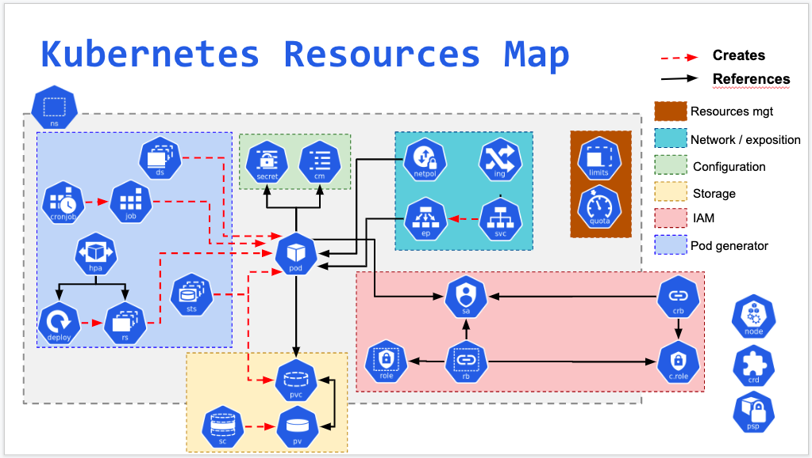

# kubernetes_learning(K8S阿里学习笔记)

## [第一章 k8s架构及基本概念](01_kube_structure_n_basic_idea.md)

## [第二章 Pod基本单元](02_pod.md)

## [第三章 应用编排基本概念](03_resource_object.md)

## [第四章 应用编排deployment](04_deployment.md)

## [第五章 应用编排Job&CronJobs和DaemonSet](05_Job_n_daemonSet.md)

## [第六章 ConfigMap](06_configMap.md)

## [第七章 应用存储和数据卷](07_volume.md)

## [第八章 k8s网络](08_k8s_network_model.md)

## [第九章 Service](09_service.md)

## [第十章 深入linux容器](10_container.md)

## [第十一章 容器运行时接口Container runtime interface](11_cri.md)

## [第十二章 hpa-Pod自动弹性伸缩](12_hpa.md)

## 工具篇
- [1 wait包](01_k8s_util/01_wait/wait_util.md)
  - [wait.Until使用](01_k8s_util/01_wait/01_util/main.go)
  - [wait.Group{}](01_k8s_util/01_wait/02_waitGroup/main.go)
- 2 sets包
  - [判断两个map的key是否重合](01_k8s_util/02_sets/main.go)
