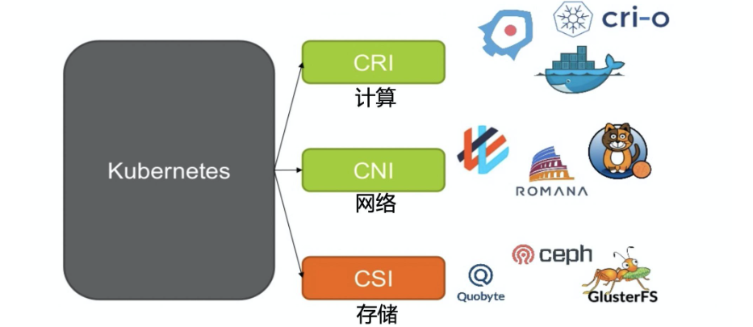

# kubernetes_learning(K8S及生态学习)

## [第一章 k8s基础]

- [1.1  k8s架构及基本概念](chapter01_k8s_basic/01_kube_structure_n_basic_idea.md)
- [1.2  Pod基本单元及相关使用](chapter01_k8s_basic/02_pod.md)
- [1.3  应用编排基本概念](chapter01_k8s_basic/03_resource_object.md)
- [1.4  应用编排deployment](chapter01_k8s_basic/04_deployment.md)
- [1.5  应用编排Job&CronJobs和DaemonSet](chapter01_k8s_basic/05_Job_n_daemonSet.md)
- [1.6  CSI Container Storage Interface机制：配置管理之ConfigMap,敏感信息secret,身份认证ServiceAccount,资源配置管理,安全管理SecurityContext,前置校验initContainer](chapter01_k8s_basic/06_configMap.md)
- [1.7  应用存储和数据卷](chapter01_k8s_basic/07_volume.md)
- [1.8  CNI Container Network Interface容器网络插件化](chapter01_k8s_basic/08_k8s_network_model.md)
- [1.9  Service](chapter01_k8s_basic/09_service.md)
- [1.10 深入linux容器](chapter01_k8s_basic/10_container.md)
- [1.11 CRI 容器运行时接口 Container runtime interface](chapter01_k8s_basic/11_cri.md)
- [1.12 scaler自动弹性伸缩](chapter01_k8s_basic/12_scaler.md)
- [1.13 kubelet](chapter01_k8s_basic/13_kubelet.md)
- [1.14 informer机制](chapter01_k8s_basic/14_informer.md)

## [第二章 k8s高级篇]
- [2.1 CRD自定义资源](chapter02_k8s_advanced/01_CustomResourcesDefinition/crd.md)

## [第三章 k8s资源管理helm](chapter03_helm/helm.md)

## [第四章 k8s client-go 工具包](chapter04_k8s_pkg/k8s_lib.md)
- [4.1 apimachinery 中 wait 工具包](chapter04_k8s_pkg/01_wait/wait_util.md)
  - [wait.Until使用](chapter04_k8s_pkg/01_wait/01_util/main.go)
  - [wait.Group{}](chapter04_k8s_pkg/01_wait/02_waitGroup/main.go)
- 4.2 apimachinery 中 sets工具包
  - [判断两个map的key是否重合](chapter04_k8s_pkg/02_sets/main.go)
- [4.3 client-go中rest模块源码分析](chapter04_k8s_pkg/03_client_go/rest.md)
  - [4.3.1 基础的客户端 Restclient 获取 pod 信息](chapter04_k8s_pkg/03_client_go/01_RESTClient/main.go)
  - [4.3.2 按照Group和Version分类再封装的 Clientset 操作资源](chapter04_k8s_pkg/03_client_go/02_Clientset/main.go)
  - [4.3.3 dynamicClient 操作非结构化数据](chapter04_k8s_pkg/03_client_go/03_dynamic_client/dynamic_client.go)
  - [4.3.4 DiscoveryClient 获取资源Group、Version、Resource](chapter04_k8s_pkg/03_client_go/04_discovery_client/discovery.go)
- [4.4 k8s使用的web框架：go-restful 源码分析](chapter04_k8s_pkg/04_k8s_restful/go-restful.md)
- 4.5 apimachinery 中的 unstructured 非结构化数据
  - [4.5.1 使用 unstructured 解析自定义数据](chapter04_k8s_pkg/05_k8s.io_api/01_unstrutured/main.go)

## 参考资料
1. [官方网址](https://kubernetes.io/docs/tasks/extend-kubernetes/custom-resources/custom-resource-definitions/#create-a-customresourcedefinition)
2. [腾讯程序员欣宸博客](https://xinchen.blog.csdn.net/?type=blog)