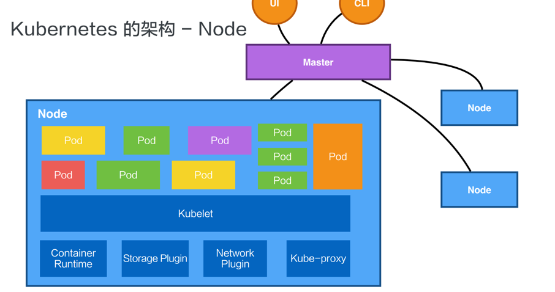
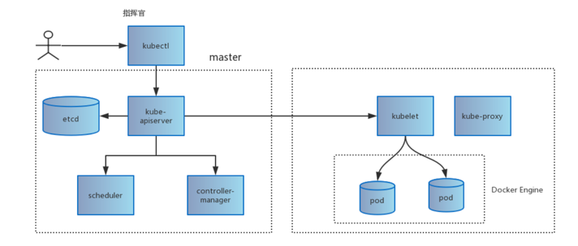
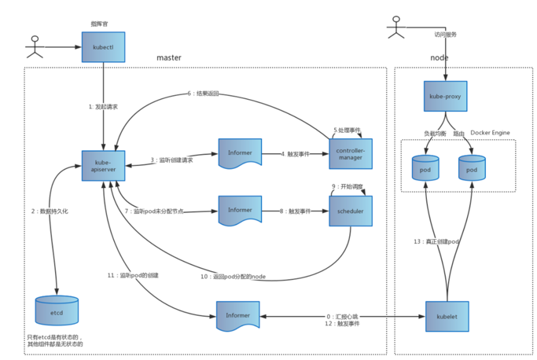
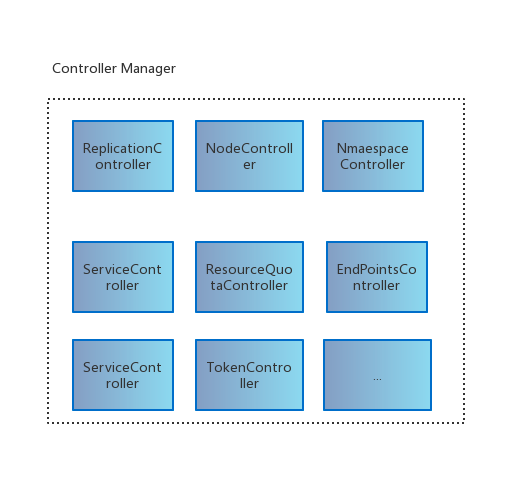
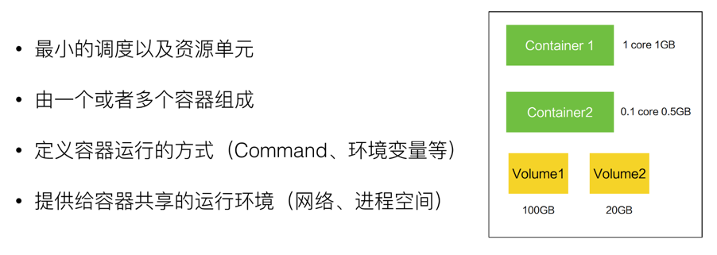
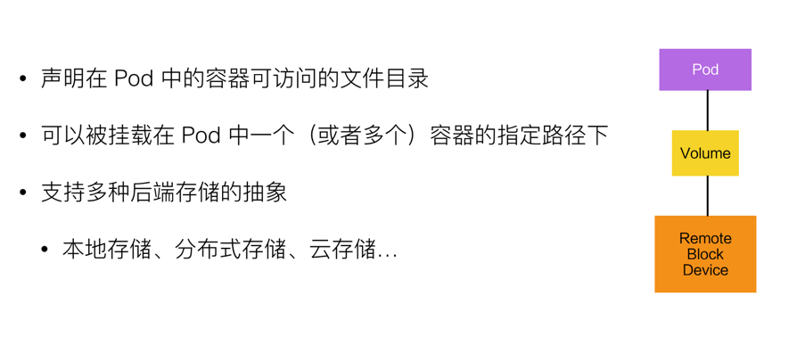
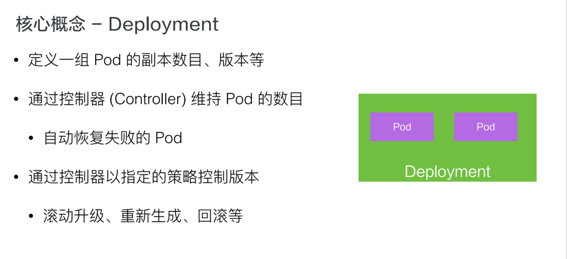
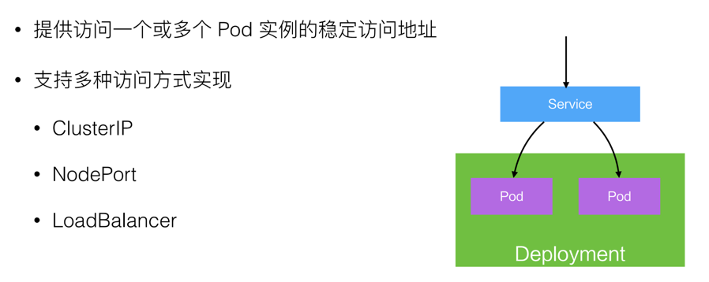
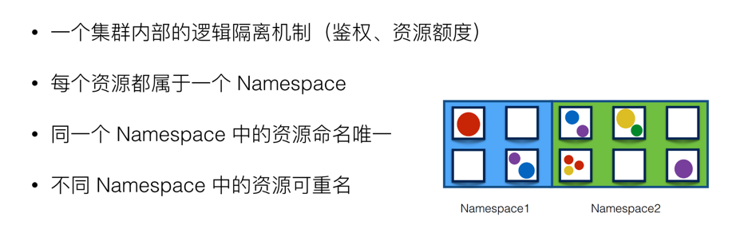
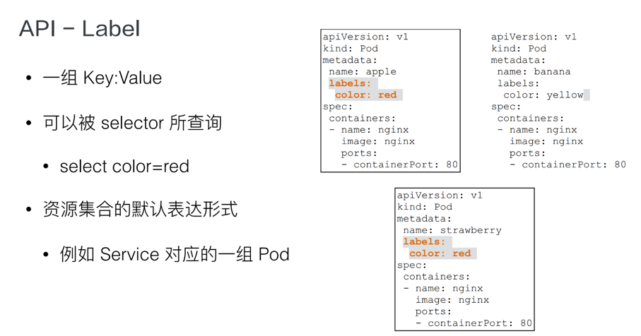

# Kubernetes架构




数据流转图



## 1. Master节点的组件
- apiServer : 提供资源操作的唯一入口，提供api注册、发现、认证、访问控制等功能
  - 整个系统的数据总线和数据中心，负责各模块通讯
  - 提供各类资源对象（pod，service等）的增、删、改、查等Restful接口
  - 集群内各个功能模块之间数据交互和通信的中心枢纽
  - 集群的API入口
  - 资源配额入口
  - 提供安全机制
- etcd:
  - 一个key-value数据库
  - 保存整个机器的状态
- controller-manager: 

  - 负责维护机器状态，比如：自动扩容、故障检查、滚动更新
  - 实现集群自动化的关键组件
- scheduler
  - 作用：将待调度的pod按照调度算法绑定到合适的Node上

### 常用的控制器controller
1. ReplicationController
- 确保集群中Pod副本一直保持预设状态
- 确保集群中有正确数量的副本（spec.replicas)
- 通过修改spec.replicas实现扩容和缩容
- 通过修改pod模板实现系统滚动升级  

2. NodeController
- 作用：通过apiserver实时获取node相关信息，实现管理和监控Node的功能
- 监控、管理功能举例：
  - 设置节点状态信息：Ready、Not Ready、UnKnown
  - 长时间未收到kubelet的心跳信息则删除etcd中的存储信息

3. ResourceQuotaController
- 作用：听资源配额管理，确保资源占用不会超过系统物理资源
- 管理维度包括：
  - 容器级别：对CPU和Memory进行限制
  - Pod级别：对pod内所有容器的可用资源进行限制
  - Namespace级别：
    - pod数量
    - service数量
    - secret数量
    - pv数量

4. NamespaceController
作用：定时通过Apiserver获取保存在etcd中的namespace，并控制namespace的创建、删除等操作

5. Endpoints Controller
   什么是endpoints？ 一个service对应的所有pod的访问地址
- 作用：负责生成和维护所有的endpoint对象，供给kube-proxy做负载均衡

6. Service Controller
- 作用：k8s与外部云平台之间的接口控制器，监听service的变化，确保正确的loadbalance被创建

### scheduler默认调度流程
- 预选调度：遍历所有节点，选出符合要求的候选节点
- 确定最优节点：基于上一步，采用优选策略，计算出候选节点积分，最高分为分配的节点

#### 预选策略
默认的预选策略包括5个维度的筛选，只有都通过了才作为候选节点
预选策略说明：
- NoDiskConfilct：Volume相关冲突检测
- PodFitsResources：资源是否满足的检测
- PodSelectorMatches：pod标签选择器的检测
- PodFitsHost：是否指定被调度到特定Node的检测
- CheckNodeLabelPresense：判断label设定备选节点时，是否选择备选节

#### 优选策略
LeastRequestedPriority：选出资源消耗最小的节点
CalcuateNodeLabelPriority：通过调用用户注册的策略计算
BalancedResourceAllocation：选出各项资源使用率最均衡的节点


## 2. Node节点的组件
- kubelet:
  - 负责容器生命周期管理，比如：创建、删除
  - 同时负责Volume，网络的管理

- kube-proxy
  - 负责为Service提供负载均衡、服务发现
- Container Runtime
  - 容器运行环境
  - 默认是Docker，同时还支持其他容器引擎

## Pod

- Pod是k8s中最重要最基本的资源
- pod是在容器之外又封装的一层概念
- pod是容器调度的基本单元（不是docker容器）
- 每个pod包含一个特殊的根容器：Pause容器，和一个或多个业务容器
- 每个pod有唯一的ip，pod内的容器可通过localhost通讯

## Volume


## deployment

- 实现Pod自动编排：创建、删除、扩容、缩容
- 通过replicas控制pod数量，template控制要创建的pod的模板
```yaml
apiVersion: extensions/v1beta1
kind: Deployment
metadata:
  name: k8s-demo
  namespace: spring-test
spec:
  replicas: 3
  template:
    metadata:
      labels:
        app: k8s-demo
    spec:
      containers:
      - name: k8s-demo
        image: k8s-demo:0.0.1-SNAPSHOT
        ports:
          - containerPort: 8080
```

## service

- k8s里最核心的资源之一，类似微服务架构中的“微服务”
- 前端应用通过入口地址访问服务，服务通过label对接到后端的pod，即使pod的ip变了
- kube-proxy负责把service请求转发到后端，并做负载均衡
- service整个生命周期内，ClusterIp不会变，对外提供的服务地址也就不会变
```yaml
apiVersion: v1
kind: Service
metadata:
  name: k8s-demo
  namespace: spring-test
spec:
  type: NodePort
  selector:
    app: k8s-demo
  ports:
   - protocol: TCP
     port: 8888
     targetPort: 8080
     nodePort: 30003
```

## namespace


## API/label



## Ingress
### 背景
service提供了ip:port的访问方式，即工作在tcp/ip层，而http服务需要将不同的url对应到不同的后端服务，service是无法实现这一功能的
```yaml
apiVersion: extensions/v1beta1
kind: Ingress
metadata:
  name: k8s-demo
  namespace: spring-test
spec:
  rules:
  - host: www.k8s-demo.com
    http:
      paths:
      - path: /hello
        backend:
          serviceName: k8s-demo
          servicePort: 8888
```
### 特点
- Ingress提供http层的负载分发功能
- Ingress可以实现不同的请求，分发到不同的后端服务
- Ingress定义后，需要结合Ingress Controller，才能形成完整的功能