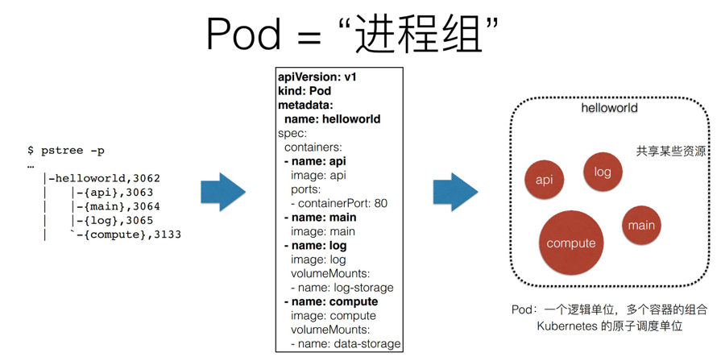
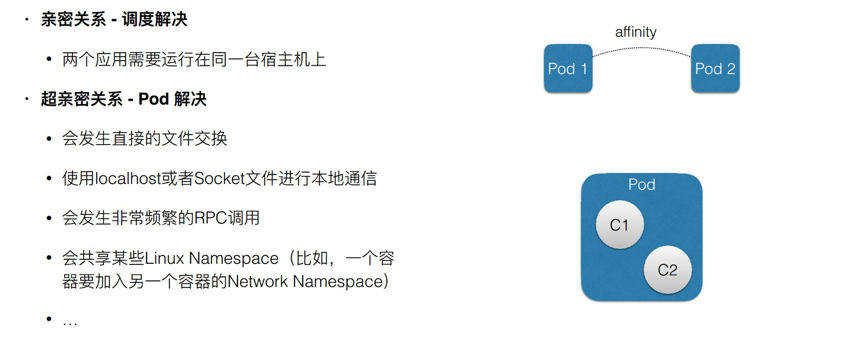
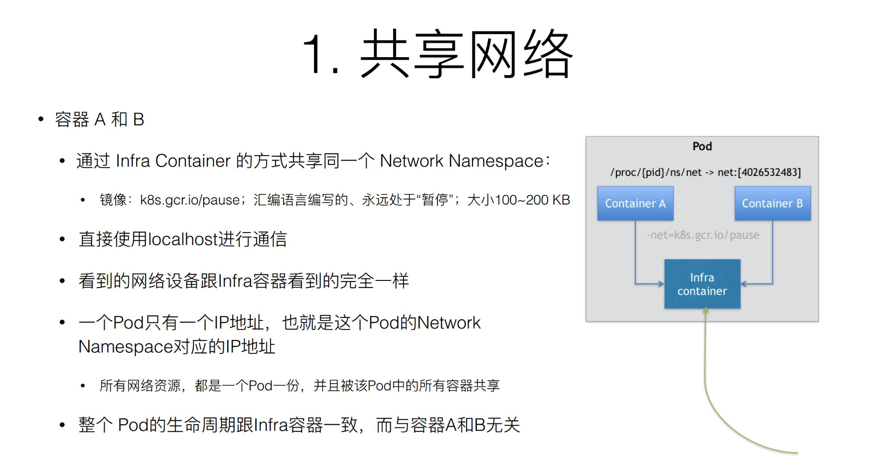
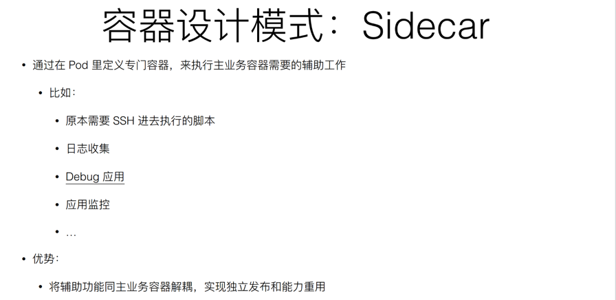
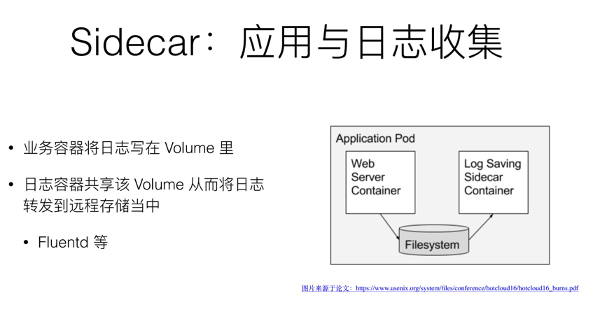

# Pod

## 为什么Pod必须是原子调度单位



## Pod需要解决的问题
如何让一个pod里面的多个容器之间高效的共享资源和数据?
但是容器之间原本是被linux Namespace 和cgroups隔离开的
### 解决
1. 共享网络   


2. 共享存储   


## 容器设计模式

### SideCar

应用    



## Pod的生命周期
Pod 生命周期的变化，主要体现在 Pod API 对象的 Status 部分，它有如下几种可能的情况：

1. Pending。这个状态意味着，Pod 的 YAML 文件已经提交给了 Kubernetes，API 对象已经被创建并保存在 Etcd 当中。但是，这个 Pod 里有些容器因为某种原因而不能被顺利创建。比如，调度不成功。
2. Running。这个状态下，Pod 已经调度成功，跟一个具体的节点绑定。它包含的容器都已经创建成功，并且至少有一个正在运行中。
3. Succeeded。这个状态意味着，Pod 里的所有容器都正常运行完毕，并且已经退出了。这种情况在运行一次性任务时最为常见。
4. Failed。这个状态下，Pod 里至少有一个容器以不正常的状态（非 0 的返回码）退出。这个状态的出现，意味着你得想办法 Debug 这个容器的应用，比如查看 Pod 的 Events 和日志。
5. Unknown。这是一个异常状态，意味着 Pod 的状态不能持续地被 kubelet 汇报给 kube-apiserver，这很有可能是主从节点（Master 和 Kubelet）间的通信出现了问题。

## Pod中的资源限制
Kubernetes通过cgroups限制容器的CPU和内存等计算资源，包括requests和limits。

如果 Pod 运行所在的节点具有足够的可用资源，容器可能（且可以）使用超出对应资源 request 属性所设置的资源量，request属性主要目的是为容器预留资源。不过，容器不可以使用超出其资源 limit 属性所设置的资源量。


CPU 资源的约束和请求以 cpu 为单位。Kubernetes 中的一个 cpu 等于云平台上的 1 个 vCPU/核和裸机 Intel 处理器上的 1 个超线程 。CPU 总是按绝对数量来请求的，不可以使用相对数量； 0.1 的 CPU 在单核、双核、48 核的机器上的意义是一样的。

Kubernetes 中的一个 cpu 等于：

1. AWS vCPU
2. GCP Core
3. Azure vCore
4. Hyperthread 在带有超线程的裸机 Intel 处理器上
   允许浮点数请求。具有 spec.containers[].resources.requests.cpu 为 0.5 的容器保证了一半 CPU 要求 1 CPU的一半。

内存的约束和请求以字节为单位。你可以使用以下后缀之一以一般整数或定点整数形式来表示内存： E、P、T、G、M、K。
您还可以使用两个字母的等效的幂数：Ei，Pi，Ti ，Gi，Mi，Ki。例如，以下代表大致相同的值：
```shell
128974848, 129e6, 129M, 123Mi

```
i表示（1Mi=1024x1024）, M表示（1M=1000x1000）（其它单位类推， 如Ki/K Gi/G）

如果没有设置一个CPU或内存的限制，那么这个container在当节点使用的资源是没有上限的。但是如果设置了默认container资源限制，那么就会被限制在默认值之下


## Pod中的网络资源

Pod是一个逻辑概念，是一组共享了某些资源的容器。Pod 里的所有容器，共享的是同一个 Network Namespace，并且可以声明共享同一个 Volume。

在 Kubernetes 项目里有一个中间容器，这个容器叫作 Infra 容器。Infra 容器永远都是第一个被创建的容器，而其他用户定义的容器，则通过 Join Network Namespace 的方式，与 Infra 容器关联在一起。

在 Kubernetes 项目里，Infra 容器一定要占用极少的资源，所以它使用的是一个非常特殊的镜像，叫作：k8s.gcr.io/pause。这个镜像是一个用汇编语言编写的、永远处于“暂停”状态的容器，解压后的大小也只有 100~200 KB 左右。


- 它们可以直接使用 localhost 进行通信；
- 它们看到的网络设备跟 Infra 容器看到的完全一样；
- 一个 Pod 只有一个 IP 地址，也就是这个 Pod 的 Network Namespace 对应的 IP 地址；
- 当然，其他的所有网络资源，都是一个 Pod 一份，并且被该 Pod 中的所有容器共享；
- Pod 的生命周期只跟 Infra 容器一致，而与容器 A 和 B 无关

## Pod中的Volume
Volume也是设计在 Pod 层级。一个 Volume 对应的宿主机目录对于 Pod 来说就只有一个，Pod 里的容器只要声明挂载这个 Volume，就一定可以共享这个 Volume 对应的宿主机目录。


## Pod中重要字段含义与用法

### NodeSelector

是一个供用户将 Pod 与 Node 进行绑定的字段，用法如下所示：
```yaml
apiVersion: v1
kind: Pod
...
spec:
 nodeSelector:
   disktype: ssd
```
这样所创建的Pod只能运行在携带了“disktype: ssd”标签（Label）的节点上；否则，它将调度失败。

### HostAliases

定义了 Pod 的 hosts 文件（比如 /etc/hosts）里的内容
```yaml
apiVersion: v1
kind: Pod
...
spec:
  hostAliases:
  - ip: "10.1.2.3"
    hostnames:
    - "foo.remote"
    - "bar.remote"
...
```
这样，这个 Pod 启动后，/etc/hosts 文件的内容将如下所示：
```shell
cat /etc/hosts
# Kubernetes-managed hosts file.
127.0.0.1 localhost
...
10.244.135.10 hostaliases-pod
10.1.2.3 foo.remote
10.1.2.3 bar.remote
```
在k8s项目中， 如果要设置hosts 文件里的内容，一定要通过这种方法。否则，如果直接修改了 hosts 文件的话，在 Pod 被删除重建之后，kubelet 会自动覆盖掉被修改的内容。

## ImagePullPolicy

定义了镜像拉取的策略，它是一个 Container 级别的属性。

ImagePullPolicy 的值默认是 IfNotPresent，即每次创建 Pod 都重新拉取一次镜像。另外，当容器的镜像是类似于 nginx 或者 nginx:latest 这样的名字时，ImagePullPolicy 会被认为Always ，即总是会去拉取最新的镜像

## Lifecycle

可以在容器状态发生变化时触发一系列“钩子”。
```yaml
apiVersion: v1
kind: Pod
metadata:
  name: lifecycle-demo
spec:
  containers:
  - name: lifecycle-demo-container
    image: nginx
    lifecycle:
      postStart:
        exec:
          command: ["/bin/sh", "-c", "echo Hello from the postStart handler > /usr/share/message"]
      preStop:
        exec:
          command: ["/usr/sbin/nginx","-s","quit"]
```

## Pod中的Projected Volume
Projected Volume是用来为容器提供预先定义好的数据。

到目前为止，Kubernetes 支持的 Projected Volume 一共有四种：

1. Secret；
2. ConfigMap；
3. Downward API；
4. ServiceAccountToken。

### Secret
作用是把 Pod 想要访问的加密数据，存放到 Etcd 中。然后，你就可以通过在 Pod 的容器里挂载 Volume 的方式，访问到这些 Secret 里保存的信息了。
```shell
$ cat ./username.txt
admin
$ cat ./password.txt
c1oudc0w!

$ kubectl create secret generic user --from-file=./username.txt
$ kubectl create secret generic pass --from-file=./password.txt
```
username.txt 和 password.txt 文件里，存放的就是用户名和密码；而 user 和 pass，则是我为 Secret 对象指定的名字。

如果要查看secret的话，使用kubectl get就可以
```shell
$ kubectl get secrets
NAME           TYPE                                DATA      AGE
user          Opaque                                1         51s
pass          Opaque                                1         51s
```
除此之外，还可以使用YAML 文件的方式来创建这个 Secret 对象，比如
```yaml
apiVersion: v1
kind: Secret
metadata:
  name: mysecret
type: Opaque
data:
  user: YWRtaW4=
  pass: MWYyZDFlMmU2N2Rm
```
需要注意的是，Secret 对象要求这些数据必须是经过 Base64 转码的，以免出现明文密码的安全隐患。

然后创建一个pod，使用secret
```yaml
apiVersion: v1
kind: Pod
metadata:
  name: test-projected-volume 
spec:
  containers:
  - name: test-secret-volume
    image: busybox
    args:
    - sleep
    - "86400"
    volumeMounts:
    - name: mysql-cred
      mountPath: "/projected-volume"
      readOnly: true
  volumes:
  - name: mysql-cred
    projected:
      sources:
      - secret:
          name: user
      - secret:
          name: pass
```

然后在容器中，查看：
```shell
$ kubectl exec -it test-projected-volume -- /bin/sh
$ ls /projected-volume/
user
pass
$ cat /projected-volume/user
root
$ cat /projected-volume/pass
1f2d1e2e67df
```

## ConfigMap
ConfigMap 保存的是不需要加密的、应用所需的配置信息。

比如，一个 Java 应用所需的配置文件（.properties 文件），就可以通过下面这样的方式保存在 ConfigMap 里：
```yaml
# .properties文件的内容
$ cat example/ui.properties
color.good=purple
color.bad=yellow
allow.textmode=true
how.nice.to.look=fairlyNice

# 从.properties文件创建ConfigMap
$ kubectl create configmap ui-config --from-file=example/ui.properties

# 查看这个ConfigMap里保存的信息(data)
$ kubectl get configmaps ui-config -o yaml
apiVersion: v1
data:
  ui.properties: |
    color.good=purple
    color.bad=yellow
    allow.textmode=true
    how.nice.to.look=fairlyNice
kind: ConfigMap
metadata:
  name: ui-config
  ...
```

## Downward API
可以让 Pod 里的容器能够直接获取到这个 Pod API 对象本身的信息。
```yaml
apiVersion: v1
kind: Pod
metadata:
  name: test-downwardapi-volume
  labels:
    zone: us-est-coast
    cluster: test-cluster1
    rack: rack-22
spec:
  containers:
    - name: client-container
      image: k8s.gcr.io/busybox
      command: ["sh", "-c"]
      args:
      - while true; do
          if [[ -e /etc/podinfo/labels ]]; then
            echo -en '\n\n'; cat /etc/podinfo/labels; fi;
          sleep 5;
        done;
      volumeMounts:
        - name: podinfo
          mountPath: /etc/podinfo
          readOnly: false
  volumes:
    - name: podinfo
      projected:
        sources:
        - downwardAPI:
            items:
              - path: "labels"
                fieldRef:
                  fieldPath: metadata.labels
```

通过这样的声明方式，当前 Pod 的 Labels 字段的值，就会被 Kubernetes 自动挂载成为容器里的 /etc/podinfo/labels 文件。

Downward API 支持的字段已经非常丰富了，比如：

```
1. 使用fieldRef可以声明使用:
spec.nodeName - 宿主机名字
status.hostIP - 宿主机IP
metadata.name - Pod的名字
metadata.namespace - Pod的Namespace
status.podIP - Pod的IP
spec.serviceAccountName - Pod的Service Account的名字
metadata.uid - Pod的UID
metadata.labels['<KEY>'] - 指定<KEY>的Label值
metadata.annotations['<KEY>'] - 指定<KEY>的Annotation值
metadata.labels - Pod的所有Label
metadata.annotations - Pod的所有Annotation

2. 使用resourceFieldRef可以声明使用:
容器的CPU limit
容器的CPU request
容器的memory limit
容器的memory request
```