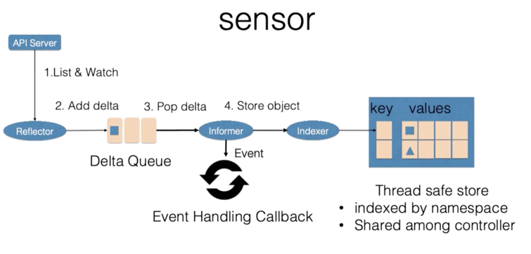

<!-- START doctoc generated TOC please keep comment here to allow auto update -->
<!-- DON'T EDIT THIS SECTION, INSTEAD RE-RUN doctoc TO UPDATE -->
**Table of Contents**  *generated with [DocToc](https://github.com/thlorenz/doctoc)*

- [K8s资源对象](#k8s%E8%B5%84%E6%BA%90%E5%AF%B9%E8%B1%A1)
  - [Labels](#labels)
  - [annotations](#annotations)
  - [ownerReference](#ownerreference)
  - [控制循环](#%E6%8E%A7%E5%88%B6%E5%BE%AA%E7%8E%AF)
    - [Sensor](#sensor)
    - [控制循环案例-扩容](#%E6%8E%A7%E5%88%B6%E5%BE%AA%E7%8E%AF%E6%A1%88%E4%BE%8B-%E6%89%A9%E5%AE%B9)

<!-- END doctoc generated TOC please keep comment here to allow auto update -->

# K8s资源对象
k8s中大部分概念，如Node，Pod，Service都可以看做一种资源对象

- 资源的描述：yaml文件或json文件
- 资源的操作：对象可以通过kubectl（或者api）执行增、删、改、查
- 资源的存储：信息在etcd中持久化
```yaml
Spec: 期望的状态
Status: 观测到的状态
Metadata:
    Labels
    Annotations
    OwnerReference
```
k8s通过对比资源的“实际状态”和etcd中的“期望状态”，实现自动化控制

## Labels


selector  


## annotations


## ownerReference


## 控制循环


    控制型模式最核心的就是控制循环的概念。在控制循环中包括了控制器，被控制的系统，以及能够观测系统的传感器，三个逻辑组件。
    
    当然这些组件都是逻辑的，外界通过修改资源 spec 来控制资源，控制器比较资源 spec 和 status，从而计算一个 diff，
    diff 最后会用来决定执行对系统进行什么样的控制操作，控制操作会使得系统产生新的输出，并被传感器以资源 status 形式上报，
    控制器的各个组件将都会是独立自主地运行，不断使系统向 spec 表示终态趋近

### Sensor 


    控制循环中逻辑的传感器主要由 Reflector、Informer、Indexer 三个组件构成。
    
    Reflector 通过 List 和 Watch K8s server 来获取资源的数据。List 用来在 Controller 重启以及 Watch 中断的情况下，进行系统资源的全量更新；
    而 Watch 则在多次 List 之间进行增量的资源更新；Reflector 在获取新的资源数据后，会在 Delta 队列中塞入一个包括资源对象信息本身以及资源对象事件类型的 Delta 记录，
    Delta 队列中可以保证同一个对象在队列中仅有一条记录，从而避免 Reflector 重新 List 和 Watch 的时候产生重复的记录。
    
    Informer 组件不断地从 Delta 队列中弹出 delta 记录，然后把资源对象交给 indexer，让 indexer 把资源记录在一个缓存中，缓存在默认设置下是用资源的命名空间来做索引的，
    并且可以被 Controller Manager 或多个 Controller 所共享。之后，再把这个事件交给事件的回调函数

    控制循环中的控制器组件主要由事件处理函数以及 worker 组成，事件处理函数之间会相互关注资源的新增、更新、删除的事件，并根据控制器的逻辑去决定是否需要处理。
    对需要处理的事件，会把事件关联资源的命名空间以及名字塞入一个工作队列中，并且由后续的 worker 池中的一个 Worker 来处理，工作队列会对存储的对象进行去重，
    从而避免多个 Woker 处理同一个资源的情况。
    
    Worker 在处理资源对象时，一般需要用资源的名字来重新获得最新的资源数据，用来创建或者更新资源对象，或者调用其他的外部服务，Worker 如果处理失败的时候，
    一般情况下会把资源的名字重新加入到工作队列中，从而方便之后进行重试

### 控制循环案例-扩容


    ReplicaSet 是一个用来描述无状态应用的扩缩容行为的资源， ReplicaSet controler 通过监听 ReplicaSet 资源来维持应用希望的状态数量，
    ReplicaSet 中通过 selector 来匹配所关联的 Pod，在这里考虑 ReplicaSet rsA 的，replicas 从 2 被改到 3 的场景


    首先，Reflector 会 watch 到 ReplicaSet 和 Pod 两种资源的变化，为什么我们还会 watch pod 资源的变化稍后会讲到。
    发现 ReplicaSet 发生变化后，在 delta 队列中塞入了对象是 rsA，而且类型是更新的记录。
    
    Informer 一方面把新的 ReplicaSet 更新到缓存中，并与 Namespace nsA 作为索引。
    另外一方面，调用 Update 的回调函数，ReplicaSet 控制器发现 ReplicaSet 发生变化后会把字符串的 nsA/rsA 字符串塞入到工作队列中，
    工作队列后的一个 Worker 从工作队列中取到了 nsA/rsA 这个字符串的 key，并且从缓存中取到了最新的 ReplicaSet 数据。
    
    Worker 通过比较 ReplicaSet 中 spec 和 status 里的数值，发现需要对这个 ReplicaSet 进行扩容，
    因此 ReplicaSet 的 Worker 创建了一个 Pod，这个 pod 中的 Ownereference 取向了 ReplicaSet rsA。
    
    然后 Reflector Watch 到的 Pod 新增事件，在 delta 队列中额外加入了 Add 类型的 deta 记录，
    一方面把新的 Pod 记录通过 Indexer 存储到了缓存中，另一方面调用了 ReplicaSet 控制器的 Add 回调函数，
    Add 回调函数通过检查 pod ownerReferences 找到了对应的 ReplicaSet，并把包括 ReplicaSet 命名空间和字符串塞入到了工作队列中
