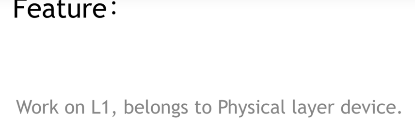

<!-- START doctoc generated TOC please keep comment here to allow auto update -->
<!-- DON'T EDIT THIS SECTION, INSTEAD RE-RUN doctoc TO UPDATE -->
**Table of Contents**  *generated with [DocToc](https://github.com/thlorenz/doctoc)*

- [k8s基本网络模型](#k8s%E5%9F%BA%E6%9C%AC%E7%BD%91%E7%BB%9C%E6%A8%A1%E5%9E%8B)
  - [underlay(对网络比如有bgp能力)](#underlay%E5%AF%B9%E7%BD%91%E7%BB%9C%E6%AF%94%E5%A6%82%E6%9C%89bgp%E8%83%BD%E5%8A%9B)
    - [1. 大二层网络（node和pod在同一个网段）](#1-%E5%A4%A7%E4%BA%8C%E5%B1%82%E7%BD%91%E7%BB%9Cnode%E5%92%8Cpod%E5%9C%A8%E5%90%8C%E4%B8%80%E4%B8%AA%E7%BD%91%E6%AE%B5)
    - [2. 大三层网络（node和pod在不同一个网段）](#2-%E5%A4%A7%E4%B8%89%E5%B1%82%E7%BD%91%E7%BB%9Cnode%E5%92%8Cpod%E5%9C%A8%E4%B8%8D%E5%90%8C%E4%B8%80%E4%B8%AA%E7%BD%91%E6%AE%B5)
    - [扩展：中间不是交换机，是路由器(跨网段,可以跨vpc)](#%E6%89%A9%E5%B1%95%E4%B8%AD%E9%97%B4%E4%B8%8D%E6%98%AF%E4%BA%A4%E6%8D%A2%E6%9C%BA%E6%98%AF%E8%B7%AF%E7%94%B1%E5%99%A8%E8%B7%A8%E7%BD%91%E6%AE%B5%E5%8F%AF%E4%BB%A5%E8%B7%A8vpc)
  - [overlay(隧道模式)](#overlay%E9%9A%A7%E9%81%93%E6%A8%A1%E5%BC%8F)
  - [docker的网络方案](#docker%E7%9A%84%E7%BD%91%E7%BB%9C%E6%96%B9%E6%A1%88)
    - [Docker网络的局限性](#docker%E7%BD%91%E7%BB%9C%E7%9A%84%E5%B1%80%E9%99%90%E6%80%A7)
  - [Netns(network namespace)](#netnsnetwork-namespace)
    - [定义](#%E5%AE%9A%E4%B9%89)
    - [使用](#%E4%BD%BF%E7%94%A8)
    - [Pod 与 Netns 的关系](#pod-%E4%B8%8E-netns-%E7%9A%84%E5%85%B3%E7%B3%BB)
  - [网络设备](#%E7%BD%91%E7%BB%9C%E8%AE%BE%E5%A4%87)
  - [k8s网络模型的原则](#k8s%E7%BD%91%E7%BB%9C%E6%A8%A1%E5%9E%8B%E7%9A%84%E5%8E%9F%E5%88%99)
    - [IP-Per-Pod与Docker端口映射的区别](#ip-per-pod%E4%B8%8Edocker%E7%AB%AF%E5%8F%A3%E6%98%A0%E5%B0%84%E7%9A%84%E5%8C%BA%E5%88%AB)
  - [k8s网络模型](#k8s%E7%BD%91%E7%BB%9C%E6%A8%A1%E5%9E%8B)
    - [1. 容器与容器的通讯](#1-%E5%AE%B9%E5%99%A8%E4%B8%8E%E5%AE%B9%E5%99%A8%E7%9A%84%E9%80%9A%E8%AE%AF)
    - [2. pod与pod的通讯](#2-pod%E4%B8%8Epod%E7%9A%84%E9%80%9A%E8%AE%AF)
      - [同一Node内的pod之间通讯](#%E5%90%8C%E4%B8%80node%E5%86%85%E7%9A%84pod%E4%B9%8B%E9%97%B4%E9%80%9A%E8%AE%AF)
      - [不同Node的pod之间通讯](#%E4%B8%8D%E5%90%8Cnode%E7%9A%84pod%E4%B9%8B%E9%97%B4%E9%80%9A%E8%AE%AF)
    - [IASS主流网络方案](#iass%E4%B8%BB%E6%B5%81%E7%BD%91%E7%BB%9C%E6%96%B9%E6%A1%88)
    - [Flannel](#flannel)
      - [实现的功能](#%E5%AE%9E%E7%8E%B0%E7%9A%84%E5%8A%9F%E8%83%BD)
      - [缺点](#%E7%BC%BA%E7%82%B9)
      - [Flannel的大致流程](#flannel%E7%9A%84%E5%A4%A7%E8%87%B4%E6%B5%81%E7%A8%8B)
      - [Flannel的设置方式](#flannel%E7%9A%84%E8%AE%BE%E7%BD%AE%E6%96%B9%E5%BC%8F)
      - [Network Policy](#network-policy)
      - [实现原理](#%E5%AE%9E%E7%8E%B0%E5%8E%9F%E7%90%86)
  - [参考资料](#%E5%8F%82%E8%80%83%E8%B5%84%E6%96%99)

<!-- END doctoc generated TOC please keep comment here to allow auto update -->

# k8s基本网络模型

分类：根据是否寄生在 Host 网络之上可以把容器网络方案大体分为 Underlay/Overlay 两大派别
    
* Underlay 的标准是它与 Host 网络是同层的，从外在可见的一个特征就是它是不是使用了 Host 网络同样的网段、输入输出基础设备、容器的 IP 地址是不是需要与 Host 网络取得协同（来自同一个中心分配或统一划分）。

* Overlay 不一样的地方就在于它并不需要从 Host 网络的 IPM 的管理的组件去申请IP，一般来说，它只需要跟 Host 网络不冲突，这个 IP 可以自由分配的。

## underlay(对网络比如有bgp能力)
### 1. 大二层网络（node和pod在同一个网段）

- 主要依据：交换机arp广播获取mac地址
- 背景：pod的Ip在物理世界对于交换机是不认识的，pod1(192.168.1.100)不知道pod2的Ip(192.168.1.101)
- 流程：
    1. 需要配置把pod1网关Ip指向node1(192.168.1.200),通过虚拟网线veth连接虚拟网桥bridge流向node1,
    2. node1的netfilter会因为同网段会进行处理发向交换机,arp给pod2,但是在物理世界不知道pod2虚拟Ip。
    3. 需要软件定义交换机SDN（Software Defined Network）伪造ARP应答:192.168.1.201的mac地址是Node2，这样可以把消息从node1发给node2。
    4. node2的netfilter进入内核，然后通过软件本地路由表，192.168.1.201/32使用veth pair进入po2，
    
- 特点：pod2创建，要让pod1知道，所以bgp要进行下发,即帮你在多个node之间同步路由表,所以node上要有bgp agent。

### 2. 大三层网络（node和pod在不同一个网段）

- 应用：calico的bgp模式：Border Gateway Protocol
- 流程：
    1. 目标地址172.168.1.x设置网关是node1:192.168.1.100,流量走向node1
    2. 三层路由表：bgp设置172.168.1.101/32发往网关node2:192.168.1.101,从eth0网口送出
    3. arp广播192.168.1.101,node2进行arp回答mac地址，交换机没有进行sdn这种行为。
    4. 过本机路由表192.168.1.101/32发往虚拟网桥bridge172.168.1.x。
    
### 扩展：中间不是交换机，是路由器(跨网段,可以跨vpc)

## overlay(隧道模式)

- 优点：对物理网络没有要求
- 缺点：
    - 封装解包，计算量上升，延迟。
    - 隧道使payload增加，在mtu固定1500时，增加头部，对应payload值会减少
    
- 过程：
    1. node1路由规则：172.168.1.201/32发往tun0设备，写real ip是192.168.1.101;然后封包src变成192.168.1.100，des变成192.168.1.101，
    payload是src：172.168.1.200,dst:172.168.1.201,data不变
    2. 经过交换机或则路由器，node2上的eth0进行解包。
    3. 经过netfilter进行forward,本地路由表直接通过veth pair发给对应应用,同网段可以没有bridge。

## docker的网络方案
docker官方并没有提供多主机的容器通信方案，单机网络的模式主要有host，container，bridge，none。

- none
- host，与宿主机共享，占用宿主机资源
- container，使用某容器的namespace，例如k8s的同一pod内的各个容器
- bridge，挂到网桥docker0上，走iptables做NAT

### Docker网络的局限性
- Docker网络模型没有考虑到多主机互联的网络解决方案，崇尚简单为美
- 同一机器内的容器之间可以直接通讯，但是不同机器之间的容器无法通讯
- 为了跨节点通讯，必须在主机的地址上分配端口，通过端口路由或代理到容器
- 分配和管理容器特别困难，特别是水平扩展时

## Netns(network namespace)
需要了解的内容

### 定义

   
网络 由网络接口,iptables,路由表 构成

1. 网卡

2. iptables

3. 路由表

### 使用

1. 自己创建netns

与docker,k8s对比

2. 两个netns交流
方式一：veth   

开始搭建梯子🪜，一边一半    

构造梯子veth    

放梯子到各自家里  

固定梯子    

启动设备     

开始拍手     

方式二：桥

建立桥  

建立梯子到王婆  

放梯子到各自家里:注意王婆是master,不是单独的namespace   

查看master王婆的信息  

固定西门庆家的梯子就行  

激活设备(包括王婆的设备ip link set wangpo up)   

同理去panjinlian家配置  

方式三：ipvlan(ip不同，mac相同)-->没有经过数据解封装

- 查看mac地址，其实net1和net2的mac地址一样的。
- 子接口172.12.1.5和子接口172.12.1.6通的
- 子接口172.12.1.5和父接口172.12.1.30不通的

- 子接口172.12.1.5和网关172.12.1.2通的
- 子接口172.12.1.5和电信114.114.114.114不通的

### Pod 与 Netns 的关系

## 网络设备

1. hub 集线器

特点  

 
2. bridge 网桥  

注意是第二层：mac地址

3. switch 交换机  

这里：可以指二层，有些到三层。

与网桥对比

4. DHCP(动态主机配置协议) Server

5. NAT Device

路由器

类型:最常用napt     

## k8s网络模型的原则
- 每个pod都拥有唯一个独立的ip地址，称IP-Per-Pod模型
- 所有pod都在一个可连通的网络环境中
- 不管是否在同一个node，都可以通过ip直接通讯
- pod被看作一台独立的物理机或虚拟机

### IP-Per-Pod与Docker端口映射的区别
docker端口映射到宿主机会引入端口管理的复杂性
docker最终被访问的ip和端口，与提供的不一致，引起配置的复杂性

## k8s网络模型

### 1. 容器与容器的通讯
- 同一个容器的pod直接共享同一个linux协议栈
- 就像在同一台机器上，可通过localhost访问
- 可类比一个物理机上不同应用程序的情况

### 2. pod与pod的通讯
#### 同一Node内的pod之间通讯
- 同一Node内的pod都是通过veth连接在同一个docker0网桥上，地址段相同，所以可以直接通讯

#### 不同Node的pod之间通讯
- docker0网段与宿主机不在同一个网段，所以不同pod之间的pod不能直接通讯
- 不同node之间通讯只能通过宿主机物理网卡
- 前面说过k8s网络模型需要不同的pod之间能通讯，所以ip不能重复，这就要求k8s部署时要规划好docker0的网段
- 同时，要记录每个pod的ip地址挂在哪个具体的node上
- 为了达到这个目的，有很多开源软件增强了docker和k8s的网络

### IASS主流网络方案
我们可以把云计算理解成一栋大楼，而这栋楼又可以分为顶楼、中间、低层三大块。那么我们就可以把Iass(基础设施)、Pass(平台)、Sass(软件)理解成这栋楼的三部分

### Flannel

#### 实现的功能
协助k8s给每个Node上的docker容器分配互不冲突的ip地址
能在这些ip地址之间建立覆盖网络（Overlay Network），将数据传递到目标容器

#### 缺点
- 引入多个网络组件，带来网络时延和损耗
- 默认使用udp作为底层传输协议，具有不可靠性

它首先要解决的是 container 的包如何到达 Host，这里采用的是加一个 Bridge 的方式。
它的 backend 其实是独立的，也就是说这个包如何离开 Host，是采用哪种封装方式，还是不需要封装，都是可选择的

三种主要的 backend：

* 一种是用户态的 udp，这种是最早期的实现；
* 然后是内核的 Vxlan，这两种都算是 overlay 的方案。Vxlan 的性能会比较好一点，但是它对内核的版本是有要求的，需要内核支持 Vxlan 的特性功能；
* 如果你的集群规模不够大，又处于同一个二层域，也可以选择采用 host-gw 的方式。这种方式的 backend 基本上是由一段广播路由规则来启动的，性能比较高

#### Flannel的大致流程
1. flannel利用Kubernetes API或者etcd用于存储整个集群的网络配置，其中最主要的内容为设置集群的网络地址空间。例如，设定整个集群内所有容器的IP都取自网段“10.1.0.0/16”。
2. flannel在每个主机中运行flanneld作为agent，它会为所在主机从集群的网络地址空间中，获取一个小的网段subnet，本主机内所有容器的IP地址都将从中分配。
3. flanneld再将本主机获取的subnet以及用于主机间通信的Public IP，同样通过kubernetes API或者etcd存储起来。
4. flannel利用各种backend ，例如udp，vxlan，host-gw等等，跨主机转发容器间的网络流量，完成容器间的跨主机通信。

#### Flannel的设置方式
Flanneld是Flannel守护程序，通常作为守护程序安装在kubernetes集群上，并以install-cni作为初始化容器。
install-cni容器在每个节点上创建CNI配置文件-/etc/cni/net.d/10-flannel.conflist。
Flanneld创建一个vxlan设备，从apiserver获取网络元数据，并监视pod上的更新。
创建Pod时，它将为整个集群中的所有Pod分配路由，这些路由允许Pod通过其IP地址相互连接。

kubelet调用Containered CRI插件以创建容器，而Containered CRI插件调用CNI插件为容器配置网络。
网络提供商CNI插件调用其他基本CNI插件来配置网络。

#### Network Policy
定义：提供了基于策略的网络控制，用于隔离应用并减少攻击面。他使用标签选择器模拟传统的分段网络，并通过策略控制他们之间的流量和外部的流量。
注意：在使用network policy之前
    
* apiserver需要开启extensions/v1beta1/networkpolicies
* 网络插件需要支持networkpolicy

Configuration

#### 实现原理
Flannel为每个主机提供独立的子网，整个集群的网络信息存储在etcd上。对于跨主机的转发，目标容器的IP地址，需要从etcd获取。

- Flannel创建名为flannel0的网桥
- flannel0网桥一端连接docker0网桥，另一端连接flanneld进程
- flanneld进程一端连接etcd，利用etcd管理分配的ip地址资源，同时监控pod地址，建立pod节点路由表
- flanneld进程一端连接docker0和物理网络，配合路由表，完成数据包投递，完成pod之间通讯

步骤：

- IP数据报被封装并通过容器的eth0发送。
- Container1的eth0通过veth对与Docker0交互并将数据包发送到Docker0。然后Docker0转发包。
- Docker0确定Container3的IP地址，通过查询本地路由表到外部容器，并将数据包发送到虚拟NIC Flannel0。
- Flannel0收到的数据包被转发到Flanneld进程。 Flanneld进程封装了数据包通过查询etcd维护的路由表并发送数据包通过主机的eth0。
- 数据包确定网络中的目标主机主机。
- 目的主机的Flanneld进程监听8285端口，负责解封包。
- 解封装的数据包将转发到虚拟NICFlannel0。
- Flannel0查询路由表，解封包，并将数据包发送到Docker0。
- Docker0确定目标容器并发送包到目标容器。

1. 在常用的vxlan模式中，涉及到上面步骤提到的封包和拆包，这也是Flannel网络传输效率相对低的原因。

2. hostgw是最简单的backend:
它的原理非常简单，直接添加路由，将目的主机当做网关，直接路由原始封包。
例如，我们从etcd中监听到一个EventAdded事件subnet为10.1.15.0/24被分配给主机Public IP 192.168.0.100，hostgw要做的工作就是在本主机上添加一条目的地址为10.1.15.0/24，网关地址为192.168.0.100，输出设备为上文中选择的集群间交互的网卡即可。对于EventRemoved事件，只需删除对应的路由

## 参考资料
1. [ip 命令使用](https://blog.csdn.net/qq_35029061/article/details/125967340)