# Service 

一个Kubernetes的Service是一种抽象，它定义了一组Pods的逻辑集合和一个用于访问它们的策略 - 有的时候被称之为微服务

## Service：Kubernetes 中的服务返现与负载均衡
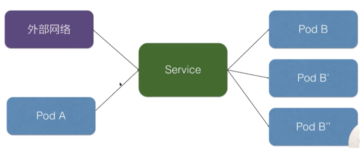
K8s 对接了另外一组 pod，即可以通过 K8s Service 的方式去负载均衡到一组 pod 上面去，这样相当于解决了前面所说的复发性问题，
或者提供了统一的访问入口去做服务发现，然后又可以给外部网络访问，解决不同的 pod 之间的访问，提供统一的访问地址


## 使用yaml格式
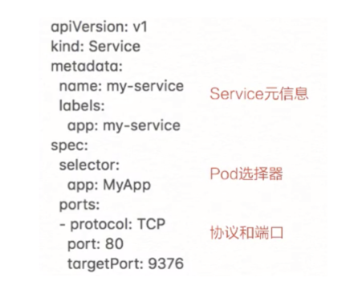

声明了一个名叫 my-service 的一个 K8s Service，它有一个 app:my-service 的 label，它选择了 app:MyApp 这样一个 label 的 pod 作为它的后端

最后是定义的服务发现的协议以及端口，这个示例中我们定义的是 TCP 协议，端口是 80，目的端口是 9376，效果是访问到这个 service 80 端口会被路由到后端的 targetPort，
就是只要访问到这个 service 80 端口的都会负载均衡到后端 app：MyApp 这种 label 的 pod 的 9376 端口

创建后查看service
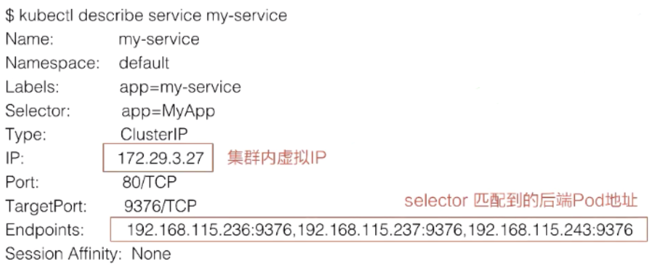

这个 IP 地址就是 service 的 IP 地址，这个 IP 地址在集群里面可以被其它 pod 所访问，相当于通过这个 IP 地址提供了统一的一个 pod 的访问入口，以及服务发现

Endpoints 的属性，就是我们通过 Endpoints 可以看到：通过前面所声明的 selector 去选择了哪些 pod？以及这些 pod 都是什么样一个状态？比如说通过 selector，我们看到它选择了这些 pod 的一个 IP，以及这些 pod 所声明的 targetPort 的一个端口。

## 集群内访问 Service
三种方式

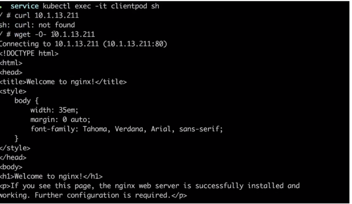

1. 首先我们可以通过 service 的虚拟 IP 去访问，比如说刚创建的 my-service 这个服务，通过 kubectl get svc 或者 kubectl discribe service 都可以看到它的虚拟 IP 地址是 10.1.13.211，端口是 80，
然后就可以通过这个虚拟 IP 及端口在 pod 里面直接访问到这个 service 的地址。
     

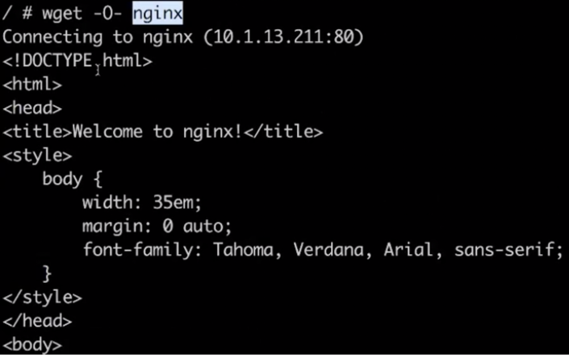
2. 第二种方式直接访问服务名，依靠 DNS 解析，就是同一个 namespace 里 pod 可以直接通过 service 的名字去访问到刚才所声明的这个 service。
    不同的 namespace 里面，我们可以通过 service 名字加“.”，然后加 service 所在的哪个 namespace 去访问这个 service，
    例如我们直接用 curl 去访问，就是 my-service:80 就可以访问到这个 service。
     

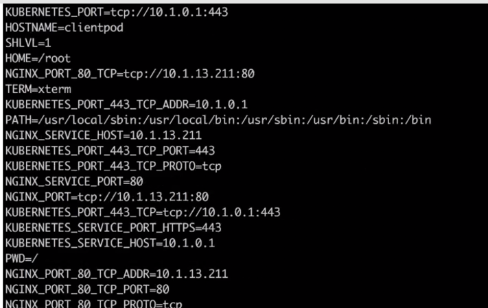
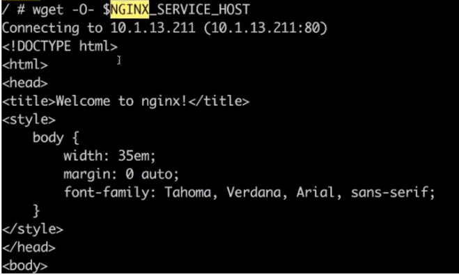
3. 第三种是通过环境变量访问，在同一个 namespace 里的 pod 启动时，K8s 会把 service 的一些 IP 地址、端口，以及一些简单的配置，
通过环境变量的方式放到 K8s 的 pod 里面。在 K8s pod 的容器启动之后，通过读取系统的环境变量比读取到 namespace 里面其他 service 配置的一个地址，
或者是它的端口号等等。比如在集群的某一个 pod 里面，可以直接通过 curl $ 取到一个环境变量的值，比如取到 MY_SERVICE_SERVICE_HOST 就是它的一个 IP 地址，
MY_SERVICE 就是刚才我们声明的 MY_SERVICE，SERVICE_PORT 就是它的端口号，这样也可以请求到集群里面的 MY_SERVICE 这个 service
    
### Headless Service
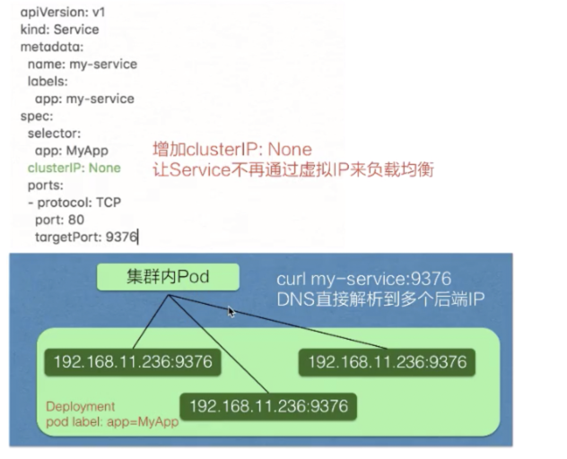  

service 有一个特别的形态就是 Headless Service。service 创建的时候可以指定 clusterIP:None，告诉 K8s 说我不需要 clusterIP（就是刚才所说的集群里面的一个虚拟 IP），
然后 K8s 就不会分配给这个 service 一个虚拟 IP 地址，它没有虚拟 IP 地址怎么做到负载均衡以及统一的访问入口呢？

它是这样来操作的：pod 可以直接通过 service_name 用 DNS 的方式解析到所有后端 pod 的 IP 地址，通过 DNS 的 A 记录的方式会解析到所有后端的 Pod 的地址，
由客户端选择一个后端的 IP 地址，这个 A 记录会随着 pod 的生命周期变化，返回的 A 记录列表也发生变化，
这样就要求客户端应用要从 A 记录把所有 DNS 返回到 A 记录的列表里面 IP 地址中，客户端自己去选择一个合适的地址去访问 pod。

可以从上图看一下跟刚才我们声明的模板的区别，就是在中间加了一个 clusterIP:None，即表明不需要虚拟 IP。
实际效果就是集群的 pod 访问 my-service 时，会直接解析到所有的 service 对应 pod 的 IP 地址，返回给 pod，然后 pod 里面自己去选择一个 IP 地址去直接访问。

## 向集群外暴露 Service
方式：一个是 NodePort，一个是 LoadBalancer

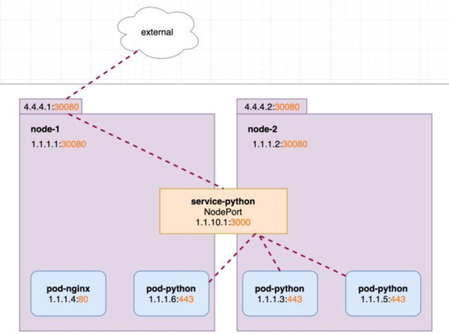
```yaml
apiVersion: v1
kind: Service
metadata:
  name: service-python
spec:
  ports:
  - port: 3000
    protocol: TCP
    targetPort: 443
    nodePort: 30080
  selector:
    run: pod-python
  type: NodePort
```
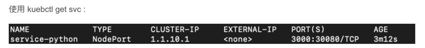
1. NodePort 的方式就是在集群的 node 上面（即集群的节点的宿主机上面）去暴露节点上的一个端口，这样相当于在节点的一个端口上面访问到之后就会再去做一层转发，
    转发到虚拟的 IP 地址上面，就是刚刚宿主机上面 service 虚拟 IP 地址。此时我们可以通过http://4.4.4.1:30080或http://4.4.4.2:30080 对pod-python访问。该端口有一定的范围，比如默认Kubernetes 控制平面将在--service-node-port-range标志指定的范围内分配端口（默认值：30000-32767）。
  


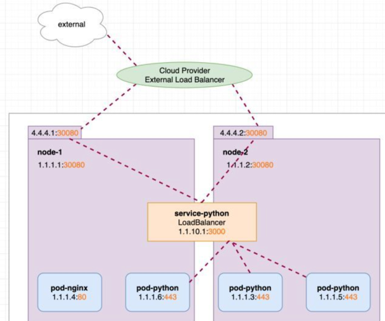

2. LoadBalancer 类型就是在 NodePort 上面又做了一层转换，刚才所说的 NodePort 其实是集群里面每个节点上面一个端口，LoadBalancer 是在所有的节点前又挂一个负载均衡。
    比如在阿里云上挂一个 SLB，这个负载均衡会提供一个统一的入口，并把所有它接触到的流量负载均衡到每一个集群节点的 node pod 上面去。然后 node pod 再转化成 ClusterIP，去访问到实际的 pod 上面。
   LoadBalancer类型的service 是可以实现集群外部访问服务的另外一种解决方案。不过并不是所有的k8s集群都会支持，大多是在公有云托管集群中会支持该类型。
```yaml
apiVersion: v1
kind: Service
metadata:
  name: service-python
spec:
  ports:
  - port: 3000
    protocol: TCP
    targetPort: 443
    nodePort: 30080
  selector:
    run: pod-python
  type: LoadBalancer
```    
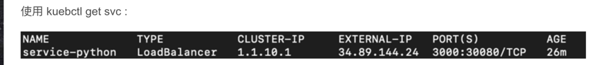
    
##  架构设计
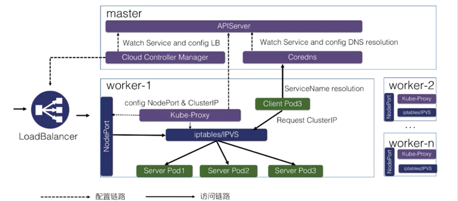

k8s 分为 master 节点和 worker 节点：
     
- master 里面主要是 K8s 管控的内容；
- worker 节点里面是实际跑用户应用的一个地方

最关键的有三个组件

一个是 Cloud Controller Manager，负责去配置 LoadBalancer 的一个负载均衡器给外部去访问；
另外一个就是 Coredns，就是通过 Coredns 去观测 APIServer 里面的 service 后端 pod 的一个变化，去配置 service 的 DNS 解析，实现可以通过 service 的名字直接访问到 service 的虚拟 IP，或者是 Headless 类型的 Service 中的 IP 列表的解析；
然后在每个 node 里面会有 kube-proxy 这个组件，它通过监听 service 以及 pod 变化，然后实际去配置集群里面的 node pod 或者是虚拟 IP 地址的一个访问。

实际访问链路？

比如说从集群内部的一个 Client Pod3 去访问 Service，就类似于刚才所演示的一个效果。
Client Pod3 首先通过 Coredns 这里去解析出 ServiceIP，Coredns 会返回给它 ServiceName 所对应的 service IP 是什么，这个 Client Pod3 就会拿这个 Service IP 去做请求，
它的请求到宿主机的网络之后，就会被 kube-proxy 所配置的 iptables 或者 IPVS 去做一层拦截处理，之后去负载均衡到每一个实际的后端 pod 上面去，这样就实现了一个负载均衡以及服务发现。


对于外部的流量，比如说刚才通过公网访问的一个请求。它是通过外部的一个负载均衡器 Cloud Controller Manager 去监听 service 的变化之后，
去配置的一个负载均衡器，然后转发到节点上的一个 NodePort 上面去，NodePort 也会经过 kube-proxy 的一个配置的一个 iptables，
把 NodePort 的流量转换成 ClusterIP，紧接着转换成后端的一个 pod 的 IP 地址，去做负载均衡以及服务发现。这就是整个 K8s 服务发现以及 K8s Service 整体的结构