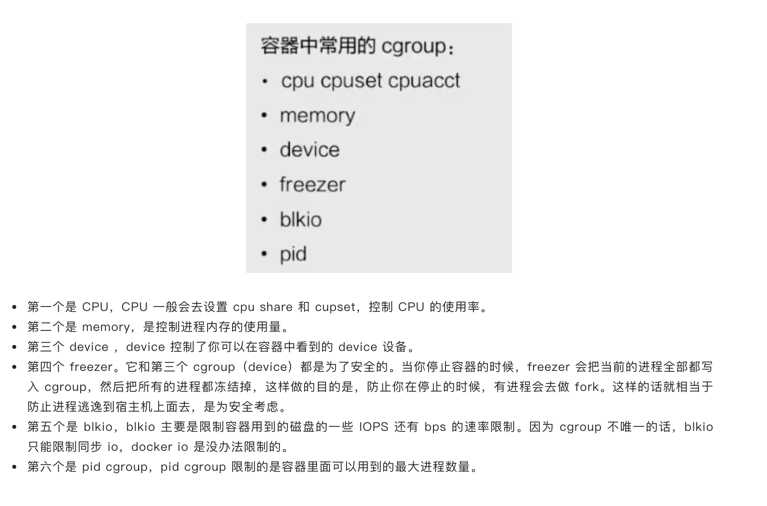
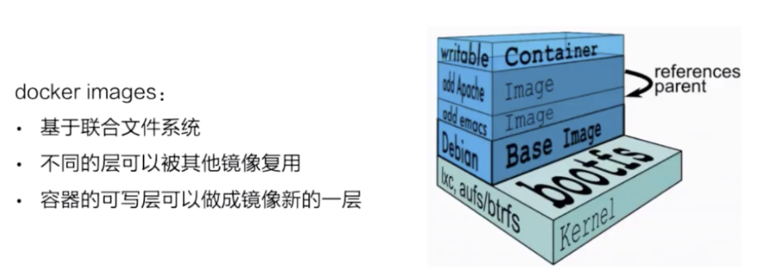
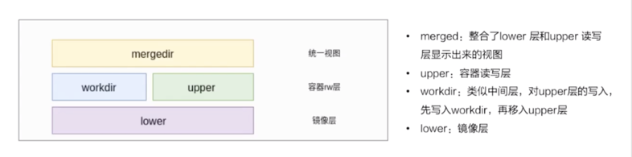
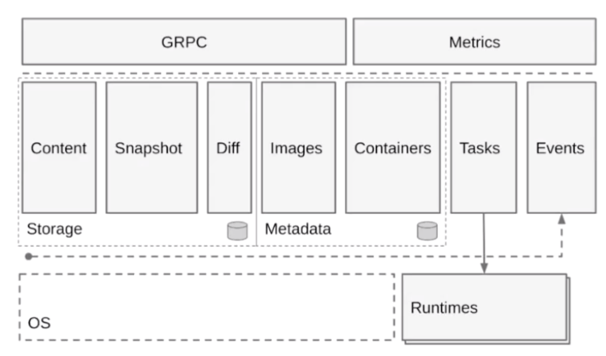
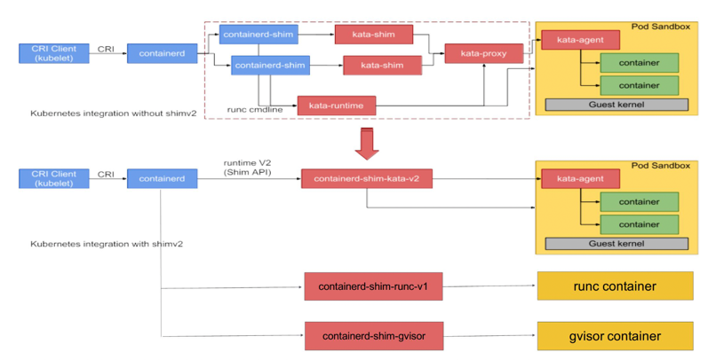

<!-- START doctoc generated TOC please keep comment here to allow auto update -->
<!-- DON'T EDIT THIS SECTION, INSTEAD RE-RUN doctoc TO UPDATE -->
**Table of Contents**  *generated with [DocToc](https://github.com/thlorenz/doctoc)*

- [Linux容器](#linux%E5%AE%B9%E5%99%A8)
  - [资源隔离和限制](#%E8%B5%84%E6%BA%90%E9%9A%94%E7%A6%BB%E5%92%8C%E9%99%90%E5%88%B6)
    - [两种 cgroup 驱动](#%E4%B8%A4%E7%A7%8D-cgroup-%E9%A9%B1%E5%8A%A8)
  - [容器中隔离中的文件系统](#%E5%AE%B9%E5%99%A8%E4%B8%AD%E9%9A%94%E7%A6%BB%E4%B8%AD%E7%9A%84%E6%96%87%E4%BB%B6%E7%B3%BB%E7%BB%9F)
  - [容器镜像的构成](#%E5%AE%B9%E5%99%A8%E9%95%9C%E5%83%8F%E7%9A%84%E6%9E%84%E6%88%90)
    - [以 overlay 为例](#%E4%BB%A5-overlay-%E4%B8%BA%E4%BE%8B)
    - [containerd容器引擎的构成](#containerd%E5%AE%B9%E5%99%A8%E5%BC%95%E6%93%8E%E7%9A%84%E6%9E%84%E6%88%90)
    - [shim v1/v2](#shim-v1v2)
    - [容器流程start和exec](#%E5%AE%B9%E5%99%A8%E6%B5%81%E7%A8%8Bstart%E5%92%8Cexec)
      - [Volume 机制](#volume-%E6%9C%BA%E5%88%B6)

<!-- END doctoc generated TOC please keep comment here to allow auto update -->

# Linux容器
容器是一种轻量级的虚拟化技术，因为它跟虚拟机比起来，它少了一层 hypervisor 层。先看一下下面这张图，这张图简单描述了一个容器的启动过程.

    
最下面是一个磁盘，容器的镜像是存储在磁盘上面的。上层是一个容器引擎，容器引擎可以是 docker，也可以是其它的容器引擎。
引擎向下发一个请求，比如说创建容器，然后这时候它就把磁盘上面的容器镜像，运行成在宿主机上的一个进程。

对于容器来说，最重要的是怎么保证这个进程所用到的资源是被隔离和被限制住的，在 Linux 内核上面是由 cgroup 和 namespace 这两个技术来保证的.
```shell
docker run -it busybox /bin/sh
```
-it 参数告诉了 Docker 项目在启动容器后，需要给我们分配一个文本输入 / 输出环境，也就是 TTY，跟容器的标准输入相关联，这样我们就可以和这个 Docker 容器进行交互了。
而 /bin/sh 就是我们要在 Docker 容器里运行的程序.
```shell
/ # ps
PID  USER   TIME COMMAND
  1 root   0:00 /bin/sh
  10 root   0:00 ps
```

可以看到，我们在 Docker 里最开始执行的 /bin/sh，就是这个容器内部的第 1 号进程（PID=1）。这就意味着，前面执行的 /bin/sh，以及我们刚刚执行的 ps，已经被 Docker 隔离在了一个跟宿主机完全不同的世界当中.

本来，每当我们在宿主机上运行了一个 /bin/sh 程序，操作系统都会给它分配一个进程编号，比如 PID=100。而现在，我们要通过 Docker 把这个 /bin/sh 程序运行在一个容器当中。

Docker会将宿主机的操作系统里，还是原来的第 100 号进程通过Linux 里面的 Namespace 机制重新进行进程编号。如下：
```shell
int pid = clone(main_function, stack_size, CLONE_NEWPID | SIGCHLD, NULL);
```
新创建的这个进程将会“看到”一个全新的进程空间，在这个进程空间里，它的 PID 是 1。

每个 Namespace 里的应用进程，都会认为自己是当前容器里的第 1 号进程，它们既看不到宿主机里真正的进程空间，也看不到其他 PID Namespace 里的具体情况。

除了我们刚刚用到的 PID Namespace，Linux 操作系统还提供了 Mount、UTS、IPC、Network 和 User 这些 Namespace，用来对各种不同的进程上下文进行“障眼法”操作。

## 资源隔离和限制

namespace 是用来做资源隔离的，在 Linux 内核上有七种 namespace，docker 中用到了前六种。
第七种 cgroup namespace 在 docker 本身并没有用到，但是在 runC 实现中实现了 cgroup namespace

1. mout namespace。mout namespace 就是保证容器看到的文件系统的视图，是容器镜像提供的一个文件系统，也就是说它看不见宿主机上的其他文件，
除了通过 -v 参数 bound 的那种模式，是可以把宿主机上面的一些目录和文件，让它在容器里面可见的。

2. uts namespace，这个 namespace 主要是隔离了 hostname 和 domain。

3. pid namespace，这个 namespace 是保证了容器的 init 进程是以 1 号进程来启动的。

4. 网络 namespace，除了容器用 host 网络这种模式之外，其他所有的网络模式都有一个自己的 network namespace 的文件。

5. user namespace，这个 namespace 是控制用户 UID 和 GID 在容器内部和宿主机上的一个映射，不过这个 namespace 用的比较少。

6. IPC namespace，这个 namespace 是控制了进程兼通信的一些东西，比方说信号量。

7. cgroup namespace，上图右边有两张示意图，分别是表示开启和关闭 cgroup namespace。
用 cgroup namespace 带来的一个好处是容器中看到的 cgroup 视图是以根的形式来呈现的，这样的话就和宿主机上面进程看到的 cgroup namespace 的一个视图方式是相同的。
另外一个好处是让容器内部使用 cgroup 会变得更安全。
Linux Cgroups 的全称是 Linux Control Group。它最主要的作用，就是限制一个进程组能够使用的资源上限，包括 CPU、内存、磁盘、网络带宽等等。

但是，基于 Linux Namespace 的隔离机制相比于虚拟化技术也有很多不足之处，其中最主要的问题就是：隔离得不彻底。

首先，既然容器只是运行在宿主机上的一种特殊的进程，那么多个容器之间使用的就还是同一个宿主机的操作系统内核。

其次，在 Linux 内核中，有很多资源和对象是不能被 Namespace 化的，最典型的例子就是：时间。

这就意味着，如果你的容器中的程序使用 settimeofday(2) 系统调用修改了时间，整个宿主机的时间都会被随之修改，这显然不符合用户的预期。

### 两种 cgroup 驱动


在 /sys/fs/cgroup 下面有很多诸如 cpuset、cpu、 memory 这样的子目录，也叫子系统。
这些都是我这台机器当前可以被 Cgroups 进行限制的资源种类。

cgroup 主要是做资源限制的，docker 容器有两种 cgroup 驱动：一种是 systemd 的，另外一种是 cgroupfs 的
1. cgroupfs 比较好理解。比如说要限制内存是多少，要用 CPU share 为多少，其实直接把 pid 写入对应的一个 cgroup 文件，
然后把对应需要限制的资源也写入相应的 memory cgroup 文件和 CPU 的 cgroup 文件就可以了。

2. 另外一个是 systemd 的一个 cgroup 驱动。这个驱动是因为 systemd 本身可以提供一个 cgroup 管理方式。所以如果用 systemd 做 cgroup 驱动的话，
所有的写 cgroup 操作都必须通过 systemd 的接口来完成，不能手动更改 cgroup 的文件


## 容器中隔离中的文件系统
如果一个容器需要启动，那么它一定需要提供一个根文件系统（rootfs），容器需要使用这个文件系统来创建一个新的进程，所有二进制的执行都必须在这个根文件系统中。

一个最常见的 rootfs，会包括如下所示的一些目录和文件，比如 /bin，/etc，/proc 等等：
```shell
$ ls /
bin dev etc home lib lib64 mnt opt proc root run sbin sys tmp usr var
```
为了保证当前的容器进程没有办法访问宿主机器上其他目录，我们在这里还需要通过 libcontainer 提供的 pivot_root 或者 chroot 函数改变进程能够访问个文件目录的根节点。不过，Docker 项目在最后一步的切换上会优先使用 pivot_root 系统调用，如果系统不支持，才会使用 chroot。

通过pivot_root或chroot将容器需要的目录挂载到了容器中，同时也禁止当前的容器进程访问宿主机器上的其他目录，保证了不同文件系统的隔离。

但是rootfs 只是一个操作系统所包含的文件、配置和目录，并不包括操作系统内核。在 Linux 操作系统中，这两部分是分开存放的，操作系统只有在开机启动时才会加载指定版本的内核镜像。

这就意味着，如果你的应用程序需要配置内核参数、加载额外的内核模块，以及跟内核进行直接的交互，你就需要注意了：这些操作和依赖的对象，都是宿主机操作系统的内核，它对于该机器上的所有容器来说是一个“全局变量”，牵一发而动全身。

我们首先来解释一下，什么是Mount Namespace：
Mount Namespace用来隔离文件系统的挂载点，这样进程就只能看到自己的 mount namespace 中的文件系统挂载点。

进程的Mount Namespace中的挂载点信息可以在 /proc/[pid]/mounts、/proc/[pid]/mountinfo 和 /proc/[pid]/mountstats 这三个文件中找到.

然后我们再来看看什么是根文件系统rootfs：

根文件系统首先是一种文件系统，该文件系统不仅具有普通文件系统的存储数据文件的功能，但是相对于普通的文件系统，它的特殊之处在于，它是内核启动时所挂载（mount）的第一个文件系统，内核代码的映像文件保存在根文件系统中，系统引导启动程序会在根文件系统挂载之后从中把一些初始化脚本（如rcS,inittab）和服务加载到内存中去运行。

Linux启动时，第一个必须挂载的是根文件系统；若系统不能从指定设备上挂载根文件系统，则系统会出错而退出启动。成功之后可以自动或手动挂载其他的文件系统。

基于上面两个基础知识，我们知道一个Linux容器，首先应该要有一个文件隔离环境，并且还要实现rootfs。

而在 Linux 操作系统里，有一个名为 chroot 的命令可以实现改变进程的根目录到指定的位置的目的从而实现rootfs。

所以我们的容器进程启动之前重新挂载它的整个根目录“/”。而由于 Mount Namespace 的存在，这个挂载对宿主机不可见，所以就创建了一个独立的隔离环境。

而挂载在容器根目录上、用来为容器进程提供隔离后执行环境的文件系统就是叫做rootfs。

所以，一个最常见的 rootfs，或者说容器镜像，会包括如下所示的一些目录和文件，比如 /bin，/etc，/proc 等等：

由于有了rootfs之后，所以rootfs 里打包的不只是应用，而是整个操作系统的文件和目录，也就意味着，应用以及它运行所需要的所有依赖，都被封装在了一起。这也就为容器镜像提供了“打包操作系统”的能力。

## 容器镜像的构成

docker 镜像是基于联合文件系统的。Docker 在镜像的设计中，引入了层（layer）的概念。也就是说，用户制作镜像的每一步操作，都会生成一个层，也就是一个增量 rootfs .

简单描述一下联合文件系统：大概的意思就是说，它允许文件是存放在不同的层级上面的，但是最终是可以通过一个统一的视图，看到这些层级上面的所有文件.

这张图非常形象的表明了 docker 的存储，docker 存储也就是基于联合文件系统，是分层的。每一层是一个 Layer，这些 Layer 由不同的文件组成，它是可以被其他镜像所复用的。
可以看一下，当镜像被运行成一个容器的时候，最上层就会是一个容器的读写层。这个容器的读写层也可以通过 commit 把它变成一个镜像顶层最新的一层.

Union File System 也叫 UnionFS，最主要的功能是将多个不同位置的目录联合挂载（union mount）到同一个目录下。
比如，我现在有两个目录 A 和 B，它们分别有两个文件.
```shell
$ tree
.
├── A
│  ├── a
│  └── x
└── B
  ├── b
  └── x
```

使用联合挂载的方式，将这两个目录挂载到一个公共的目录 C 上：
```shell
$ mkdir C
$ mount -t aufs -o dirs=./A:./B none ./C

$ tree ./C
./C
├── a
├── b
└── x
```
比如我们拉取一个镜像：
```shell
docker run -d ubuntu:latest sleep 3600
```
在Docker中，这个所谓的“镜像”，实际上就是一个 Ubuntu 操作系统的 rootfs，它的内容是 Ubuntu 操作系统的所有文件和目录。
但是Docker 镜像使用的 rootfs，往往由多个“层”组成：
```shell
$ docker image inspect ubuntu:latest
...
     "RootFS": {
      "Type": "layers",
      "Layers": [
        "sha256:f49017d4d5ce9c0f544c...",
        "sha256:8f2b771487e9d6354080...",
        "sha256:ccd4d61916aaa2159429...",
        "sha256:c01d74f99de40e097c73...",
        "sha256:268a067217b5fe78e000..."
      ]
    }
```
可以看到，这个 Ubuntu 镜像，实际上由五个层组成。这五个层就是五个增量 rootfs，每一层都是 Ubuntu 操作系统文件与目录的一部分；
而在使用镜像时，Docker 会把这些增量联合挂载在一个统一的挂载点上。

这个挂载点就是 /var/lib/docker/aufs/mnt/，比如，这个目录里面正是一个完整的 Ubuntu 操作系统：
```shell
$ ls /var/lib/docker/aufs/mnt/6e3be5d2ecccae7cc0fcfa2a2f5c89dc21ee30e166be823ceaeba15dce645b3e
bin boot dev etc home lib lib64 media mnt opt proc root run sbin srv sys tmp usr var
```

我们可以在/sys/fs/aufs 下查看被联合挂载在一起的各个层的信息：
```shell
$ cat /sys/fs/aufs/si_972c6d361e6b32ba/br[0-9]*
/var/lib/docker/aufs/diff/6e3be5d2ecccae7cc...=rw
/var/lib/docker/aufs/diff/6e3be5d2ecccae7cc...-init=ro+wh
/var/lib/docker/aufs/diff/32e8e20064858c0f2...=ro+wh
/var/lib/docker/aufs/diff/2b8858809bce62e62...=ro+wh
/var/lib/docker/aufs/diff/20707dce8efc0d267...=ro+wh
/var/lib/docker/aufs/diff/72b0744e06247c7d0...=ro+wh
/var/lib/docker/aufs/diff/a524a729adadedb90...=ro+wh
```
从这个结构可以看出来，这个容器的 rootfs 由如下图所示的三部分组成：


### 以 overlay 为例


最下层是一个 lower 层，也就是镜像层，它是一个只读层。右上层是一个 upper 层，upper 是容器的读写层，upper 层采用了写实复制的机制，
也就是说只有对某些文件需要进行修改的时候才会从 lower 层把这个文件拷贝上来，之后所有的修改操作都会对 upper 层的副本进行修改。

upper 并列的有一个 workdir，它的作用是充当一个中间层的作用。也就是说，当对 upper 层里面的副本进行修改时，会先放到 workdir，
然后再从 workdir 移到 upper 里面去，这个是 overlay 的工作机制。

最上面的是 mergedir，是一个统一视图层。从 mergedir 里面可以看到 upper 和 lower 中所有数据的整合，然后我们 docker exec 到容器里面，
看到一个文件系统其实就是 mergedir 统一视图层.

在最新的 Docker 中，overlay2 取代了 aufs 成为了推荐的存储驱动，但是在没有 overlay2 驱动的机器上仍然会使用 aufs作为 Docker 的默认驱动。

### containerd容器引擎的构成

按照水平层次来看的话:
    
1. 第一层是 GRPC，containerd 对于上层来说是通过 GRPC serve 的形式来对上层提供服务的。Metrics 这个部分主要是提供 cgroup Metrics 的一些内容。

2. 下面这层的左边是容器镜像的一个存储，中线 images、containers 下面是 Metadata，这部分 Matadata 是通过 bootfs 存储在磁盘上面的。
右边的 Tasks 是管理容器的容器结构，Events 是对容器的一些操作都会有一个 Event 向上层发出，然后上层可以去订阅这个 Event，由此知道容器状态发生什么变化。

3. 最下层是 Runtimes 层，这个 Runtimes 可以从类型区分，比如说 runC 或者是安全容器之类的。


### shim v1/v2


### 容器流程start和exec

```shell
docker exec -it {container id} /bin/sh
```
Linux Namespace 创建的隔离空间虽然看不见摸不着，但一个进程的 Namespace 信息在宿主机上是确确实实存在的，并且是以一个文件的方式存在

比如，通过如下指令，你可以看到当前正在运行的 Docker 容器的进程号（PID）：
```shell
# docker inspect --format '{{ .State.Pid }}' 6e27dcd23489
29659
```

这也就意味着：一个进程，可以选择加入到某个进程已有的 Namespace 当中，从而达到“进入”这个进程所在容器的目的，这正是 docker exec 的实现原理。

#### Volume 机制
Volume 机制，允许你将宿主机上指定的目录或者文件，挂载到容器里面进行读取和修改操作。

在 Docker 项目里，它支持两种 Volume 声明方式，可以把宿主机目录挂载进容器的 /test 目录当中：
```shell
$ docker run -v /test ...
$ docker run -v /home:/test ...
```

在第一种情况下，由于你并没有显示声明宿主机目录，那么 Docker 就会默认在宿主机上创建一个临时目录 /var/lib/docker/volumes/[VOLUME_ID]/_data，然后把它挂载到容器的 /test 目录上。而在第二种情况下，Docker 就直接把宿主机的 /home 目录挂载到容器的 /test 目录上。

镜像的各个层，保存在 /var/lib/docker/aufs/diff 目录下，在容器进程启动后，它们会被联合挂载在 /var/lib/docker/aufs/mnt/ 目录中，这样容器所需的 rootfs 就准备好了。

容器会在 rootfs 准备好之后，在执行 chroot 之前，把 Volume 指定的宿主机目录（比如 /home 目录），挂载到指定的容器目录（比如 /test 目录）在宿主机上对应的目录（即 /var/lib/docker/aufs/mnt/[可读写层 ID]/test）上，这个 Volume 的挂载工作就完成了。

由于执行这个挂载操作时，“容器进程”已经创建了，也就意味着此时 Mount Namespace 已经开启了。所以，这个挂载事件只在这个容器里可见。你在宿主机上，是看不见容器内部的这个挂载点的。从而保证了容器的隔离性不会被 Volume 打破。

这里的挂载技术就是Linux 的绑定挂载（bind mount）机制。它的主要作用就是，允许你将一个目录或者文件，而不是整个设备，挂载到一个指定的目录上。并且，这时你在该挂载点上进行的任何操作，只是发生在被挂载的目录或者文件上，而原挂载点的内容则会被隐藏起来且不受影响。


mount –bind /home /test，会将 /home 挂载到 /test 上。其实相当于将 /test 的 dentry，重定向到了 /home 的 inode。这样当我们修改 /test 目录时，实际修改的是 /home 目录的 inode。

