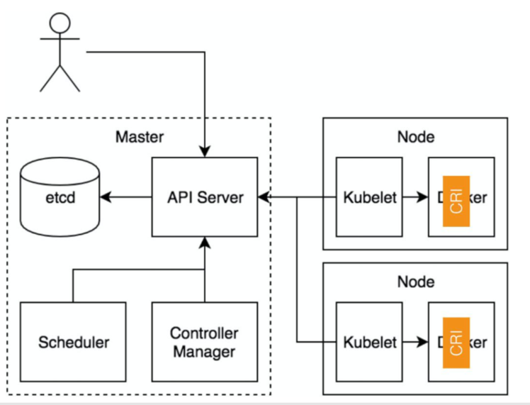
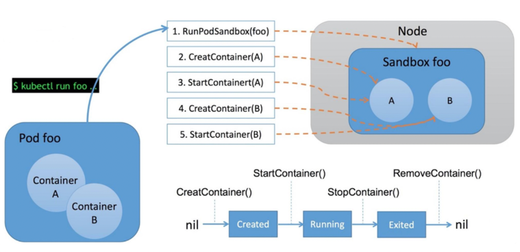
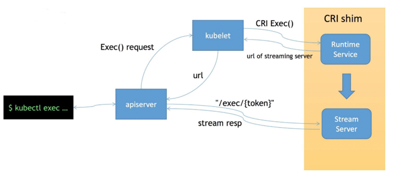
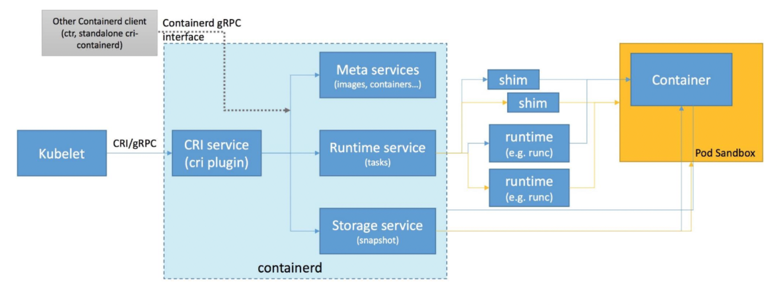
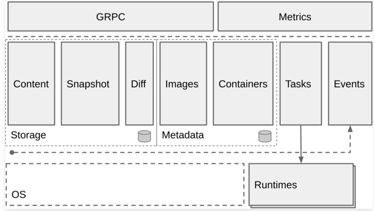

<!-- START doctoc generated TOC please keep comment here to allow auto update -->
<!-- DON'T EDIT THIS SECTION, INSTEAD RE-RUN doctoc TO UPDATE -->
**Table of Contents**  *generated with [DocToc](https://github.com/thlorenz/doctoc)*

- [Container Runtime Interface 容器运行时接口(CRI)](#container-runtime-interface-%E5%AE%B9%E5%99%A8%E8%BF%90%E8%A1%8C%E6%97%B6%E6%8E%A5%E5%8F%A3cri)
  - [背景](#%E8%83%8C%E6%99%AF)
  - [CRI 接口分组](#cri-%E6%8E%A5%E5%8F%A3%E5%88%86%E7%BB%84)
    - [1. 通过 CRI 操作容器的生命周期](#1-%E9%80%9A%E8%BF%87-cri-%E6%93%8D%E4%BD%9C%E5%AE%B9%E5%99%A8%E7%9A%84%E7%94%9F%E5%91%BD%E5%91%A8%E6%9C%9F)
    - [2. CRI streaming 接口](#2-cri-streaming-%E6%8E%A5%E5%8F%A3)
    - [目前 CRI 的一些实现](#%E7%9B%AE%E5%89%8D-cri-%E7%9A%84%E4%B8%80%E4%BA%9B%E5%AE%9E%E7%8E%B0)
    - [Containerd结构](#containerd%E7%BB%93%E6%9E%84)

<!-- END doctoc generated TOC please keep comment here to allow auto update -->

# Container Runtime Interface 容器运行时接口(CRI)
本质上就是 Kubernetes 定义的一组与容器运行时进行交互的接口，所以只要实现了这套接口的容器运行时都可以对接到 Kubernetes 平台上来。

不过 Kubernetes 推出 CRI 这套标准的时候还没有现在的统治地位，所以有一些容器运行时可能不会自身就去实现 CRI 接口，于是就有了 shim（垫片）， 
一个 shim 的职责就是作为适配器将各种容器运行时本身的接口适配到 Kubernetes 的 CRI 接口上，其中 dockershim 就是 Kubernetes 对接 Docker 到 CRI 接口上的一个垫片实现。

## 背景
在 Kubernetes 早期的时候，当时 Docker 实在是太火了，Kubernetes 当然会先选择支持 Docker，而且是通过硬编码的方式直接调用 Docker API，
后面随着 Docker 的不断发展以及 Google 的主导，出现了更多容器运行时，
Kubernetes 为了支持更多更精简的容器运行时，Google 就和红帽主导推出了 CRI 标准，用于将 Kubernetes 平台和特定的容器运行时（当然主要是为了干掉 Docker）解耦

## CRI 接口分组

跟容器最相关的一个 Manager 是 Generic Runtime Manager，就是一个通用的运行时管理器。

remote 指的就是 CRI 接口。

Kubelet 通过 gRPC 框架与容器运行时或 shim 进行通信，其中 kubelet 作为客户端，CRI shim（也可能是容器运行时本身）作为服务器。

CRI 定义的 API(https://github.com/kubernetes/kubernetes/blob/release-1.5/pkg/kubelet/api/v1alpha1/runtime/api.proto) 主要包括两个 gRPC 服务，ImageService 和 RuntimeService

* 一组是ImageService，主要是容器镜像相关的操作，比如拉取镜像、删除镜像等。

* 另一组是RuntimeService，主要是跟容器相关的操作，比如创建、启动、删除Container、Exec等。

不过这里同样也有一个例外，那就是 Docker，由于 Docker 当时的江湖地位很高，Kubernetes 是直接内置了 dockershim 在 kubelet 中的，所以如果你使用的是 Docker 这种容器运行时的话是不需要单独去安装配置适配器之类的，当然这个举动似乎也麻痹了 Docker 公司。
不过Kubernetes 社区在2020年7月份 的 1.20 版本就移除 dockershim 方案。

现在如果我们使用的是 Docker 的话，当我们在 Kubernetes 中创建一个 Pod 的时候，首先就是 kubelet 通过 CRI 接口调用 dockershim，请求创建一个容器，kubelet 可以视作一个简单的 CRI Client, 而 dockershim 就是接收请求的 Server，不过他们都是在 kubelet 内置的。

dockershim 收到请求后, 转化成 Docker Daemon 能识别的请求, 发到 Docker Daemon 上请求创建一个容器，请求到了 Docker Daemon 后续就是 Docker 创建容器的流程了，去调用 containerd，然后创建 containerd-shim 进程，通过该进程去调用 runc 去真正创建容器
### 1. 通过 CRI 操作容器的生命周期

流程
1. 首先调用 RunPodSandbox 接口来创建一个 Pod 容器，Pod 容器是用来持有容器的相关资源的，比如说网络空间、PID空间、进程空间等资源；
2. 然后调用 CreatContainer 接口在 Pod 容器的空间创建业务容器；
3. 再调用 StartContainer 接口启动容器，相对应的销毁容器的接口为 StopContainer 与 RemoveContaine

### 2. CRI streaming 接口
举例流式接口 exec：

它可以用来在容器内部执行一个命令，又或者说可以 attach 到容器的 IO 流中做各种交互式的命令。
它的特别之处在于，一个是节省资源，另一个是连接的可靠性

首先 exec 操作会发送到 apiserver，经过鉴权，apiserver 将对 Kubelet Server 发起 exec 的请求，
然后 Kubelet 会调用 CRI 的 exec 接口将具体的请求发至容器的运行时。这个时候，容器运行时不是直接地在 exec 接口上来服务这次请求，而是通过我们的 streaming server 来异步地返回每一次执行的结果。
也就是说 apiserver 其实实际上是跟 streaming server 交互来获取我们的流式数据的。这样一来让我们的整个 CRI Server 接口更轻量、更可靠

### 目前 CRI 的一些实现

* CRI-containerd
* CRI-O  ：红帽公司
* CouchContainer @alibaba

docker由 docker-client ,dockerd,containerd,docker-shim,runc组成，所以containerd是docker的基础组件之一，
docker 对容器的管理和操作基本都是通过 containerd 完成的。 那么，containerd 是什么呢？

Containerd 是一个工业级标准的容器运行时（Container Runtime Interface），它强调简单性、健壮性和可移植性。Containerd 可以在宿主机中管理完整的容器生命周期：容器镜像的传输和存储、容器的执行和管理、存储和网络等。
详细点说，Containerd 负责干下面这些事情：

* 管理容器的生命周期(从创建容器到销毁容器)
* 拉取/推送容器镜像
* 存储管理(管理镜像及容器数据的存储)
* 调用 runC 运行容器(与 runC 等容器运行时交互)
* 管理容器网络接口及网络

### Containerd结构

这里的 Meta services、Runtime service 与 Storage service 都是 containerd 提供的接口。
它们是通用的容器相关的接口，包括镜像管理、容器运行时管理等。CRI 在这之上包装了一个 gRPC 的服务。
右侧就是具体的容器的实现，比如说，创建容器时就要创建具体的 runtime 和它的 shim，它们和 Container 一起组成了一个 Pod Sandbox。

CRI-containerd 的一个好处是，containerd 还额外实现了更丰富的容器接口，所以它可以用 containerd 提供的 ctr 工具来调用这些丰富的容器运行时接口，而不只是 CRI 接口