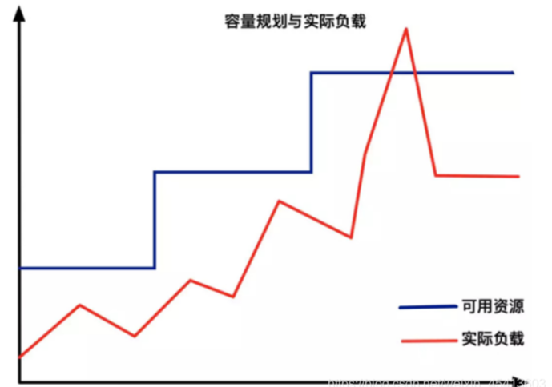
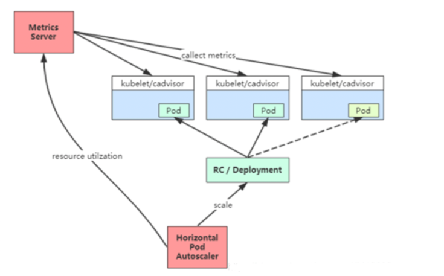
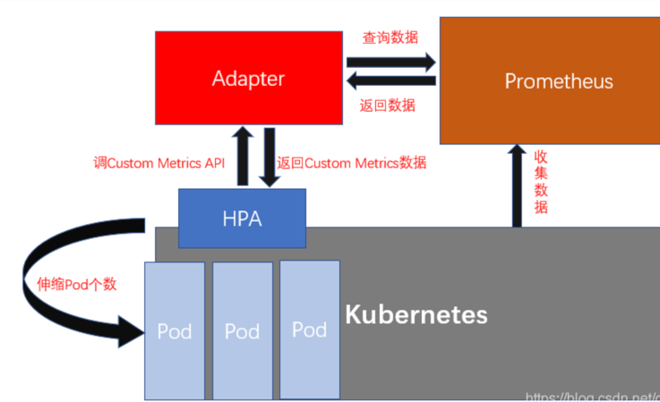
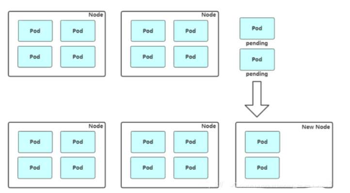
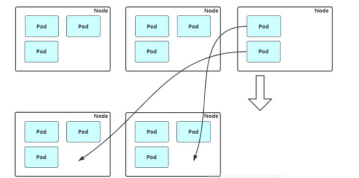

# autoscaler

应用部署在集群中，应用的负载本身是会随着时间动态发生变化的，为了更好的平衡资源使用率以及性能，kubernetes引入了autoscaler.

弹性伸缩就是要解决当实际负载增大，而集群资源容量没来得及反应的问题。


## autoscaler要处理问题
1. cpu/mem的监控数据是抽样采集的，波动是非常迅速的，而实际容器增减的速度显然跟不上监控数据波动的速度，你的伸缩相对实际负载来说是有滞后性的。
2. 扩容的时候，扩容的pod数量超过了集群容量怎么办？而缩容的时候，要不要在没有请求的时候把集群大小缩为0，缩为0就意味着你的服务实际上已经下线了，而这个时候再有请求过来就会请求失败
3. 监控数据并不是稳定可靠的，如果采集到的数据经常有缺失怎么办。如果你的集群机器数量很大的话，某次采集缺失几个pod的数据发生的概率不会低，这种情况还要不要继续伸缩
4. 如果负载存在大范围波动的情况下该怎么办，比如说监控数据一直在某个值附近反复横跳，导致你的集群大小也会反复横跳，但是从更长的时间角度看，所有的波动其实都发生在某个值的附近，这个时候是不是应该优化


## 解决

1. 限制伸缩的值在最大最小范围之内。（避免超过资源限制）

2. 限制一次伸缩的pod数量和每分钟伸缩的pod数量。（钝化伸缩动作，避免反复横跳）

3. autoscaler根据当前metrics计算出一个值并不会直接拿来伸缩，而是作为推荐值和稳定窗口内的所有推荐值比较，取最小值作为伸缩依据，
   一方面autoscaler对于负载的变动是敏感的（每秒推荐一次），另一方面autoscaler对于变化的反应是迟钝的，你必须要连续5分钟的持续变动才能造成伸缩动作（当然你可以调这个窗口大小），
   这样提高了整个集群pod数量的稳定性。那么，为什么要取最小值而不是最大值（伸和缩都取最小）呢？因为HPA整个的设计思路就是节约资源，所以能少用点资源就少用点资源，这样整个k8s集群能够容纳的服务才能变多。
   
4. 对于微服务来说，scale到0之后，有新的请求进来了，怎么办？单纯靠HPA并不能解决这个问题，这个时候我们就需要Knative了，
   Knative解决这个问题的方式是先用proxy拦截掉这部分请求，然后由KPA（Knative的autoscaler）通过activator去激活一个pod，激活之后再把流量放进来，这样保证0pod的时候服务仍然看起来可用，

## 不同业务需求
> ①在线负载型：微服务、网站、API
> ②离线任务型：离线计算、机器学习
> ③定时任务型：定时批量计算

不同类型的负载对于弹性伸缩的要求有所不同，在线负载对弹出时间敏感，离线任务对价格敏感，定时任务对调度敏感

## 分类
Kubernetes的autoscaler分成两个层次:
1. pod级别的扩容，包含横向扩容(HPA)以及纵向扩容(VPA),扩容容器可用的资源使用量。
2. 集群级别的扩容，通过CA(Cluster Autoscaler)来控制扩容或者缩小集群中Node的数量。集群级别的扩容，通过CA(Cluster Autoscaler)来控制扩容或者缩小集群中Node的数量。


## pod级别

### 1. HPA（Horizontal Pod Autoscaler）Pod自动弹性伸缩


K8S通过对Pod中运行的容器各项指标（CPU占用、内存占用、网络请求量）的检测，实现对Pod实例个数的动态新增和减少。

早期的kubernetes版本，只支持CPU指标的检测，因为它是通过kubernetes自带的监控系统heapster实现的。

到了kubernetes 1.8版本后，heapster已经弃用，资源指标主要通过metrics api获取，这时能支持检测的指标就变多了（CPU、内存等核心指标和qps等自定义指标）

Horizontal Pod Autoscaler 实现为一个控制循环，其周期由--horizontal-pod-autoscaler-sync-period选项指定（默认15秒）。

在每个周期内，controller manager都会根据每个HorizontalPodAutoscaler定义的指定的指标去查询资源利用率。 controller manager从资源指标API（针对每个pod资源指标）或自定义指标API（针对所有其他指标）获取指标。

对于每个Pod资源指标（比如：CPU），控制器会从资源指标API中获取相应的指标。然后，如果设置了目标利用率值，则控制器计算利用率值作为容器上等效的资源请求百分比。如果设置了目标原始值，则直接使用原始指标值。然后，控制器将所有目标容器的利用率或原始值（取决于指定的目标类型）取平均值，并产生一个用于缩放所需副本数量的比率。

如果某些Pod的容器未设置相关资源请求，则不会定义Pod的CPU使用率，并且自动缩放器不会对该指标采取任何措施。

#### HPA设置
目前 HPA 已经支持了 autoscaling/v1、autoscaling/v1beta1和autoscaling/v1beta2 三个大版本

参考配置
```yaml
apiVersion: autoscaling/v2beta1
kind: HorizontalPodAutoscaler
metadata:
  name: podinfo
spec:
  scaleTargetRef:
    apiVersion: extensions/v1beta1
    kind: Deployment
    name: podinfo
  minReplicas: 2
  maxReplicas: 10
  metrics:
  - type: Resource
    resource:
      name: cpu
      targetAverageUtilization: 80
  - type: Resource
    resource:
      name: memory
      targetAverageValue: 200Mi
  - type: Pods
    pods:
      metric:
        name: packets-per-second
      target:
        type: AverageValue
        averageValue: 1k
  - type: Object
    object:
      metric:
        name: requests-per-second
      describedObject:
        apiVersion: networking.k8s.io/v1beta1
        kind: Ingress
        name: main-route
      target:
        type: Value
        value: 10k

```
- scaleTargetRef：表示当前要伸缩对象是谁
- minReplicas： 最小pod实例数

- maxReplicas： 最大pod实例数

- metrics： 用于计算所需的Pod副本数量的指标列表

- resource： 核心指标，包含cpu和内存两种（被弹性伸缩的pod对象中容器的requests和limits中定义的指标。）

- object： k8s内置对象的特定指标（需自己实现适配器）

- pods： 应用被弹性伸缩的pod对象的特定指标（例如，每个pod每秒处理的事务数）（需自己实现适配器）

- external： 非k8s内置对象的自定义指标（需自己实现适配器）

#### HPA获取自定义指标（Custom Metrics）的底层实现（基于Prometheus）


Kubernetes是借助Agrregator APIServer扩展机制来实现Custom Metrics。Custom Metrics APIServer是一个提供查询Metrics指标的API服务（Prometheus的一个适配器），
这个服务启动后，kubernetes会暴露一个叫custom.metrics.k8s.io的API，当请求这个URL时，请求通过Custom Metics APIServer去Prometheus里面去查询对应的指标，然后将查询结果按照特定格式返回。

HPA样例配置：
```yaml
kind: HorizontalPodAutoscaler
apiVersion: autoscaling/v2beta1
metadata:
  name: sample-metrics-app-hpa
spec:
  scaleTargetRef:
    apiVersion: apps/v1
    kind: Deployment
    name: sample-metrics-app
  minReplicas: 2
  maxReplicas: 10
  metrics:
  - type: Object
    object:
      target:
        kind: Service
        name: sample-metrics-app
      metricName: http_requests
      targetValue: 100

```

当配置好HPA后，HPA会向Custom Metrics APIServer发送https请求      
```http request
https://<apiserver_ip>/apis/custom-metrics.metrics.k8s.io/v1beta1/namespaces/default/services/sample-metrics-app/http_requests

```
可以从上面的https请求URL路径中得知，这是向 default 这个 namespaces 下的名为 sample-metrics-app 的 service 发送获取 http_requests 这个指标的请求。

Custom Metrics APIServer收到 http_requests 查询请求后，向Prometheus发送查询请求查询 http_requests_total 的值（总请求次数），Custom Metics APIServer再将结果计算成 http_requests （单位时间请求率）返回，实现HPA对性能指标的获取，从而进行弹性伸缩操作。

#### 算法
```go
desiredReplicas = ceil[currentReplicas * ( currentMetricValue / desiredMetricValue )]
```
直译为：(当前指标值 ➗ 期望指标值) ✖️ 当前副本数 ，结果再向上取整，最终结果就是期望的副本数量

例如，假设当前指标值是200m ，期望指标值是100m，期望的副本数量就是双倍。因为，200.0 / 100.0 == 2.0

如果当前值是50m，则根据50.0 / 100.0 == 0.5，那么最终的副本数量就是当前副本数量的一半

如果该比率足够接近1.0，则会跳过伸缩

当targetAverageValue或者targetAverageUtilization被指定的时候，currentMetricValue取HorizontalPodAutoscaler伸缩目标中所有Pod的给定指标的平均值。

所有失败的和标记删除的Pod将被丢弃，即不参与指标计算

当基于CPU利用率来进行伸缩时，如果有尚未准备好的Pod（即它仍在初始化），那么该Pod将被放置到一边，即将被保留。

```shell
# 查看autoscalers列表
kubectl get hpa
# 查看具体描述
kubectl describe hpa
# 删除autoscaler
kubectl delete hpa

# 示例：以下命名将会为副本集foo创建一个autoscaler，并设置目标CPU利用率为80%，副本数在2~5之间
kubectl autoscale rs foo --min=2 --max=5 --cpu-percent=80
```

### 2. VPA（Vertical Pods Autoscaler纵向扩容）

Vertical Pods Autoscaler（VPA）为现有pod分配更多（或更少）的CPU或内存。它可以适用于有状态和无状态的pod，但它主要是为有状态服务而构建的。

## Cluster Autoscaler: Node级别自动扩/缩容

 

- 扩容 : Cluster Autoscaler（CA）根据pending状态的pod来扩展您的群集节点。它会定期检查是否有pending状态的pod，如果需要更多资源并且扩展后的群集仍在用户提供的约束范围内，则会增加群集的大小。
CA与云提供商接口以请求更多节点或释放空闲节点。它适用于GCP，AWS和Azure

- 缩容：Cluster AutoScaler 也会定期监测 Node 的资源使用情况，当一个 Node 长时间资源利用率都很低时（低于 50%）自动将其所在虚拟机从云服务商中删除。此时，原来的 Pod 会自动调度到其他 Node 上面。

### CA架构
CA由以下几个模块组成：

- autoscaler：核心模块，负责整体扩缩容功能
- Estimator：负责评估计算扩容节点
- Simulator：负责模拟调度，计算缩容节点
- CA Cloud-Provider：与云交互进行节点的增删操作。

### 什么样的节点不会被CA删除
- 节点上有pod被PodDisruptionBudget控制器限制。
- 节点上有命名空间是kube-system的pods。
- 节点上的pod不是被控制器创建，例如不是被deployment, replica set, job, stateful set创建。
- 节点上有pod使用了本地存储
- 节点上pod驱逐后无处可去，即没有其他node能调度这个pod
- 节点有注解：”cluster-autoscaler.kubernetes.io/scale-down-disabled”: “true”

## CA如何与HPA协同工作
HPA（Horizontal Pod Autoscaling）是k8s中pod的水平自动扩展，HPA的操作对象是RC、RS或Deployment对应的Pod，根据观察到的CPU等实际使用量与用户的期望值进行比对，做出是否需要增减实例数量的决策。
当CPU负载增加，HPA扩容pod，如果此pod因为资源不足无法被调度，则此时CA出马扩容节点。
当CPU负载减小，HPA减少pod，CA发现有节点资源利用率低甚至已经是空时，CA就会删除此节点

## 源码分析：待补充
// /Users/python/Desktop/kubernetes/pkg/controller/podautoscaler/horizontal.go
```go
```

## 参考链接：
1. 容器定时伸缩（CronHPA）：https://help.aliyun.com/document_detail/151557.html


