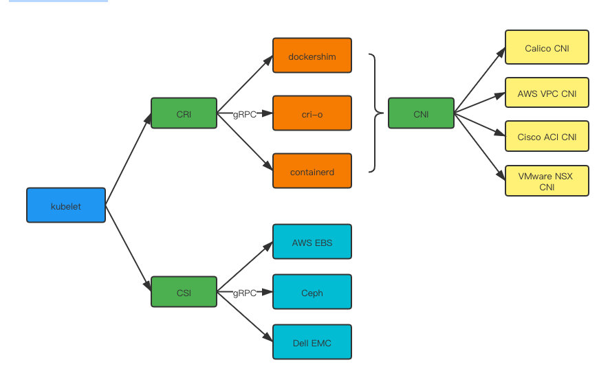

<!-- START doctoc generated TOC please keep comment here to allow auto update -->
<!-- DON'T EDIT THIS SECTION, INSTEAD RE-RUN doctoc TO UPDATE -->
**Table of Contents**  *generated with [DocToc](https://github.com/thlorenz/doctoc)*

- [kubelet](#kubelet)
  - [kubelet组件模块](#kubelet%E7%BB%84%E4%BB%B6%E6%A8%A1%E5%9D%97)
  - [深入 kubelet 工作原理](#%E6%B7%B1%E5%85%A5-kubelet-%E5%B7%A5%E4%BD%9C%E5%8E%9F%E7%90%86)
  - [版本 1.21 源码 run](#%E7%89%88%E6%9C%AC-121-%E6%BA%90%E7%A0%81-run)
    - [各种Manager](#%E5%90%84%E7%A7%8Dmanager)

<!-- END doctoc generated TOC please keep comment here to allow auto update -->

# kubelet
在k8s集群中的每个节点上都运行着一个kubelet服务进程，其主要负责向apiserver注册节点、管理pod及pod中的容器，并通过 cAdvisor 监控节点和容器的资源。

- 节点管理：节点注册、节点状态更新(定期心跳)
- pod管理：接受来自apiserver、file、http等PodSpec，并确保这些 PodSpec 中描述的容器处于运行状态且运行状况良好
- 容器健康检查：通过ReadinessProbe、LivenessProbe两种探针检查容器健康状态
- 资源监控：通过 cAdvisor 获取其所在节点及容器的监控数据

Kubernetes对各种资源的使用，则主要依赖于抽象出来的三种接口协议，即CRI, CNI和CSI，在Kubernetes经典的Controller-Loop模型中，kubelet是最终的动作执行者，
它部署在每个worker节点，负责当前节点Pod相关的资源生命周期管理，通过这三个接口协议跟远端的资源服务提供者进行交互。

通过CRI，向远端的计算资源提供者（容器运行时，Container Runtime）申请对应的容器资源，
但是在创建容器之前，先要准备容器所在网络环境，即SandBox，所谓SandBox，其实就是网络命名空间，比如是一个network namespace或者是一个虚拟机，以及在其中的网络设备和相关的网络信息，
而这些网络信息则是容器运行时(Container Runtime)通过CNI接口向远端的网络资源提供者申请的，包括IP地址，路由以及DNS等信息，将这些信息配置到网络命名空间中，
SandBox就准备好了，然后就可以在其中创建容器了，在同一个SandBox中可以创建多个容器，它们共享同一个网络命名空间，这些就组成了所谓的Pod；

Kubelet再通过CSI接口，向远端的存储资源提供者申请对应的存储资源，根据存储类型，可能需要挂载或者格式化成文件系统供Pod使用；
这里面有点特殊的就是CNI，kubelet没有直接通过CNI跟网络资源提供者交互，而是由Container Runtime来做这件事，kubelet只需要通过CRI向Container Runtime发送请求，即可获得相关的网络信息。



## kubelet组件模块

- Pleg(Pod Lifecycle Event Generator) 是kubelet 的核心模块，PLEG周期性调用container runtime获取本节点containers/sandboxes的信息(像docker ps)，并与自身维护的pods cache信息进行对比，生成对应的 PodLifecycleEvent并发送到plegCh中，在kubelet syncLoop中对plegCh进行消费处理，最终达到用户的期望状态
- podManager提供存储、访问Pod信息的接口，维护static pod和mirror pod的映射关系
- containerManager 管理容器的各种资源，比如 CGroups、QoS、cpuset、device 等
- KubeletGenericRuntimeManager是容器运行时的管理者，负责于 CRI 交互，完成容器和镜像的管理； 
- statusManager负责维护pod状态信息并负责同步到apiserver
- probeManager负责探测pod状态，依赖statusManager、statusManager、livenessManager、startupManager
- cAdvisor是google开源的容器监控工具，集成在kubelet中，收集节点与容器的监控信息，对外提供查询接口
- volumeManager 管理容器的存储卷，比如格式化资盘、挂载到 Node 本地、最后再将挂载路径传给容器

## 深入 kubelet 工作原理


由图我们可以看到kubelet 的工作核心，就是一个控制循环，即：SyncLoop。驱动整个控制循环的事件有：pod更新事件、pod生命周期变化、kubelet本身设置的执行周期、定时清理事件等。

在SyncLoop循环上还有很多xxManager，例如probeManager 会定时去监控 pod 中容器的健康状况，当前支持两种类型的探针：livenessProbe 和readinessProbe；statusManager 负责维护状态信息，并把 pod 状态更新到 apiserver；containerRefManager 容器引用的管理，相对简单的Manager，用来报告容器的创建，失败等事件等等。

kubelet 调用下层容器运行时的执行过程，并不会直接调用 Docker 的 API，而是通过一组叫作 CRI（Container Runtime Interface，容器运行时接口）的 gRPC 接口来间接执行的。


Kubelet实现对Pod以及各种外部资源的管理，主要依赖两个机制：一个是SyncLoop，一个是各种各样的Manager。

在SyncLoop中，kubelet会从几个特定的事件来源处，获取到关于Pod的事件，比如通过informer机制从apiserver处获取到的Pod的增删改事件，这些事件触发kubelet根据Pod的期望状态对本节点的Pod做出相应操作，
比如新建一个Pod，或者给Pod添加一个新的存储等等，除了apiserver的事件，还有每隔1秒获取到的定期执行sync的事件，周期性的sync事件确保Pod的实际状态跟期望状态是一致的，
在Kubelet的实现中，每一个Pod都对应的建了一个worker线程，在该线程中处理对该Pod的更新操作，同一个Pod不能并发进行更新，但是不同Pod是可以并发进行操作的；

而各种各样的Manager则负责各种对象以及资源的管理，它们互相配合，形成一个有机的整体，是kubelet各种功能的实现者，比如secretManager/configMapManager等，
它们负责从apiserver处通过reflector机制将本节点Pod绑定的secret和configmap缓存到本地，containerManager负责管理container所需要使用到的资源，
比如qos, cpu, memory, device等，statusManager负责Pod状态的持续维护，会周期性的将缓存中的pod status通过apiserver更新到数据库中，
volumePluginManager负责管理内置(intree)和动态发现的(flexvolume dynamic)的存储插件，csi就是作为intree的一个plugin的形式存在的，
volumeManager则是负责管理本节点上的pod/volume/node的attach和mount操作的，等等这些Manager就好比人体的各种器官一样，每个器官负责一个或多个功能，各种器官协调组成一个健康的个体


## 版本 1.21 源码 run


### 各种Manager

```css
* cloudResourceSyncManager
    * pkg/kubelet/cloudresource/cloud_request_manager.go
    * 从cloud provider周期性的同步instnace列表到本地
* secretManager
    * pkg/kubelet/secret/secret_manager.go
    * NewWatchingSecretManager
    * 当一个pod在本节点注册时，会将该pod绑定的secret通过reflector机制缓存到本地
* configMapManager
    * pkg/kubelet/configmap/configmap_manager.go
    * NewWatchingConfigMapManager
    * 当一个Pod在本节点注册时，会将该pod绑定的configmap通过reflector机制缓存到本地
* livenessManager
    * pkg/kubelet/prober/results/results_manager.go
    * Manager
    * set/get某个container在本地缓存中的的liveness状态
* startupManager
    * pkg/kubelet/prober/results/results_manager.go
    * Manager
    * set/get某个container在本地缓存中的startup缓存状态
* podCache
    * pkg/kubelet/container/cache.go
    * cache
    * 各个pods的PodStatus缓存
* podManager
    * pkg/kubelet/pod/pod_manager.go
    * basicManager
    * Kubelet relies on the pod manager as the source of truth for the desired state.
    * 管理pod在本地的映射，从podUID或者是podFullName到pod的映射关系
    * mirrorPod是static pod在apiserver中的代表对象，static pod就是从file, http等source创建的pod，不是从apiserver中直接创建的，这种pod会对应的在apiserver中创建一个mirror pod，跟static pod对应
* statusManager
    * pkg/kubelet/status/status_manager.go
    * manager
    * pod status状态的管理，同时维护了一份本地的缓存，并且有一个周期性的sync任务，将缓存中的pod status跟通过apiserver跟数据库中的pod status进行同步
    * 实现了GetPodStatus()、SetPodStatus()、SetContainerReadiness()等方法
    * 这里有一个很经典的chan的用法，异步的实现缓存和数据库的同步
* resourceAnalyzer
    * pkg/kubelet/server/stats/resource_analyzer.go
    * resourceAnalyzer{fsResourceAnalyzer, SummaryProvider}
    * SummaryProvider提供该node节点的cpu/内存/磁盘/网络/pods等信息，而fsResourceAnalyzer，则提供每个pod的volume信息，并且通过每个pod的周期性循环任务，将该节点上所有pod的volume信息缓存到本地statCache中
* dockerLegacyService
    * DockerService
* runtimeService
    * remoteRuntimeService，实现了k8s.io/cri-api项目中定义的RuntimeService接口，而它又是调用了k8s.io/cri-api中定义的runtimeServiceClient，它客户端实现了grpc的调用。
    * grpc.Server的客户端，用来跟remote runtime service发送请求
* containerLogManager
* containerManager
    * 路径：kubernetes/pkg/kubelet/cm/*
    * 该manager并不是针对container本身的管理，而更多的是管理container所需要使用的资源的管理，比如qos, cpu, memory, device等
    * cgroupManager
        * 跟cgroup交互的manager，通过它来对cgroup进行更新，被qosContainerManager引用
    * qosContainerManager
        * 设置/kubepods.slice/kubepods-burstable.slice 和 /kubepods.slice/kubepods-besteffort.slice级别的cgroup
        * besteffort级别的cpu.shares设置为固定值2，burstable级别的cpu.shares设置为该节点的所有pods的request cpu之和
        * 此外还有hugepage, memory的设置，这里设置的是总的qos，并不是单个pod的
        * 有一个周期性循环的任务在不断更新这两个cgroup
    * podContainerManager
        * 设置pod级别的cgroup，包括cpu, memory, hugepage, pids
        * container级别的cgroup规则是由cri runtime下发的，kubelet没有直接下发
    * cpuManager
        * 可以为containder设置静态cpuset，即进行CPU绑定
        * The static policy allows containers in Guaranteed pods with integer CPU requests access to exclusive CPUs on the node.
        * https://kubernetes.io/docs/tasks/administer-cluster/cpu-management-policies/
    * memoryManager
        * 跟topologyManager一起配合使用
    * deviceManager
    * topologyManager
        * 能够让container感知各种外设(gpu/sr-iov nic)和CPU，与NUMA node的关系，可以将设备绑定到同一个NUMA node上，以提高性能。
        * https://kubernetes.io/blog/2020/04/01/kubernetes-1-18-feature-topoloy-manager-beta/
* containerRuntime
    * kubeGenericRuntimeManager，实现了container/runtime.go中定义的Runtime接口
    * Kubelet的Runtime Manager，通过runtimeService来向remote runtime进行交互，各个manager要跟runtime交互，都是通过该接口
* streamingRuntime
* runner
* runtimeCache
    * runtimeCache {pods []*Pod}
    * pod的本地缓存，从runtime里面拿到pods列表，更新到本地缓存中
* StatsProvider
* pleg(Pod Lifecycle Event Generator)
    * GenericPLEG
    * https://github.com/kubernetes/community/blob/master/contributors/design-proposals/node/pod-lifecycle-event-generator.md
    * https://developers.redhat.com/blog/2019/11/13/pod-lifecycle-event-generator-understanding-the-pleg-is-not-healthy-issue-in-kubernetes/
    * 它的作用是周期性从container runtime中获取到pods/containers列表，即relist，跟之前的状态进行比较，如果发生变化，则生成一个对应的event
* runtimeState
    * 检查container runtime的storage/network/runtime的状态
* containerGC
    * 清理不正常的container
* containerDeletor
    * podContainerDeletor
    * 通过channel的方式异步删除container，即外部调用deleteContainersInPod()方法，将待删除的container id放入到channel中，然后调用runtime中的DeleteContainer()方法，向runtime发送删除请求
* imageManager
    * realImageGCManager
    * 根据镜像占用的文件系统的百分比，删除没有用的镜像
* serverCertificateManager
    * 动态rotate kubelet server certificate
* probeManager
    * 针对每一个Pod中的每一个container的startup/readiness/liveness这三种probe，分别建一个周期性循环的worker任务，不断通过其定义的probe条件进行检查，将检查的结果更新到startupManager/readinessManager/livenessManager中，这三个Manager是同一个类型的Manager，通过其Set()方法，将probe的结果放到updates channel中，probeManager周期性的从readniessManager和startupManager的Updates channel中读取result，然后通过statusManager的SetContainerReadiness()和SetContainerStartup()方法将结果同步到statusManager中，然后statusManager再将结果异步同步到apiserver
    * 以上的逻辑涉及到probeManager，statusManager, startupManager, readniessManager, livenessManager这几个manager的相互协作。
* tokenManager
    * 获取ServiceAccountToken，缓存到本地，通过GetServiceAccountToken()先从cache中找token，如果过期了，则从TokenRequest API中重新获取新的token
* volumePluginMgr
    * VolumePluginMgr
        * plugins  map[string]VolumePlugin
        * probedPlugins  map[string]VolumePlugin
    * 管理intree和flexvolume dynamic的VolumePlugin，csi也是作为intree的一个plugin的形式存在的，所谓管理就是自动发现，注册，查找VolumePlugin。
    * 在volumeManager中，会根据各种条件查找注册到volumePluginMgr中的VolumePlugin
    * flexvolume动态发现插件的默认目录：/usr/libexec/kubernetes/kubelet-plugins/volume/exec/，由配置项VolumePluginDir进行配置
* pluginManager
    * 主要是来注册CSIPlugin和DevicePlugin
    * 这里面主要有两个loop: desiredStateOfWorldPopulator 和 reconciler
        * 前者是通过fsnotify watch机制从插件目录发现csi的socket文件，默认路径在/var/lib/kubelet/plugins_registry/，然后将其信息添加到desiredStateOfWorld结构中；
        * 后者会去对比actualStateOfWorld 和 desiredStateOfWorld中记录的插件注册的情况，desiredStateOfWorld是全部期望注册的插件，而actualStateOfWorld则是全部已经注册的插件，如果没注册的，则会调用operationExecutor去注册，如果需要插件已经没删除，则调用operationExecutor去删除注册；
    * operationExecutor是用来执行注册方法的执行器，本质上就是通过goroutine去执行注册方法，而operationGenerator则是注册方法生成器，在该注册方法中，首先通过该socket建立了一个grpc的客户端，通过向该socket发送grpc请求，即client.GetInfo()，获取到该CSI插件的信息，根据该插件的种类(CSIPlugin或者是DevicePlugin)，来调用相应的handler，来进一步进行注册，首先要handler.ValidatePlugin()，然后handler.RegisterPlugin()，handler是在服务启动时，添加到pluginManager中的。
    * 如果是CSIPlugin的话，其注册流程大致如下：
        * 主要代码逻辑在 kubernetes/pkg/volume/csi/ 路径下
        * 首先根据插件的socket文件，初始化一个csi的grpc client，用来跟csi server进行交互
            * csi rpc client又引用了container-storage-interface项目中定义的csi protobuffer协议的接口
        * 发送csi.NodeGetInfo() rpc请求，获取到本节点的相关信息 //NodeGetInfo()即是CSI规范定义的接口
        * 接下来，通过nim，即nodeInfoManager（这个是在volumePluginMgr在进行插件初始化的时候实例化的），继续进行注册，主要分为两步：
            * 更新本节点的Node对象，添加csi相关的annotation和labels
            * 创建或者更新本节点对应的CSINode对象，里面包含了该node的CSI插件信息，主要是包含插件的名字
* volumeManager
    * 是用来管理本node上的pod/volume/node的attach 和 mount 操作的
    * DesiredStateOfWorldPopulator 周期性的从podManager中获取本node的Pod列表，然后遍历pod列表，获取到每个pod的Volumes，遍历每个volume，获取到详细的信息，然后添加到desiredStateOfWorld中，desiredStateOfWorld用以下的数据结构记录本节点的所有pod的所有volume信息，包括该volume是否可挂载，可mount，以及所属的pod，而且某个volume可能属于多个pod
        * desiredStateOfWorld
            * volumesToMount map[v1.UniqueVolumeName]volumeToMount
            * volumePluginMgr *volume.VolumePluginMgr
        * volumeToMount
            * volumeName v1.UniqueVolumeName
            * podsToMount map[types.UniquePodName]podToMount
            * pluginIsAttachable bool
            * pluginIsDeviceMountable bool
            * volumeGidValue string
        * podToMount
            * podName types.UniquePodName
            * pod *v1.Pod
            * volumeSpec *volume.Spec
    * OperatorGenerator是从volume对应的VolumePlugin中获取到对应的AttachVolume/MountVolume等具体实现方法
    * OperatorExecutor会在goroutine中调用OperatorGenerator中的方法去执行具体的动作
    * reconciler会周期性的从desiredStateOfWorld中获取到需要进行Attach或者Mount的Volume，然后调用OperatorExecutor来执行具体的Attach/Mount操作
        * rc.unmountVolumes()
            * // Filesystem volume case
            * volumePlugin, err := og.volumePluginMgr.FindPluginByName(volumeToUnmount.PluginName)
            * volumeUnmounter, newUnmounterErr :=volumePlugin.NewUnmounter()
            * unmountErr := volumeUnmounter.TearDown()
            * // Block volume case
            * blockVolumePlugin, err := og.volumePluginMgr.FindMapperPluginByName(volumeToUnmount.PluginName)
            * blockVolumeUnmapper, newUnmapperErr := blockVolumePlugin.NewBlockVolumeUnmapper()
            * customBlockVolumeUnmapper, ok := blockVolumeUnmapper.(volume.CustomBlockVolumeUnmapper)
            * unmapErr = customBlockVolumeUnmapper.UnmapPodDevice()
        * rc.mountAttachVolumes()
            * // if volume is not attached
            * attachableVolumePlugin, err := og.volumePluginMgr.FindAttachablePluginBySpec(volumeToAttach.VolumeSpec)
            * volumeAttacher, newAttacherErr := attachableVolumePlugin.NewAttacher()
            * devicePath, attachErr := volumeAttacher.Attach()
            * // if volume is not mounted
                * // Filesystem volume case
                * volumePlugin, err := og.volumePluginMgr.FindPluginBySpec(volumeToMount.VolumeSpec)
                * volumeMounter, newMounterErr := volumePlugin.NewMounter()
                * attachableVolumePlugin, _ := og.volumePluginMgr.FindAttachablePluginBySpec(volumeToMount.VolumeSpec)
                * volumeAttacher, _ = attachableVolumePlugin.NewAttacher()
                * deviceMountableVolumePlugin, _ := og.volumePluginMgr.FindDeviceMountablePluginBySpec(volumeToMount.VolumeSpec)
                * volumeDeviceMounter, _ = deviceMountableVolumePlugin.NewDeviceMounter()
                * devicePath, err = volumeAttacher.WaitForAttach()
                * err = volumeDeviceMounter.MountDevice()
                * mountErr := volumeMounter.SetUp()
                * // Block volume case
                * blockVolumePlugin, err := og.volumePluginMgr.FindMapperPluginBySpec(volumeToMount.VolumeSpec)
                * blockVolumeMapper, newMapperErr := blockVolumePlugin.NewBlockVolumeMapper()
                * attachableVolumePlugin, _ := og.volumePluginMgr.FindAttachablePluginBySpec(volumeToMount.VolumeSpec)
                * volumeAttacher, _ = attachableVolumePlugin.NewAttacher()
                * devicePath, err = volumeAttacher.WaitForAttach()
                * customBlockVolumeMapper, ok := blockVolumeMapper.(volume.CustomBlockVolumeMapper);
                * stagingPath, mapErr = customBlockVolumeMapper.SetUpDevice()
                * pluginDevicePath, mapErr := customBlockVolumeMapper.MapPodDevice()
        * rc.unmountDetachDevices()
    * 所以，具体的Attach/Mount逻辑是在对应的VolumePlugin中实现的
* podWorkers
    * klet.podWorkers = newPodWorkers(klet.syncPod, kubeDeps.Recorder, klet.workQueue, klet.resyncInterval, backOffPeriod, klet.podCache)
    * podUpdates map[types.UID]chan UpdatePodOptions  // 每个pod对应了一个chan，里面保存了针对该pod的更新选项
    * 每一个pod有一个loop，当有对该pod的更新操作时，该loop就会被触发执行syncPod()方法，每个pod同时只能有一个syncPod()动作在执行
* podKiller
    * 删除pod
* evictionManager
    * Eviction，就是当节点的内存，磁盘，pid这几个资源压力大时，会选择性的将一些Pod kill掉，以保持资源足够维持系统稳定
* admitHandlers
    * 在kubelet创建pod时，会依次调用admit handler去检查该pod是否符合创建条件，如果不符合的话，则会返回相应的错误信息
* softAdmitHandlers
    * softAdmithandlers are applied to the pod after it is admitted by the Kubelet, but before it is run.
    * A pod rejected by a softAdmitHandler will be left in a Pending state indefinitely.
* nodeLeaseController
    * node的心跳机制，每个node都在apiserver中创建了一个Lease对象，每隔10秒，kubelet就会更新它对应的Lease对象，类似于租约续期
    * 除了Lease这种心跳机制，还有NodeStatus，kubelet也会周期性的更新NodeStatus，不过这个间稍长，默认是5分钟
* shutdownManager
```