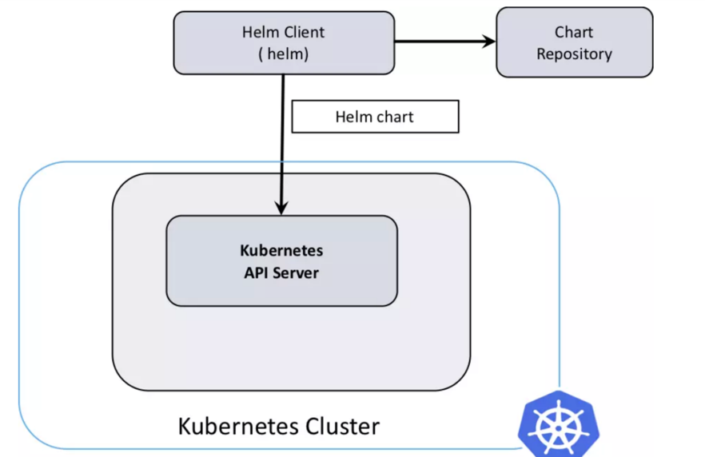
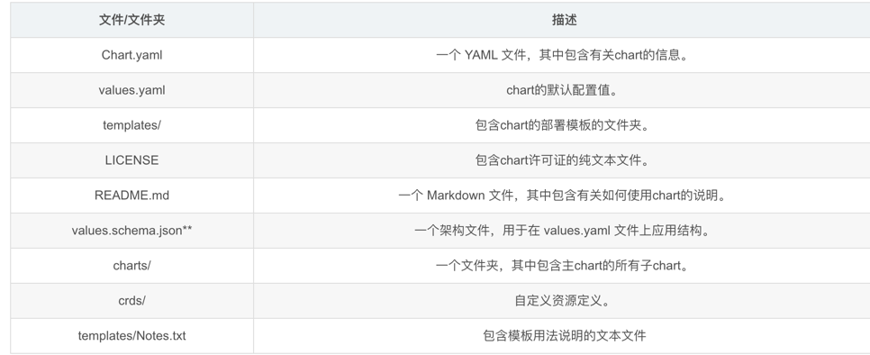

<!-- START doctoc generated TOC please keep comment here to allow auto update -->
<!-- DON'T EDIT THIS SECTION, INSTEAD RE-RUN doctoc TO UPDATE -->
**Table of Contents**  *generated with [DocToc](https://github.com/thlorenz/doctoc)*

- [helm](#helm)
  - [helm组件](#helm%E7%BB%84%E4%BB%B6)
    - [helm 客户端](#helm-%E5%AE%A2%E6%88%B7%E7%AB%AF)
    - [Chart](#chart)
    - [Helm 仓库/存储库](#helm-%E4%BB%93%E5%BA%93%E5%AD%98%E5%82%A8%E5%BA%93)
    - [Release](#release)
  - [基本使用](#%E5%9F%BA%E6%9C%AC%E4%BD%BF%E7%94%A8)

<!-- END doctoc generated TOC please keep comment here to allow auto update -->

# helm
Helm是一个由CNCF孵化和管理的项目，用于对需要在Kubernetes 上部署的复杂应用进行定义、安装和更新。Helm以Chart的方式对应用软件进行描述，可以方便地创建、版本化、共享和发布复杂的应用软件。

1. k8s 部署：web应用+ deployment,service,ingress yaml + kubectl 
2. k8s 部署：web应用+ helm chart + kubectl


## helm组件


Helm 使用四个组件来管理 Kubernetes 群集上的应用程序部署。

- Helm 客户端
- Helm chart
- Helm release
- Helm 仓库 repositories，或者叫 repos


### helm 客户端
Helm 客户端是客户端安装的二进制文件，负责创建和提交部署 Kubernetes 应用程序所需的清单文件。 客户端负责用户与 Kubernetes 群集之间的交互。


### Chart

描述相关的一组 Kubernetes 资源的模板化部署包。 它包含为了让应用程序在 Kubernetes 群集上运行而为其生成和部署清单文件所需的所有信息。


Charts包含Chart.yaml文件和模板，默认值(values.yaml)，以及相关依赖。

### Helm 仓库/存储库

Helm chart可以被存储在专用的HTTP服务器上，称之为 chart 仓库（repositories，或者就叫 repos）

chart仓库服务器就是一个简单的HTTP服务器，提供一个index.yaml 文件来描述一批chart， 并且提供每个chart的下载位置信息。(很多chart仓库同时提供chart和 index.yaml文件。

Helm客户端可以指向0个或多个chart仓库。默认没有配置仓库。Chart仓库可以随时使用helm repo add命令添加。


### Release
在Kubernetes集群上运行的一个Chart实例。在同一个 集群上，一个Chart可以被安装多次。
例如有一个MySQL Chart，如果想在服务器上运行两个MySQL数据库，就可以基于这个Chart安装两次。 每次安装都会生成新的Release，会有独立的Release名称

## 基本使用
1. 创建项目
```shell
(⎈ |danny.com-test:danny-xia)➜  helm_test helm create nginx
Creating nginx
(⎈ |danny.com-test:danny-xia)➜  helm_test ls
nginx
(⎈ |danny.com-test:danny-xia)➜  helm_test tree
.
├── charts  #包含chart依赖的其他chart
├── Chart.yaml #包含了chart信息的YAML文件
├── templates #模板目录， 当和values 结合时，可生成有效的Kubernetes manifest文件
│   ├── deployment.yaml
│   ├── _helpers.tpl  # 开头的文件用来存储局部和辅助对象，供其他chart模板使用。
│   ├── hpa.yaml
│   ├── ingress.yaml
│   ├── NOTES.txt
│   ├── serviceaccount.yaml
│   ├── service.yaml
│   └── tests #测试
│       └── test-connection.yaml
└── values.yaml #chart 默认的配置值

```
```shell
$ cat Chart.yaml 
apiVersion: v2 #在heml3中apiVersion必须是v2
name: nginx #chart名字
description: A Helm chart for Kubernetes #chart描述
type: application #chart类型 application（默认）、library
version: 0.1.0 #chart的版本
appVersion: "1.16.0" #应用的版本

```