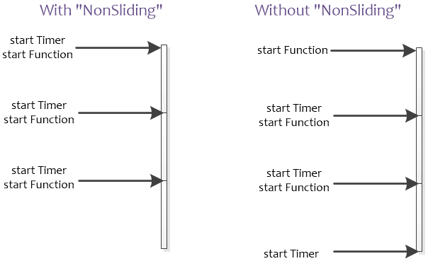

# kubernetes源码阅读之工具函数wait使用

## 源码
```go
func Forever(f func(), period time.Duration) 
func Until(f func(), period time.Duration, stopCh <-chan struct{}) 
func UntilWithContext(ctx context.Context, f func(context.Context), period time.Duration) 
func NonSlidingUntil(f func(), period time.Duration, stopCh <-chan struct{}) 
func NonSlidingUntilWithContext(ctx context.Context, f func(context.Context), period time.Duration)
```
Until函数每period会调度f函数，如果stopCh中有停止信号，则退出。当程序运行时间超过period时，也不会退出调度循环，该特性和Ticker相同。底层使用Timer实现。



Until和NonSlidingUntil为一对，UntilWithContext和NonSlidingUntilWithContext为一对，区别只是定时器启动时间点不同，可以简单用下图表示：
```go
func JitterUntil(f func(), period time.Duration, jitterFactor float64, sliding bool, stopCh <-chan struct{}) {
	BackoffUntil(f, NewJitteredBackoffManager(period, jitterFactor, &clock.RealClock{}), sliding, stopCh)
}
```
- If sliding is true, the period is computed after f runs. If it is false then period includes the runtime for f.
sliding为true时，时间不包括f运行时间，即f函数执行完成后计时周期。

## 指数退让
```go
 func ExponentialBackoff(backoff Backoff, condition ConditionFunc) error 
```
ExponentialBackoff可以实现在函数执行错误后实现以指数退避方式的延时重试。ExponentialBackoff内部使用的是time.Sleep
```go
type Backoff struct {
    // 表示初始的延时时间
    Duration time.Duration
    // Duration is multiplied by factor each iteration. Must be greater
    // than or equal to zero.
    // 指数退避的因子
    Factor float64

    // 可以看作是偏差因子，该值越大，每次重试的延时的可选区间越大
    Jitter float64
    // The number of steps before duration stops changing. If zero, initial
    // duration is always used. Used for exponential backoff in combination
    // with Factor.
    // 指数退避的步数，可以看作程序的最大重试次数
    Steps int
    // The returned duration will never be greater than cap *before* jitter
    // is applied. The actual maximum cap is `cap * (1.0 + jitter)`.
    // 用于在Factor非0时限制最大延时时间和最大重试次数，为0表示不限制最大延时时间
    Cap time.Duration
}
```
- ConditionFunc表示运行的函数，返回的bool值表示该函数是否执行成功，如果执行成功则会退出指数退避

```go
func (b *Backoff) Step() time.Duration {
	if b.Steps < 1 {
		if b.Jitter > 0 {
			return Jitter(b.Duration, b.Jitter)
		}
		return b.Duration
	}
	b.Steps--

	duration := b.Duration

	// calculate the next step
	if b.Factor != 0 {
		b.Duration = time.Duration(float64(b.Duration) * b.Factor)
		if b.Cap > 0 && b.Duration > b.Cap {
			b.Duration = b.Cap
			b.Steps = 0
		}
	}

	if b.Jitter > 0 {
		duration = Jitter(duration, b.Jitter)
	}
	return duration
}
```

```go
func Jitter(duration time.Duration, maxFactor float64) time.Duration {
	if maxFactor <= 0.0 {
		maxFactor = 1.0
	}
	wait := duration + time.Duration(rand.Float64()*maxFactor*float64(duration))
	return wait
}
```

1. Duration= 1 * time.Second, Factor= 0,Jitter=0.5，根据下面计算方式wait := duration + time.Duration(rand.Float64()*maxFactor*float64(duration)),即1+[0.0,1.0)*0.5,预期duration为[1s,1.5s)
2. Duration= 1 * time.Second, Factor= 3,根据下面计算方式b.Duration = time.Duration(float64(b.Duration) * b.Factor)，即duration(1) = duration*3 ，duration(2) = 3 * duration(1)


## wait.Group源码
创造性地将sync.WaitGroup与chan和ctx结合，实现了协程间同步和等待全部Group中的协程结束的功能。由于StartWithChannel和StartWithContext的入参函数类型比较固定，因此使用上并不通用，但可以作为参考
```go
func (g *Group) Wait() 
func (g *Group) StartWithChannel(stopCh <-chan struct{}, f func(stopCh <-chan struct{}))
func (g *Group) StartWithContext(ctx context.Context, f func(context.Context))
```
