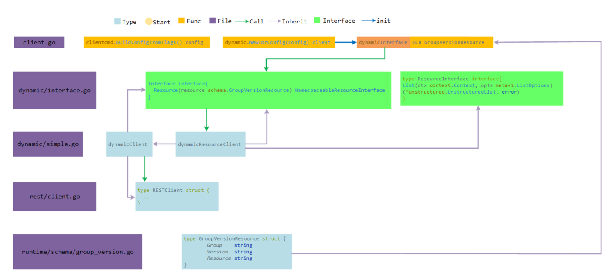

<!-- START doctoc generated TOC please keep comment here to allow auto update -->
<!-- DON'T EDIT THIS SECTION, INSTEAD RE-RUN doctoc TO UPDATE -->
**Table of Contents**  *generated with [DocToc](https://github.com/thlorenz/doctoc)*

- [dynamicClient](#dynamicclient)
  - [源码](#%E6%BA%90%E7%A0%81)
    - [基本使用](#%E5%9F%BA%E6%9C%AC%E4%BD%BF%E7%94%A8)

<!-- END doctoc generated TOC please keep comment here to allow auto update -->

# dynamicClient


与 ClientSet 的区别是，可以对任意 Kubernetes 资源进行 RESTful 操作。同样提供管理的方法

最大的不同，ClientSet 需要预先实现每种 Resource 和 Version 的操作，内部的数据都是结构化数据（已知数据结构）；
DynamicClient 内部实现了 Unstructured，用于处理非结构化的数据（无法提前预知的数据结构），这是其可以处理 CRD 自定义资源的关键。


## 源码

### 基本使用

1 通过 NewForConfig 实例化 conf 为 DynamicInterface客户端

```go
// /Users/python/go/pkg/mod/k8s.io/client-go@v0.24.0/dynamic/simple.go
func NewForConfig(inConfig *rest.Config) (Interface, error) {
	config := ConfigFor(inConfig)

	httpClient, err := rest.HTTPClientFor(config)
	if err != nil {
		return nil, err
	}
	return NewForConfigAndClient(config, httpClient)
}
```


2 DynamicInterface 客户端中，实现了一个Resource 方法即为实现了Interface接口

```go
// /Users/python/go/pkg/mod/k8s.io/client-go@v0.24.0/dynamic/interface.go
type Interface interface {
	Resource(resource schema.GroupVersionResource) NamespaceableResourceInterface
}
```

3 dynamicClient 实现了非结构化数据类型与rest client，可以通过其方法将Resource 由rest从apiserver中获得api对象，runtime.DeafultUnstructuredConverter.FromUnstructrued 转为对应的类型。
