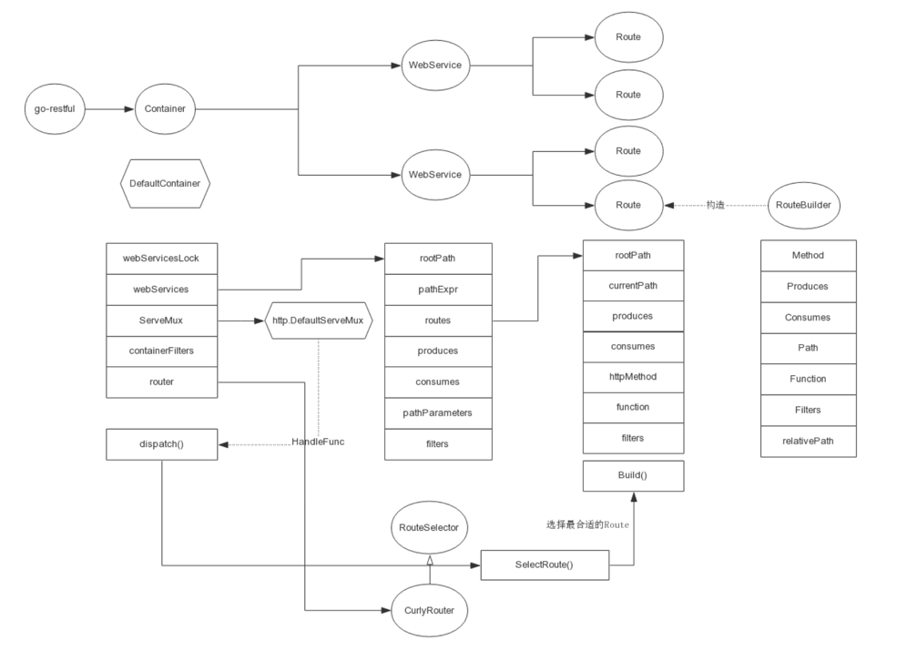

<!-- START doctoc generated TOC please keep comment here to allow auto update -->
<!-- DON'T EDIT THIS SECTION, INSTEAD RE-RUN doctoc TO UPDATE -->
**Table of Contents**  *generated with [DocToc](https://github.com/thlorenz/doctoc)*

- [github.com/emicklei/go-restful](#githubcomemickleigo-restful)
  - [特性](#%E7%89%B9%E6%80%A7)
    - [过滤器（Filter）](#%E8%BF%87%E6%BB%A4%E5%99%A8filter)
    - [响应编码（Response Encoding）](#%E5%93%8D%E5%BA%94%E7%BC%96%E7%A0%81response-encoding)
  - [数据结构](#%E6%95%B0%E6%8D%AE%E7%BB%93%E6%9E%84)
    - [1. 核心数据结构 Route](#1-%E6%A0%B8%E5%BF%83%E6%95%B0%E6%8D%AE%E7%BB%93%E6%9E%84-route)
    - [2. webservice](#2-webservice)
    - [3. container](#3-container)
  - [流程分析](#%E6%B5%81%E7%A8%8B%E5%88%86%E6%9E%90)
    - [路由分发函数 dispatch](#%E8%B7%AF%E7%94%B1%E5%88%86%E5%8F%91%E5%87%BD%E6%95%B0-dispatch)
      - [路由选择](#%E8%B7%AF%E7%94%B1%E9%80%89%E6%8B%A9)
  - [第三方应用：k8s](#%E7%AC%AC%E4%B8%89%E6%96%B9%E5%BA%94%E7%94%A8k8s)
  - [参考](#%E5%8F%82%E8%80%83)

<!-- END doctoc generated TOC please keep comment here to allow auto update -->

# github.com/emicklei/go-restful

REST 是 Representational State Transfer 的缩写， 中文翻译是 表现层状态转换 。

go-restful是一个用go语言开发的快速构建restful风格的web框架。k8s最核心的组件kube-apiserver使用到了该框架.


## 特性

- 支持可配置的请求路由，默认使用 CurlyRouter 快速路由算法，也支持 RouterJSR311。
- 支持在 URL path 上定义正则表达式，例如：/static/{subpath:*}。
- 提供 Request API 用于从JSON、XML 读取路径参数、查询参数、头部参数，并转换为 Struct。
- 提供 Response API用于将 Struct 写入到 JSON、XML 以及 Header。
- 支持对请求、响应流进行过滤和拦截。
- 支持使用过滤器自动响应 OPTIONS请求和CORS（跨域）请求。
- 支持使用 RecoverHandler 自定义处理 HTTP 500 错误。
- 支持使用 ServiceErrorHandler 自定义处理路由错误产生 HTTP 404/405/406/415 等错误。
- 支持对请求、响应的有效负载进行编码（例如：gzip、deflate）。
- 支持使用 CompressorProvider注册自定义的 gzip、deflate 的读入器和输出器。
- 支持使用 EntityReaderWriter 注册的自定义编码实现。
- 支持 Swagger UI编写的 API 文档。
- 支持可配置的日志跟踪。


### 过滤器（Filter）
go-restful 支持服务级、路由级的请求或响应过滤。开发者可以使用 Filter 来执行常规的日志记录、计量、验证、重定向、设置响应头部等工作
```go
type FilterFunction func(*Request, *Response, *FilterChain)
```


CORS Filter：是 WebService 可以响应 CORS 请求
```go
func (c CrossOriginResourceSharing) Filter(req *Request, resp *Response, chain *FilterChain) {
	origin := req.Request.Header.Get(HEADER_Origin)
	if len(origin) == 0 {
		if trace {
			traceLogger.Print("no Http header Origin set")
		}
		chain.ProcessFilter(req, resp)
		return
	}
	if !c.isOriginAllowed(origin) { // check whether this origin is allowed
		if trace {
			traceLogger.Printf("HTTP Origin:%s is not part of %v, neither matches any part of %v", origin, c.AllowedDomains, c.allowedOriginPatterns)
		}
		chain.ProcessFilter(req, resp)
		return
	}
	if req.Request.Method != "OPTIONS" {
		c.doActualRequest(req, resp)
		chain.ProcessFilter(req, resp)
		return
	}
	if acrm := req.Request.Header.Get(HEADER_AccessControlRequestMethod); acrm != "" {
		c.doPreflightRequest(req, resp)
	} else {
		c.doActualRequest(req, resp)
		chain.ProcessFilter(req, resp)
		return
	}
}
```


### 响应编码（Response Encoding）

如果 HTTP Request 包含了 Accept-Encoding Header，那么 HTTP Response 就必须使用指定的编码格式进行压缩。go-restful 目前支持 zip 、deflate 这两种响应编码格式
```go
// 如果要为所有的响应启用它们
restful.DefaultContainer.EnableContentEncoding(true)
```

## 数据结构


go-restful定义了三个重要的数据结构：

- Route：Route 表示一条请求路由记录，即：Resource 的 URL Path（URI），从编程的角度可细分为 RootPath 和 SubPath。Route 包含了 Resource 的 URL Path、HTTP Method、Handler 三者之间的组合映射关系。go-restful 内置的 RouteSelector（请求路由分发器）根据 Route 将客户端发出的 HTTP 请求路由到相应的 Handler 进行处理。
go-restful 支持两种路由分发器：快速路由 CurlyRouter 和 RouterJSR311。实际上，CurlyRoute 也是基于 RouterJSR311 的，相比 RouterJSR11，还支持了正则表达式和动态参数，也更加轻量级，Kubernetes ApiServer 中使用的就是这种路由。

- Webservice：表示一个服务.
- Container：一个 Web Server（服务器）

三者的关系如下：

- go-restful支持多个container，一个container相当于一个http server，不同的container监控不同的地址和端口
- 一个 Web Server（服务器），由多个 WebServices 组成，此外还包含了若干个 Filters（过滤器）、一个 http.ServeMux 多路复用器以及一个 dispatch。go-restful 如何在从 Container 开始将路由分发给各个 WebService，再由 WebService 分发给具体的 Handler 函数，这些都在 dispatch 中实现
- 一个 WebService 由若干个 Routes 组成，并且 WebService 内的 Routes 拥有同一个 RootPath、输入输出格式、基本一致的请求数据类型等等一系列的通用属性。通常的，我们会根据需要将一组相关性非常强的 API 封装成为一个 WebServiice，继而将 Web Application 所拥有的全部 APIs 划分若干个 Group。
所以，WebService 至少会有一个 Root Path，通过 ws.Path() 方法设置，例如：/user_group，作为 Group 的 “根”。Group 下属的 APIs 都是 RootRoute（RootPath）下属的 SubRoute（SubPath）


### 1. 核心数据结构 Route
```go
type Route struct {
	ExtensionProperties
	Method   string
	Produces []string
	Consumes []string
	Path     string // webservice root path + described path
	Function RouteFunction // 单路由处理函数
	Filters  []FilterFunction // 拦截器
	If       []RouteSelectionConditionFunction

	// cached values for dispatching
	relativePath string
	pathParts    []string
	pathExpr     *pathExpression // cached compilation of relativePath as RegExp

	// documentation
	Doc                     string
	Notes                   string
	Operation               string
	ParameterDocs           []*Parameter
	ResponseErrors          map[int]ResponseError
	DefaultResponse         *ResponseError
	ReadSample, WriteSample interface{} // structs that model an example request or response payload

	// Extra information used to store custom information about the route.
	Metadata map[string]interface{}

	// marks a route as deprecated
	Deprecated bool

	//Overrides the container.contentEncodingEnabled
	contentEncodingEnabled *bool

	// indicate route path has custom verb
	hasCustomVerb bool

	// if a request does not include a content-type header then
	// depending on the method, it may return a 415 Unsupported Media
	// Must have uppercase HTTP Method names such as GET,HEAD,OPTIONS,...
	allowedMethodsWithoutContentType []string
}

type RouteFunction func(*Request, *Response)
```

### 2. webservice
```go
type WebService struct {
	rootPath       string
	pathExpr       *pathExpression // cached compilation of rootPath as RegExp
	routes         []Route
	produces       []string
	consumes       []string
	pathParameters []*Parameter
	filters        []FilterFunction
	documentation  string
	apiVersion     string

	typeNameHandleFunc TypeNameHandleFunction

	dynamicRoutes bool

	// protects 'routes' if dynamic routes are enabled
	routesLock sync.RWMutex
}
```
WebService拥有一组Route，这组Router有公共的rootPath，

### 3. container
```go
type Container struct {
	webServicesLock        sync.RWMutex
	webServices            []*WebService
	ServeMux               *http.ServeMux
	isRegisteredOnRoot     bool
	containerFilters       []FilterFunction
	doNotRecover           bool // default is true
	recoverHandleFunc      RecoverHandleFunction
	serviceErrorHandleFunc ServiceErrorHandleFunction
	router                 RouteSelector // default is a CurlyRouter (RouterJSR311 is a slower alternative)
	contentEncodingEnabled bool          // default is false
}
```
一个Container包含多个Service，不同的Container监听不同的ip地址或端口，他们之间提供的服务的独立的。

## 流程分析
1. 创建WebService对象

2. 为WebService对象添加路由地址和处理函数
```go
ws.Route(ws.GET("/hello").To(hello))
```

```go
// Get方法内部new了一个RouteBuilder，用于构造Route对象
func (w *WebService) GET(subPath string) *RouteBuilder {
  // 典型的建造者模式用法
  return new(RouteBuilder).typeNameHandler(w.typeNameHandleFunc).servicePath(w.rootPath).Method("GET").Path(subPath)
}

// 建造者模式：给属性赋值
// 其他的方法类似，就不再展开
func (b *RouteBuilder) typeNameHandler(handler TypeNameHandleFunction) *RouteBuilder {
  b.typeNameHandleFunc = handler
  return b
}


// Get方法后，属性并没有完全构造完，handler处理函数是用单独的To方法赋值的
func (b *RouteBuilder) To(function RouteFunction) *RouteBuilder {
  b.function = function
  return b
}

// Path specifies the relative (w.r.t WebService root path) URL path to match. Default is "/".
func (b *RouteBuilder) Path(subPath string) *RouteBuilder {
	b.currentPath = subPath
	return b
}
```

根据RouteBuilder生成Route对象
```go
func (w *WebService) Route(builder *RouteBuilder) *WebService {
  w.routesLock.Lock()
  defer w.routesLock.Unlock()
  // 填充默认值
  builder.copyDefaults(w.produces, w.consumes)
  // 调用RouteBuilder的Build方法，构造Route
  // 并将Route添加到routes列表中
  w.routes = append(w.routes, builder.Build())
  return w
}

// Build方法返回Route对象
func (b *RouteBuilder) Build() Route {
  // ...
  route := Route{
    Method:                           b.httpMethod,
    Path:                             concatPath(b.rootPath, b.currentPath),
    // ...
  }
  route.postBuild()
  return route
}
```

3. 将WebService添加到Container中（这里没有声明Container，用的默认Container）
```go
restful.Add(ws)
```

```go
// 定义全局变量,作为默认的Container
var DefaultContainer *Container

// init函数在别的包import时，自动触发。也就是只要引用了go-restful框架，就会默认有一个Container
func init() {
  DefaultContainer = NewContainer()
  // 这里将Golang中标准http包下的默认路由对象DefaultServeMux赋值给Container的ServeMux
  // 这里要特别注意，正是因为这个地方的逻辑，就能回答前面我们提出的问题。go-restful和http库，通过这个赋值建立了关联关系。
  DefaultContainer.ServeMux = http.DefaultServeMux
}

// 生成默认的container
func NewContainer() *Container {
  return &Container{
    webServices:            []*WebService{},
    ServeMux:               http.NewServeMux(),
    isRegisteredOnRoot:     false,
    containerFilters:       []FilterFunction{},
    doNotRecover:           true,
    recoverHandleFunc:      logStackOnRecover,
    serviceErrorHandleFunc: writeServiceError,
    // 默认的路由选择器用的是CurlyRouter
    router:                 CurlyRouter{},
    contentEncodingEnabled: false}
}

// 将WebService添加到默认Container中
func Add(service *WebService) {
  DefaultContainer.Add(service)
}

// Add
func (c *Container) Add(service *WebService) *Container {
  ...
  // if rootPath was not set then lazy initialize it
  if len(service.rootPath) == 0 {
    service.Path("/")
  }

  // 判断有没有重复的RootPath，不同的WebService，rootPath不能重复
  for _, each := range c.webServices {
    if each.RootPath() == service.RootPath() {
      log.Printf("WebService with duplicate root path detected:['%v']", each)
      os.Exit(1)
    }
  }

  if !c.isRegisteredOnRoot {
    // 核心逻辑：为servcie添加handler处理函数
    // 这里将c.ServeMux作为参数传入，这个值是前面提到的http.DefaultServeMux
    c.isRegisteredOnRoot = c.addHandler(service, c.ServeMux)
  }
  // 将webServices添加到container的webservice列表中
  c.webServices = append(c.webServices, service)
  return c
}

// addHandler
func (c *Container) addHandler(service *WebService, serveMux *http.ServeMux) bool {
  pattern := fixedPrefixPath(service.RootPath())
  // ...
  // 这里的关键函数：serveMux.HandleFunc，是Golang标准包中实现路由的函数
  // go-restful中将路由处理函数统一交给c.dispatch函数，可以看出整个go-restful框架中，最核心的就是这个函数了
  if !alreadyMapped {
    serveMux.HandleFunc(pattern, c.dispatch)
    if !strings.HasSuffix(pattern, "/") {
      serveMux.HandleFunc(pattern+"/", c.dispatch)
    }
  }
  return false
}
```


### 路由分发函数 dispatch
如何由container -> webservice -> handler 实现层级分发？ 
go-restful框架通过serveMux.HandleFunc(pattern, c.dispatch)函数，一边连接了Golang提供的官方http扩展机制，另一边通过一个dispatch实现了路由的分发，这样就不用单独写很多的handler了。

这个函数的核心是c.router.SelectRoute，根据请求找到合适的webservice和route
```go
func (c *Container) dispatch(httpWriter http.ResponseWriter, httpRequest *http.Request) {
  ...
  // 根据请求，找到最合适的webService和route
  // 这个方法后面单独介绍
  func() {
    // ...
    webService, route, err = c.router.SelectRoute(
      c.webServices,
      httpRequest)
  }()
  // ...
  if err != nil {
    // 构造过滤器
    chain := FilterChain{Filters: c.containerFilters, Target: func(req *Request, resp *Response) {
      switch err.(type) {
      case ServiceError:
        ser := err.(ServiceError)
        c.serviceErrorHandleFunc(ser, req, resp)
      }
      // TODO
    }}
    // 运行Container的过滤器
    chain.ProcessFilter(NewRequest(httpRequest), NewResponse(writer))
    return
  }

  // 尝试将router对象转为PathProcessor对象
  // 我们使用的是默认的Container，前面介绍过router默认用的CurlyRouter，
  // SelectRoute的其中一个实现类RouterJSR311，也实现了PathProcessor。所以如果用了RouterJSR311,这里接口转换才能获取到值
  // 而默认的CurlyRouter并没有实现PathProcessor接口，因此这里转换后是空值，会走到下一个if语句
  pathProcessor, routerProcessesPath := c.router.(PathProcessor)
  if !routerProcessesPath {
    // 使用默认的路处理器
    pathProcessor = defaultPathProcessor{}
  }
  // 从request的url请求中抽取参数
  pathParams := pathProcessor.ExtractParameters(route, webService, httpRequest.URL.Path)
  wrappedRequest, wrappedResponse := route.wrapRequestResponse(writer, httpRequest, pathParams)
  // 如果有filter的话，处理将所有的filter添加到filter链中
  if size := len(c.containerFilters) + len(webService.filters) + len(route.Filters); size > 0 {
    // compose filter chain
    allFilters := make([]FilterFunction, 0, size)
    allFilters = append(allFilters, c.containerFilters...)
    allFilters = append(allFilters, webService.filters...)
    allFilters = append(allFilters, route.Filters...)
    chain := FilterChain{Filters: allFilters, Target: route.Function}
    chain.ProcessFilter(wrappedRequest, wrappedResponse)
  } else {
    // no filters, handle request by route
    // 没有filter，通过route直接处理请求
    route.Function(wrappedRequest, wrappedResponse)
  }
}
```

#### 路由选择
前面的dispatch中提到的c.router.SelectRoute的作用是选择合适的webservice和route

container中的router属性是一个RouteSelector接口
```go
type RouteSelector interface {
  // SelectRoute根据输入的http请求和webservice列表，找到一个路由并返回
  SelectRoute(
    webServices []*WebService,
    httpRequest *http.Request) (selectedService *WebService, selected *Route, err error)
}
```

go-restful框架中共有两个实现类：

- CurlyRouter
- RouterJSR311
```go
// 选择路由功能
func (c CurlyRouter) SelectRoute(
  webServices []*WebService,
  httpRequest *http.Request) (selectedService *WebService, selected *Route, err error) {
  // 解析url，根据'/'拆分为token列表
  requestTokens := tokenizePath(httpRequest.URL.Path)
  // 根据tokens列表和webservice的路由表做匹配，返回一个最合适的webservice
  detectedService := c.detectWebService(requestTokens, webServices)
  //...
  // 返回webservice中匹配的routes集合
  candidateRoutes := c.selectRoutes(detectedService, requestTokens)
  //...
  // 从前面的list中找到最合适的route
  selectedRoute, err := c.detectRoute(candidateRoutes, httpRequest)
  if selectedRoute == nil {
    return detectedService, nil, err
  }
  return detectedService, selectedRoute, nil
}

// 选择webservice
func (c CurlyRouter) detectWebService(requestTokens []string, webServices []*WebService) *WebService {
  var best *WebService
  score := -1
  for _, each := range webServices {
    // 计算webservice的得分
    matches, eachScore := c.computeWebserviceScore(requestTokens, each.pathExpr.tokens)
    // 返回得分最高的webservice
    if matches && (eachScore > score) {
      best = each
      score = eachScore
    }
  }
  // 将得分最高的webservice返回
  return best
}

// 计算webservice得分
func (c CurlyRouter) computeWebserviceScore(requestTokens []string, tokens []string) (bool, int) {
  if len(tokens) > len(requestTokens) {
    return false, 0
  }
  score := 0
  for i := 0; i < len(tokens); i++ {
    each := requestTokens[i]
    other := tokens[i]
    if len(each) == 0 && len(other) == 0 {
      score++
      continue
    }
    if len(other) > 0 && strings.HasPrefix(other, "{") {
      // no empty match
      if len(each) == 0 {
        return false, score
      }
      score += 1
    } else {
      // not a parameter
      if each != other {
        return false, score
      }
      score += (len(tokens) - i) * 10 //fuzzy
    }
  }
  return true, score
}

// 初选：匹配path，返回一批Route作为备选
func (c CurlyRouter) selectRoutes(ws *WebService, requestTokens []string) sortableCurlyRoutes {
  // 选中的Route存放到sortableCurlyRoutes中
  candidates := make(sortableCurlyRoutes, 0, 8)
  // 遍历webservice下所有的route
  for _, each := range ws.routes {
    // paramCount：正则命中
    // staticCount：完全匹配命中
    matches, paramCount, staticCount := c.matchesRouteByPathTokens(each.pathParts, requestTokens, each.hasCustomVerb)
    // 如果匹配，加入到备选列表中
    if matches {
      candidates.add(curlyRoute{each, paramCount, staticCount}) // TODO make sure Routes() return pointers?
    }
  }
  // 排序备选的route
  sort.Sort(candidates)
  return candidates
}

// 二次筛选：匹配属性等信息。返回最合适的Route
func (c CurlyRouter) detectRoute(candidateRoutes sortableCurlyRoutes, httpRequest *http.Request) (*Route, error) {
  // tracing is done inside detectRoute
  return jsr311Router.detectRoute(candidateRoutes.routes(), httpRequest)
}

// 匹配多个属性是否匹配：method、content-type、accept
func (r RouterJSR311) detectRoute(routes []Route, httpRequest *http.Request) (*Route, error) {
  candidates := make([]*Route, 0, 8)
  for i, each := range routes {
    ok := true
    for _, fn := range each.If {
      if !fn(httpRequest) {
        ok = false
        break
      }
    }
    if ok {
      candidates = append(candidates, &routes[i])
    }
  }
  if len(candidates) == 0 {
    if trace {
      traceLogger.Printf("no Route found (from %d) that passes conditional checks", len(routes))
    }
    return nil, NewError(http.StatusNotFound, "404: Not Found")
  }

  // 判断 http method 是否匹配
  previous := candidates
  candidates = candidates[:0]
  for _, each := range previous {
    if httpRequest.Method == each.Method {
      candidates = append(candidates, each)
    }
  }
  if len(candidates) == 0 {
    if trace {
      traceLogger.Printf("no Route found (in %d routes) that matches HTTP method %s\n", len(previous), httpRequest.Method)
    }
    allowed := []string{}
  allowedLoop:
    for _, candidate := range previous {
      for _, method := range allowed {
        if method == candidate.Method {
          continue allowedLoop
        }
      }
      allowed = append(allowed, candidate.Method)
    }
    header := http.Header{"Allow": []string{strings.Join(allowed, ", ")}}
    return nil, NewErrorWithHeader(http.StatusMethodNotAllowed, "405: Method Not Allowed", header)
  }

  // 判断 Content-Type 是否匹配
  contentType := httpRequest.Header.Get(HEADER_ContentType)
  previous = candidates
  candidates = candidates[:0]
  for _, each := range previous {
    if each.matchesContentType(contentType) {
      candidates = append(candidates, each)
    }
  }
  if len(candidates) == 0 {
    if trace {
      traceLogger.Printf("no Route found (from %d) that matches HTTP Content-Type: %s\n", len(previous), contentType)
    }
    if httpRequest.ContentLength > 0 {
      return nil, NewError(http.StatusUnsupportedMediaType, "415: Unsupported Media Type")
    }
  }

  // 判断 accept 是否匹配
  previous = candidates
  candidates = candidates[:0]
  accept := httpRequest.Header.Get(HEADER_Accept)
  if len(accept) == 0 {
    accept = "*/*"
  }
  for _, each := range previous {
    if each.matchesAccept(accept) {
      candidates = append(candidates, each)
    }
  }
  if len(candidates) == 0 {
    if trace {
      traceLogger.Printf("no Route found (from %d) that matches HTTP Accept: %s\n", len(previous), accept)
    }
    available := []string{}
    for _, candidate := range previous {
      available = append(available, candidate.Produces...)
    }
    return nil, NewError(
      http.StatusNotAcceptable,
      fmt.Sprintf("406: Not Acceptable\n\nAvailable representations: %s", strings.Join(available, ", ")),
    )
  }
  // 如果有多个匹配，返回第一个
  return candidates[0], nil
}
```

## 第三方应用：k8s 

```go
// https://github.com/kubernetes/kubernetes/blob/4b8ec54d8e5ede787e2f94343d0723462f430127/staging/src/k8s.io/apiserver/pkg/endpoints/installer.go

func (a *APIInstaller) Install() ([]metav1.APIResource, []*storageversion.ResourceInfo, *restful.WebService, []error) {
	var apiResources []metav1.APIResource
	var resourceInfos []*storageversion.ResourceInfo
	var errors []error
	// 初始化 webservice
	ws := a.newWebService()

	// Register the paths in a deterministic (sorted) order to get a deterministic swagger spec.
	paths := make([]string, len(a.group.Storage))
	var i int = 0
	for path := range a.group.Storage {
		paths[i] = path
		i++
	}
	sort.Strings(paths)
	for _, path := range paths {
		// 实现Storage到Router的转换，将路由注册到webservice
		apiResource, resourceInfo, err := a.registerResourceHandlers(path, a.group.Storage[path], ws)
		if err != nil {
			errors = append(errors, fmt.Errorf("error in registering resource: %s, %v", path, err))
		}
		if apiResource != nil {
			apiResources = append(apiResources, *apiResource)
		}
		if resourceInfo != nil {
			resourceInfos = append(resourceInfos, resourceInfo)
		}
	}
	return apiResources, resourceInfos, ws, errors
}


func (a *APIInstaller) newWebService() *restful.WebService {
	// 初始化 service 
	ws := new(restful.WebService)
	
	// apigroup 设置
	ws.Path(a.prefix)
	// a.prefix contains "prefix/group/version"
	ws.Doc("API at " + a.prefix)
	// Backwards compatibility, we accepted objects with empty content-type at V1.
	// If we stop using go-restful, we can default empty content-type to application/json on an
	// endpoint by endpoint basis
	ws.Consumes("*/*")
	mediaTypes, streamMediaTypes := negotiation.MediaTypesForSerializer(a.group.Serializer)
	// 支持的返回数据类型
	ws.Produces(append(mediaTypes, streamMediaTypes...)...)
	ws.ApiVersion(a.group.GroupVersion.String())

	return ws
}
```

```go
// 这个方法很长，核心功能是根据storage构造handler，再将handler和path构造成go-restful框架的Route对象，最后Route添加到webservice
func (a *APIInstaller) registerResourceHandlers(path string, storage rest.Storage, ws *restful.WebService) (*metav1.APIResource, *storageversion.ResourceInfo, error) {
	admit := a.group.Admit

	optionsExternalVersion := a.group.GroupVersion
	if a.group.OptionsExternalVersion != nil {
		optionsExternalVersion = *a.group.OptionsExternalVersion
	}

	resource, subresource, err := splitSubresource(path)
	if err != nil {
		return nil, nil, err
	}

	group, version := a.group.GroupVersion.Group, a.group.GroupVersion.Version

	fqKindToRegister, err := GetResourceKind(a.group.GroupVersion, storage, a.group.Typer)
	if err != nil {
		return nil, nil, err
	}

	versionedPtr, err := a.group.Creater.New(fqKindToRegister)
	if err != nil {
		return nil, nil, err
	}
	defaultVersionedObject := indirectArbitraryPointer(versionedPtr)
	kind := fqKindToRegister.Kind
	isSubresource := len(subresource) > 0

	// If there is a subresource, namespace scoping is defined by the parent resource
	var namespaceScoped bool
	if isSubresource {
		parentStorage, ok := a.group.Storage[resource]
		if !ok {
			return nil, nil, fmt.Errorf("missing parent storage: %q", resource)
		}
		scoper, ok := parentStorage.(rest.Scoper)
		if !ok {
			return nil, nil, fmt.Errorf("%q must implement scoper", resource)
		}
		namespaceScoped = scoper.NamespaceScoped()

	} else {
		scoper, ok := storage.(rest.Scoper)
		if !ok {
			return nil, nil, fmt.Errorf("%q must implement scoper", resource)
		}
		namespaceScoped = scoper.NamespaceScoped()
	}

	// 判断storage实现了哪些Rest接口
	creater, isCreater := storage.(rest.Creater)
	namedCreater, isNamedCreater := storage.(rest.NamedCreater)
	lister, isLister := storage.(rest.Lister)
	getter, isGetter := storage.(rest.Getter)
	getterWithOptions, isGetterWithOptions := storage.(rest.GetterWithOptions)
	gracefulDeleter, isGracefulDeleter := storage.(rest.GracefulDeleter)
	collectionDeleter, isCollectionDeleter := storage.(rest.CollectionDeleter)
	updater, isUpdater := storage.(rest.Updater)
	patcher, isPatcher := storage.(rest.Patcher)
	watcher, isWatcher := storage.(rest.Watcher)
	connecter, isConnecter := storage.(rest.Connecter)
	storageMeta, isMetadata := storage.(rest.StorageMetadata)
	storageVersionProvider, isStorageVersionProvider := storage.(rest.StorageVersionProvider)
	gvAcceptor, _ := storage.(rest.GroupVersionAcceptor)
	
	// ...
	
    params := []*restful.Parameter{}
    actions := []action{}
	
	// ..

	// Get the list of actions for the given scope.
	switch {
	case !namespaceScoped:
		// Handle non-namespace scoped resources like nodes.
		resourcePath := resource
		resourceParams := params
		itemPath := resourcePath + "/{name}"
		nameParams := append(params, nameParam)
		proxyParams := append(nameParams, pathParam)
		suffix := ""
		if isSubresource {
			suffix = "/" + subresource
			itemPath = itemPath + suffix
			resourcePath = itemPath
			resourceParams = nameParams
		}
		apiResource.Name = path
		apiResource.Namespaced = false
		apiResource.Kind = resourceKind
		namer := handlers.ContextBasedNaming{
			Namer:         a.group.Namer,
			ClusterScoped: true,
		}

		// Handler for standard REST verbs (GET, PUT, POST and DELETE).
		// Add actions at the resource path: /api/apiVersion/resource
		actions = appendIf(actions, action{"LIST", resourcePath, resourceParams, namer, false}, isLister)
		actions = appendIf(actions, action{"POST", resourcePath, resourceParams, namer, false}, isCreater)
		actions = appendIf(actions, action{"DELETECOLLECTION", resourcePath, resourceParams, namer, false}, isCollectionDeleter)
		// DEPRECATED in 1.11
		actions = appendIf(actions, action{"WATCHLIST", "watch/" + resourcePath, resourceParams, namer, false}, allowWatchList)

		// Add actions at the item path: /api/apiVersion/resource/{name}
		actions = appendIf(actions, action{"GET", itemPath, nameParams, namer, false}, isGetter)
		if getSubpath {
			actions = appendIf(actions, action{"GET", itemPath + "/{path:*}", proxyParams, namer, false}, isGetter)
		}
		actions = appendIf(actions, action{"PUT", itemPath, nameParams, namer, false}, isUpdater)
		actions = appendIf(actions, action{"PATCH", itemPath, nameParams, namer, false}, isPatcher)
		actions = appendIf(actions, action{"DELETE", itemPath, nameParams, namer, false}, isGracefulDeleter)
		// DEPRECATED in 1.11
		actions = appendIf(actions, action{"WATCH", "watch/" + itemPath, nameParams, namer, false}, isWatcher)
		actions = appendIf(actions, action{"CONNECT", itemPath, nameParams, namer, false}, isConnecter)
		actions = appendIf(actions, action{"CONNECT", itemPath + "/{path:*}", proxyParams, namer, false}, isConnecter && connectSubpath)
	default:
		namespaceParamName := "namespaces"
		// Handler for standard REST verbs (GET, PUT, POST and DELETE).
		namespaceParam := ws.PathParameter("namespace", "object name and auth scope, such as for teams and projects").DataType("string")
		namespacedPath := namespaceParamName + "/{namespace}/" + resource
		namespaceParams := []*restful.Parameter{namespaceParam}

		resourcePath := namespacedPath
		resourceParams := namespaceParams
		itemPath := namespacedPath + "/{name}"
		nameParams := append(namespaceParams, nameParam)
		proxyParams := append(nameParams, pathParam)
		itemPathSuffix := ""
        // ...
	}

    

	// ..

	for _, action := range actions {
		producedObject := storageMeta.ProducesObject(action.Verb)
		if producedObject == nil {
			producedObject = defaultVersionedObject
		}
		reqScope.Namer = action.Namer

		requestScope := "cluster"
		var namespaced string
		var operationSuffix string
		if apiResource.Namespaced {
			requestScope = "namespace"
			namespaced = "Namespaced"
		}
		if strings.HasSuffix(action.Path, "/{path:*}") {
			requestScope = "resource"
			operationSuffix = operationSuffix + "WithPath"
		}
		if strings.Index(action.Path, "/{name}") != -1 || action.Verb == "POST" {
			requestScope = "resource"
		}
		if action.AllNamespaces {
			requestScope = "cluster"
			operationSuffix = operationSuffix + "ForAllNamespaces"
			namespaced = ""
		}

		if kubeVerb, found := toDiscoveryKubeVerb[action.Verb]; found {
			if len(kubeVerb) != 0 {
				kubeVerbs[kubeVerb] = struct{}{}
			}
		} else {
			return nil, nil, fmt.Errorf("unknown action verb for discovery: %s", action.Verb)
		}

		routes := []*restful.RouteBuilder{}

		// If there is a subresource, kind should be the parent's kind.
		if isSubresource {
			parentStorage, ok := a.group.Storage[resource]
			if !ok {
				return nil, nil, fmt.Errorf("missing parent storage: %q", resource)
			}

			fqParentKind, err := GetResourceKind(a.group.GroupVersion, parentStorage, a.group.Typer)
			if err != nil {
				return nil, nil, err
			}
			kind = fqParentKind.Kind
		}

		verbOverrider, needOverride := storage.(StorageMetricsOverride)

		// accumulate endpoint-level warnings
		var (
			warnings       []string
			deprecated     bool
			removedRelease string
		)

		{
			versionedPtrWithGVK := versionedPtr.DeepCopyObject()
			versionedPtrWithGVK.GetObjectKind().SetGroupVersionKind(fqKindToRegister)
			currentMajor, currentMinor, _ := deprecation.MajorMinor(versioninfo.Get())
			deprecated = deprecation.IsDeprecated(versionedPtrWithGVK, currentMajor, currentMinor)
			if deprecated {
				removedRelease = deprecation.RemovedRelease(versionedPtrWithGVK)
				warnings = append(warnings, deprecation.WarningMessage(versionedPtrWithGVK))
			}
		}

		switch action.Verb {
		case "GET": // Get a resource.
			var handler restful.RouteFunction
			if isGetterWithOptions {
				// 初始化handler
				handler = restfulGetResourceWithOptions(getterWithOptions, reqScope, isSubresource)
			} else {
				handler = restfulGetResource(getter, reqScope)
			}

			if needOverride {
				// need change the reported verb
				handler = metrics.InstrumentRouteFunc(verbOverrider.OverrideMetricsVerb(action.Verb), group, version, resource, subresource, requestScope, metrics.APIServerComponent, deprecated, removedRelease, handler)
			} else {
				handler = metrics.InstrumentRouteFunc(action.Verb, group, version, resource, subresource, requestScope, metrics.APIServerComponent, deprecated, removedRelease, handler)
			}
			handler = utilwarning.AddWarningsHandler(handler, warnings)

			doc := "read the specified " + kind
			if isSubresource {
				doc = "read " + subresource + " of the specified " + kind
			}
			// 构造route
			route := ws.GET(action.Path).To(handler).
				Doc(doc).
				Param(ws.QueryParameter("pretty", "If 'true', then the output is pretty printed.")).
				Operation("read"+namespaced+kind+strings.Title(subresource)+operationSuffix).
				Produces(append(storageMeta.ProducesMIMETypes(action.Verb), mediaTypes...)...).
				Returns(http.StatusOK, "OK", producedObject).
				Writes(producedObject)
			if isGetterWithOptions {
				if err := AddObjectParams(ws, route, versionedGetOptions); err != nil {
					return nil, nil, err
				}
			}
			addParams(route, action.Params)
			//  route追加到routes
			routes = append(routes, route)
		case "LIST": // List all resources of a kind.
		    // ...
		case "PUT": // Update a resource.
            // ..
			routes = append(routes, route)
		case "PATCH": // Partially update a resource
            // ..
			routes = append(routes, route)
		case "POST": // Create a resource.
		    // ..
			routes = append(routes, route)
		case "DELETE": // Delete a resource.
            // ..
			routes = append(routes, route)
		case "DELETECOLLECTION":
            // ..
			routes = append(routes, route)
		// deprecated in 1.11
		case "WATCH": // Watch a resource.
			doc := "watch changes to an object of kind " + kind
			if isSubresource {
				doc = "watch changes to " + subresource + " of an object of kind " + kind
			}
			doc += ". deprecated: use the 'watch' parameter with a list operation instead, filtered to a single item with the 'fieldSelector' parameter."
			handler := metrics.InstrumentRouteFunc(action.Verb, group, version, resource, subresource, requestScope, metrics.APIServerComponent, deprecated, removedRelease, restfulListResource(lister, watcher, reqScope, true, a.minRequestTimeout))
			handler = utilwarning.AddWarningsHandler(handler, warnings)
			route := ws.GET(action.Path).To(handler).
				Doc(doc).
				Param(ws.QueryParameter("pretty", "If 'true', then the output is pretty printed.")).
				Operation("watch"+namespaced+kind+strings.Title(subresource)+operationSuffix).
				Produces(allMediaTypes...).
				Returns(http.StatusOK, "OK", versionedWatchEvent).
				Writes(versionedWatchEvent)
			if err := AddObjectParams(ws, route, versionedListOptions); err != nil {
				return nil, nil, err
			}
			addParams(route, action.Params)
			routes = append(routes, route)
		// deprecated in 1.11
		case "WATCHLIST": // Watch all resources of a kind.
            // ...
		case "CONNECT":
            // ...
		default:
			return nil, nil, fmt.Errorf("unrecognized action verb: %s", action.Verb)
		}
		// 遍历所有的route
		for _, route := range routes {
			route.Metadata(ROUTE_META_GVK, metav1.GroupVersionKind{
				Group:   reqScope.Kind.Group,
				Version: reqScope.Kind.Version,
				Kind:    reqScope.Kind.Kind,
			})
			// 添加自定义扩展属性（k8s所有的扩展属性以x-打头）
			route.Metadata(ROUTE_META_ACTION, strings.ToLower(action.Verb))
			// 将route加入到WebService中
			ws.Route(route)
		}
		// Note: update GetAuthorizerAttributes() when adding a custom handler.
	}

	apiResource.Verbs = make([]string, 0, len(kubeVerbs))
	for kubeVerb := range kubeVerbs {
		apiResource.Verbs = append(apiResource.Verbs, kubeVerb)
	}
	sort.Strings(apiResource.Verbs)

	if shortNamesProvider, ok := storage.(rest.ShortNamesProvider); ok {
		apiResource.ShortNames = shortNamesProvider.ShortNames()
	}
	if categoriesProvider, ok := storage.(rest.CategoriesProvider); ok {
		apiResource.Categories = categoriesProvider.Categories()
	}
	if !isSubresource {
		singularNameProvider, ok := storage.(rest.SingularNameProvider)
		if !ok {
			return nil, nil, fmt.Errorf("resource %s must implement SingularNameProvider", resource)
		}
		apiResource.SingularName = singularNameProvider.GetSingularName()
	}

	if gvkProvider, ok := storage.(rest.GroupVersionKindProvider); ok {
		gvk := gvkProvider.GroupVersionKind(a.group.GroupVersion)
		apiResource.Group = gvk.Group
		apiResource.Version = gvk.Version
		apiResource.Kind = gvk.Kind
	}

	// Record the existence of the GVR and the corresponding GVK
	a.group.EquivalentResourceRegistry.RegisterKindFor(reqScope.Resource, reqScope.Subresource, fqKindToRegister)

	return &apiResource, resourceInfo, nil
}

```


## 参考
- [k8s使用的web框架：go-restful 源码分析](https://cloud.tencent.com/developer/article/1951995)