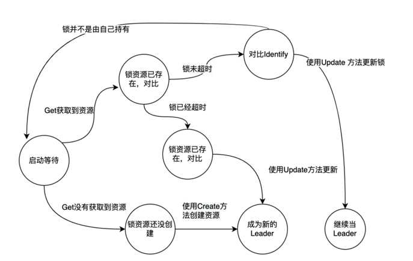

<!-- START doctoc generated TOC please keep comment here to allow auto update -->
<!-- DON'T EDIT THIS SECTION, INSTEAD RE-RUN doctoc TO UPDATE -->
**Table of Contents**  *generated with [DocToc](https://github.com/thlorenz/doctoc)*

- [leaderElection](#leaderelection)
  - [问题](#%E9%97%AE%E9%A2%98)
    - [leaderelection 使用轮询的方式来选主抢锁吗 ?](#leaderelection-%E4%BD%BF%E7%94%A8%E8%BD%AE%E8%AF%A2%E7%9A%84%E6%96%B9%E5%BC%8F%E6%9D%A5%E9%80%89%E4%B8%BB%E6%8A%A2%E9%94%81%E5%90%97-)
    - [并发 leaderelection 操作是否有冲突 ?](#%E5%B9%B6%E5%8F%91-leaderelection-%E6%93%8D%E4%BD%9C%E6%98%AF%E5%90%A6%E6%9C%89%E5%86%B2%E7%AA%81-)
  - [资源锁抽象](#%E8%B5%84%E6%BA%90%E9%94%81%E6%8A%BD%E8%B1%A1)
  - [选举流程](#%E9%80%89%E4%B8%BE%E6%B5%81%E7%A8%8B)
  - [参考](#%E5%8F%82%E8%80%83)

<!-- END doctoc generated TOC please keep comment here to allow auto update -->

# leaderElection

## 问题
### leaderelection 使用轮询的方式来选主抢锁吗 ?
是的, k8s leader election 抢锁选主的逻辑是周期轮询实现的, 相比社区中标准的分布式锁来说, 不仅增加了由于无效轮询带来的性能开销, 也不能解决公平性, 谁抢到了锁谁就是主 leader.

### 并发 leaderelection 操作是否有冲突 ?
不会的 !!!

因为 create 创建操作在 etcd 层面是原子的, 同一时间只能有一个协程可以创建成功, 另一个协程会拿到 key 已存在的错误.

另外, 更新操作则使用 etcd 软事务来实现的, 当 Identity 值一致才更新.


## 资源锁抽象
```go
// k8s.io/client-go@v0.24.0/tools/leaderelection/resourcelock/interface.go

type Interface interface {
	// Get 返回选举记录
	Get(ctx context.Context) (*LeaderElectionRecord, []byte, error)

	// Create 创建一个LeaderElectionRecord
	Create(ctx context.Context, ler LeaderElectionRecord) error

	// Update will update and existing LeaderElectionRecord
	Update(ctx context.Context, ler LeaderElectionRecord) error

	// RecordEvent is used to record events
	RecordEvent(string)

	// 返回锁的标识
	Identity() string

	// Describe is used to convert details on current resource lock
	// into a string
	Describe() string
}
```
client-go 提供了四种资源锁

- leaselock
- configmaplock
- multilock
- endpointlock

Lease 是 kubernetes 控制平面中的通过 ETCD 来实现的一个 Leases 的资源，主要为了提供分布式租约的一种控制机制。
```go
type LeaseLock struct {
	// 资源类型的属性
	LeaseMeta  metav1.ObjectMeta
	Client     coordinationv1client.LeasesGetter
	LockConfig ResourceLockConfig
	lease      *coordinationv1.Lease
}

// 创建
func (ll *LeaseLock) Create(ctx context.Context, ler LeaderElectionRecord) error {
	var err error
	ll.lease, err = ll.Client.Leases(ll.LeaseMeta.Namespace).Create(ctx, &coordinationv1.Lease{
		ObjectMeta: metav1.ObjectMeta{
			Name:      ll.LeaseMeta.Name,
			Namespace: ll.LeaseMeta.Namespace,
		},
		Spec: LeaderElectionRecordToLeaseSpec(&ler),
	}, metav1.CreateOptions{})
	return err
}

// 获取
func (ll *LeaseLock) Get(ctx context.Context) (*LeaderElectionRecord, []byte, error) {
	var err error
	ll.lease, err = ll.Client.Leases(ll.LeaseMeta.Namespace).Get(ctx, ll.LeaseMeta.Name, metav1.GetOptions{})
	if err != nil {
		return nil, nil, err
	}
	record := LeaseSpecToLeaderElectionRecord(&ll.lease.Spec)
	recordByte, err := json.Marshal(*record)
	if err != nil {
		return nil, nil, err
	}
	return record, recordByte, nil
}
```

锁记录信息
```go
type LeaderElectionRecord struct {
	// HolderIdentity is the ID that owns the lease. If empty, no one owns this lease and
	// all callers may acquire. Versions of this library prior to Kubernetes 1.14 will not
	// attempt to acquire leases with empty identities and will wait for the full lease
	// interval to expire before attempting to reacquire. This value is set to empty when
	// a client voluntarily steps down.
	HolderIdentity       string      `json:"holderIdentity"`
	LeaseDurationSeconds int         `json:"leaseDurationSeconds"`
	AcquireTime          metav1.Time `json:"acquireTime"`
	RenewTime            metav1.Time `json:"renewTime"`
	LeaderTransitions    int         `json:"leaderTransitions"`
}
```


```shell
# 查看lease数据
✗ kubectl get lease lease-key -n default -o yaml
apiVersion: coordination.k8s.io/v1
kind: Lease
metadata:
  name: lease-key
  namespace: default
spec:
  acquireTime: "2025-02-19T12:27:03.643894Z"
  holderIdentity: df252c5f-bdbc-4827-adeb-4913b7510544
  leaseDurationSeconds: 60
  leaseTransitions: 7
  renewTime: "2025-02-19T12:27:08.685517Z"
```

## 选举流程



启动选举
```go
func RunOrDie(ctx context.Context, lec LeaderElectionConfig) {
	// 选举配置
	le, err := NewLeaderElector(lec)
	if err != nil {
		panic(err)
	}
	if lec.WatchDog != nil {
		lec.WatchDog.SetLeaderElection(le)
	}
	// 开始运行
	le.Run(ctx)
}
```


```go
func (le *LeaderElector) Run(ctx context.Context) {
	defer runtime.HandleCrash()
	defer func() {
		le.config.Callbacks.OnStoppedLeading()
	}()

	if !le.acquire(ctx) { // 没有拿到则阻塞着
		return // ctx signalled done
	}
	ctx, cancel := context.WithCancel(ctx)
	defer cancel()
	// 成为 leader 
	go le.config.Callbacks.OnStartedLeading(ctx)
	// 续约
	le.renew(ctx)
}

```
Run() 内部调用是 acquire() 不断的尝试拿锁和续约, 当拿到锁或者更新已有锁后, 调用 renew() 方法来周期性的续约.

```go
func (le *LeaderElector) acquire(ctx context.Context) bool {
	ctx, cancel := context.WithCancel(ctx)
	defer cancel()
	succeeded := false
	desc := le.config.Lock.Describe()
	klog.Infof("attempting to acquire leader lease %v...", desc)
	wait.JitterUntil(func() {
		succeeded = le.tryAcquireOrRenew(ctx)
		le.maybeReportTransition()
		if !succeeded {
			klog.V(4).Infof("failed to acquire lease %v", desc)
			return
		}
		le.config.Lock.RecordEvent("became leader")
		le.metrics.leaderOn(le.config.Name)
		klog.Infof("successfully acquired lease %v", desc)
		cancel()
	}, le.config.RetryPeriod, JitterFactor, true, ctx.Done())
	return succeeded
}


func (le *LeaderElector) tryAcquireOrRenew(ctx context.Context) bool {
    // 构建一个选举record
	now := metav1.Now()
	leaderElectionRecord := rl.LeaderElectionRecord{
		HolderIdentity:       le.config.Lock.Identity(),
		LeaseDurationSeconds: int(le.config.LeaseDuration / time.Second),
		RenewTime:            now,
		AcquireTime:          now,
	}

	// 1. 获取旧 record
	oldLeaderElectionRecord, oldLeaderElectionRawRecord, err := le.config.Lock.Get(ctx)
	if err != nil {
		if !errors.IsNotFound(err) {
			klog.Errorf("error retrieving resource lock %v: %v", le.config.Lock.Describe(), err)
			return false
		}
		// 不存在则创建
		if err = le.config.Lock.Create(ctx, leaderElectionRecord); err != nil {
			klog.Errorf("error initially creating leader election record: %v", err)
			return false
		}

		le.setObservedRecord(&leaderElectionRecord)

		return true
	}

	// 2. Record obtained, check the Identity & Time
	if !bytes.Equal(le.observedRawRecord, oldLeaderElectionRawRecord) {
		le.setObservedRecord(oldLeaderElectionRecord)

		le.observedRawRecord = oldLeaderElectionRawRecord
	}
	// 如果有id, 且没有到竞选,并且不是leader 
	if len(oldLeaderElectionRecord.HolderIdentity) > 0 &&
		le.observedTime.Add(le.config.LeaseDuration).After(now.Time) &&
		!le.IsLeader() {
		klog.V(4).Infof("lock is held by %v and has not yet expired", oldLeaderElectionRecord.HolderIdentity)
		return false
	}

	// 3. We're going to try to update. The leaderElectionRecord is set to it's default
	// here. Let's correct it before updating.
	if le.IsLeader() {
		leaderElectionRecord.AcquireTime = oldLeaderElectionRecord.AcquireTime
		leaderElectionRecord.LeaderTransitions = oldLeaderElectionRecord.LeaderTransitions
	} else {
		leaderElectionRecord.LeaderTransitions = oldLeaderElectionRecord.LeaderTransitions + 1
	}

	// 更新锁信息
	if err = le.config.Lock.Update(ctx, leaderElectionRecord); err != nil {
		klog.Errorf("Failed to update lock: %v", err)
		return false
	}

	le.setObservedRecord(&leaderElectionRecord)
	return true
}
```

续约
```go
func (le *LeaderElector) renew(ctx context.Context) {
	ctx, cancel := context.WithCancel(ctx)
	defer cancel()
	wait.Until(func() {
		timeoutCtx, timeoutCancel := context.WithTimeout(ctx, le.config.RenewDeadline)
		defer timeoutCancel()
		err := wait.PollImmediateUntil(le.config.RetryPeriod, func() (bool, error) {
			return le.tryAcquireOrRenew(timeoutCtx), nil
		}, timeoutCtx.Done())

		le.maybeReportTransition()
		desc := le.config.Lock.Describe()
		if err == nil {
			klog.V(5).Infof("successfully renewed lease %v", desc)
			return
		}
		le.config.Lock.RecordEvent("stopped leading")
		le.metrics.leaderOff(le.config.Name)
		klog.Infof("failed to renew lease %v: %v", desc, err)
		cancel()
	}, le.config.RetryPeriod, ctx.Done())

	// if we hold the lease, give it up
	if le.config.ReleaseOnCancel {
		le.release()
	}
}
```

## 参考

- [巧用 Kubernetes 中的 Leader 选举机制来实现自己的 HA 应用](https://z.itpub.net/article/detail/28AF6CA54AE996F4A717A63CECFC07F5)
- [源码分析 kubernetes leaderelection 选举的实现原理](https://xiaorui.cc/archives/7331)