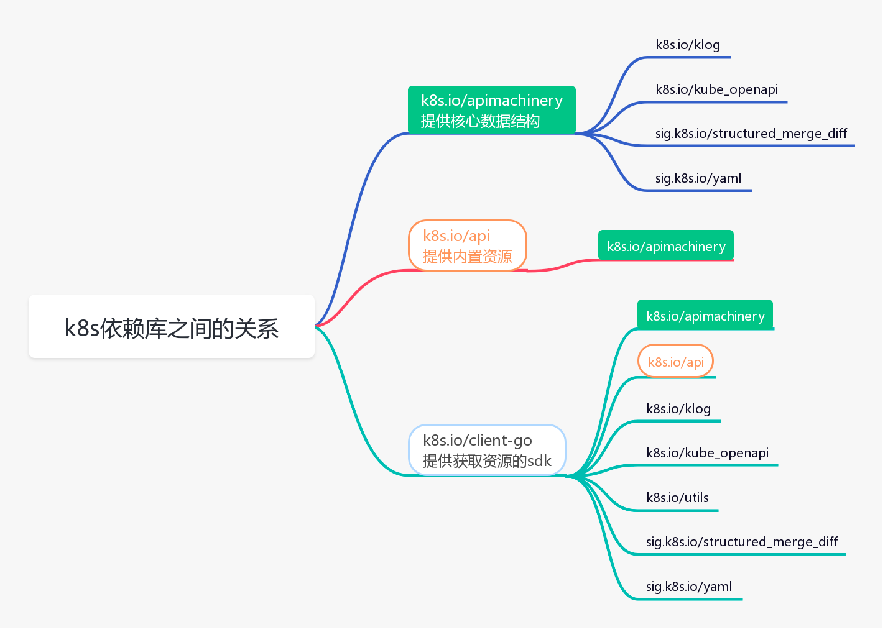

# k8s库

## k8s中Apimachinery、Api、Client-go库之间的关系

使用 k8s 相关 sdk 做二次开发时，经常用到 apimachinery、api、client-go 这三个库，总结他们之间的依赖关系如下：

- apimachinery 是最基础的库，包括核心的数据结构，比如 Scheme、Group、Version、Kind、Resource，以及排列组合出来的 常用的GVK、GV、GK、GVR等等，再就是编码、解码等操作
- api 库，这个库依赖 apimachinery，提供了k8s的内置资源，以及注册到 Scheme 的接口，这些资源比如：Pod、Service、Deployment、Namespace
- client-go 库，这个库依赖前两个库，提供了访问k8s 内置资源的sdk，最常用的就是 clientSet。底层通过 http 请求访问k8s 的 api-server，从etcd获取资源信息

## 1. apimachinery
apimachinery提供k8s最核心的数据结构。