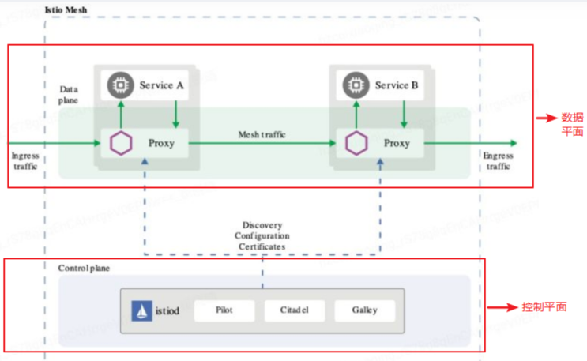
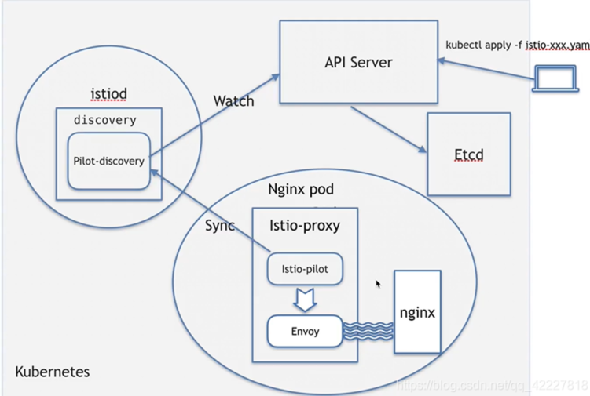
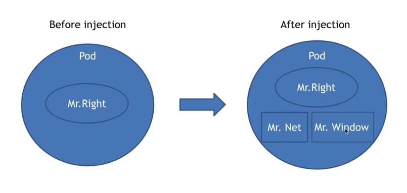
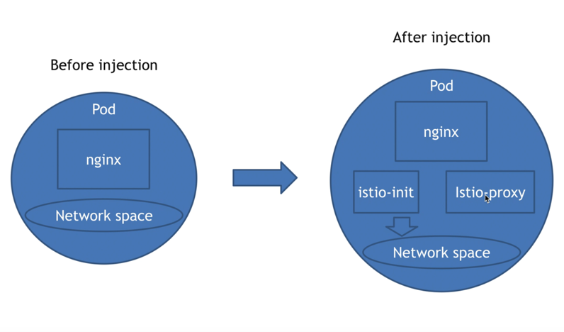
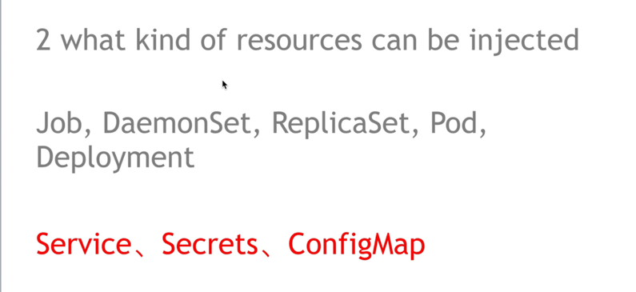
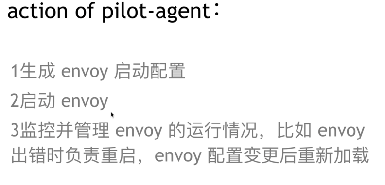
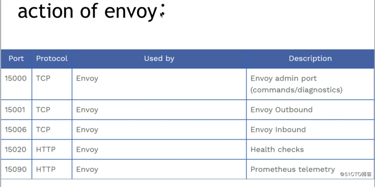
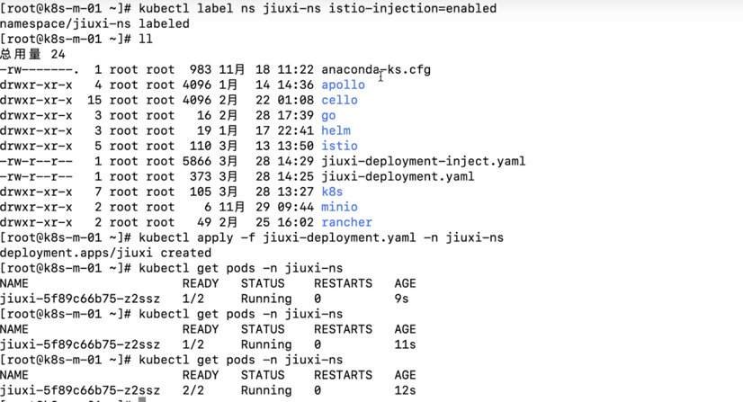

# istio架构


# inject 注入

## 注入的本质




## 哪些资源可以注入

- job,daemonSet,replicaSet,Pod,Deployment,注入后多了资源
- Service,Secrets,ConfigMap，注入后不多资源

## 手工注入使用
cat nginx-deployment.yaml
```yaml
apiVersion: apps/v1
kind: Deployment
metadata:
  name: nginx-deploy
spec:
 selector:                                    #定义标签选择器
  matchLabels:                                #定义匹配的标签，必须要设置
   app: nginx                                 #匹配的目标标签
 replicas: 3                                  #开启Pod的数量
 template:                                    #定义模板，必须定义，模板是起到描述要创建的pod的作用
  metadata:                                   #定义模板元数据
    labels:                                   #定义模板label，Deployment.spec.template.metadata.labels
     app : nginx                              #定义标签，必须等于 matchLabels 定义的标签

  spec:
   containers:
   - image: nginx:1.18.0                        # 我的镜像是可以从本地的Harbor上拉取
     name: nginx                                 #镜像名称
     ports:
     - containerPort: 80                         #定义容器使用的端口
```

```shell
(⎈ |teleport.gllue.com-test:default)➜  istio_test kubectl apply -f nginx-deployment.yaml -n danny-xia
deployment.apps/nginx-deploy created

(⎈ |teleport.gllue.com-test:default)➜  istio_test kubectl get pod -n danny-xia  -o wide
NAME                            READY   STATUS    RESTARTS   AGE   IP              NODE                                 NOMINATED NODE   READINESS GATES
nginx-deploy-75ddd4d4b4-56zdc   1/1     Running   0          28m   172.22.11.179   cn-hangzhou.i-bp1febvvnm07ajjgwnll   <none>           <none>
nginx-deploy-75ddd4d4b4-kdqbh   1/1     Running   0          28m   172.22.10.34    cn-hangzhou.i-bp1ik7uqxu43omp7gy23   <none>           <none>
nginx-deploy-75ddd4d4b4-pbljl   1/1     Running   0          28m   172.22.5.89     cn-hangzhou.i-bp1fdluqx20ky1vlqi4c   <none>           <none>

```


## 注入的变化
注入后端口多了envoy和pilot，修改了netfilter表

pilot-agent与pilot-discovery通信，监听api server规则,修改envoy


```shell
(⎈ |teleport.gllue.com-test:default)➜  istio_test kubectl get pods -n istio-system -o  wide
NAME                                                    READY   STATUS    RESTARTS   AGE     IP              NODE                                 NOMINATED NODE   READINESS GATES
istio-ingressgateway-1-10-2-758497b88-dq2fh             1/1     Running   0          4d20h   172.22.11.230   cn-hangzhou.i-bp1febvvnm07ajjgwnll   <none>           <none>
istio-ingressgateway-1-10-2-758497b88-k59wq             1/1     Running   0          87d     172.22.5.150    cn-hangzhou.i-bp14hxtzp8uad4fvu6mq   <none>           <none>
istio-ingressgateway-internal-1-10-2-7dd6fd47d4-9h8jv   1/1     Running   0          95d     172.22.11.228   cn-hangzhou.i-bp1febvvnm07ajjgwnll   <none>           <none>
istio-ingressgateway-internal-1-10-2-7dd6fd47d4-sdt7q   1/1     Running   0          95d     172.22.5.245    cn-hangzhou.i-bp14hxtzp8uad4fvu6mq   <none>           <none>
istiod-1-10-2-cc9fddb75-9xltp                           1/1     Running   0          62d     172.22.5.195    cn-hangzhou.i-bp14hxtzp8uad4fvu6mq   <none>           <none>
istiod-1-10-2-cc9fddb75-ztb9b                           1/1     Running   0          37d     172.22.10.183   cn-hangzhou.i-bp1hn3ksx41y0lvl4f64   <none>           <none>
kiali-749845bc7-9jldk                                   1/1     Running   133        213d    172.22.5.57     cn-hangzhou.i-bp1fdluqx20ky1vlqi4c   <none>           <none>
prometheus-istio-0                                      3/3     Running   0          71d     172.22.5.201    cn-hangzhou.i-bp14hxtzp8uad4fvu6mq   <none>           <none>
ratelimit-96869695f-5zt7z                               1/1     Running   0          19d     172.22.10.137   cn-hangzhou.i-bp1hn3ksx41y0lvl4f64   <none>           <none>
(⎈ |teleport.gllue.com-test:default)➜  istio_test kubectl exec -it -n istio-system istiod-1-10-2-cc9fddb75-9xltp -- bash
istio-proxy@istiod-1-10-2-cc9fddb75-9xltp:/$ ps -ef
UID          PID    PPID  C STIME TTY          TIME CMD
istio-p+       1       0 80 Feb15 ?        50-10:50:13 /usr/local/bin/pilot-discovery discovery --monitoringAddr=:15014 --log_output_level=default:info --domain cluster.local --keepaliveMaxSer
istio-p+      41       0  0 05:50 pts/0    00:00:00 bash
istio-p+      50      41  0 05:50 pts/0    00:00:00 ps -ef
```

envoy进程



## 打标签自动注入
