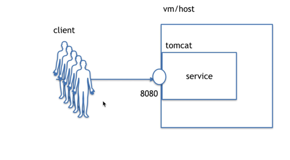
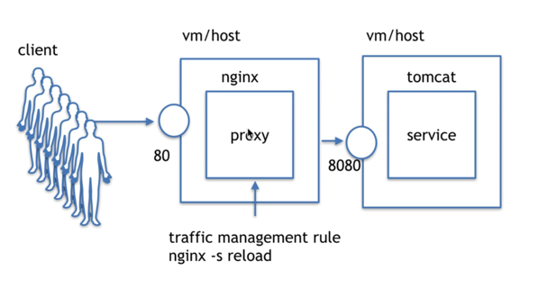
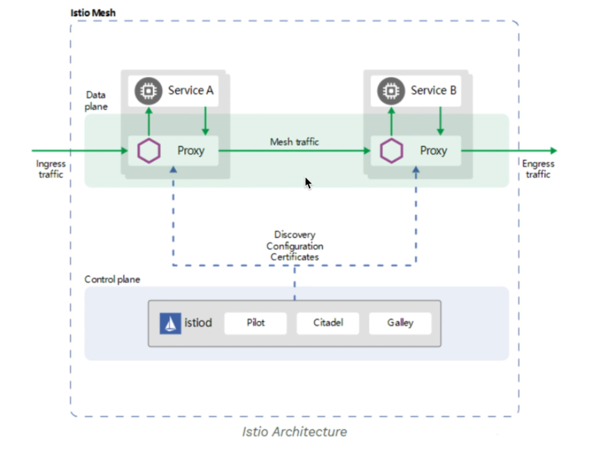
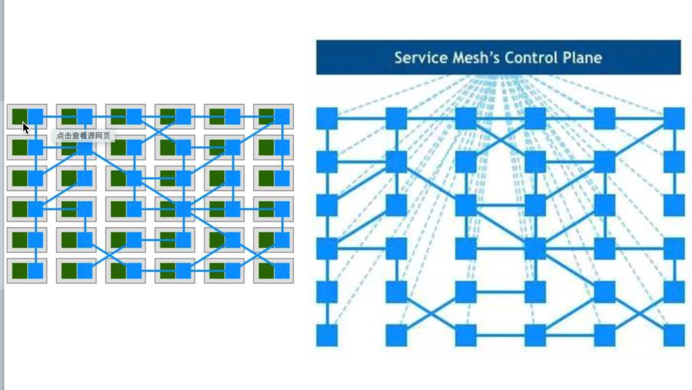
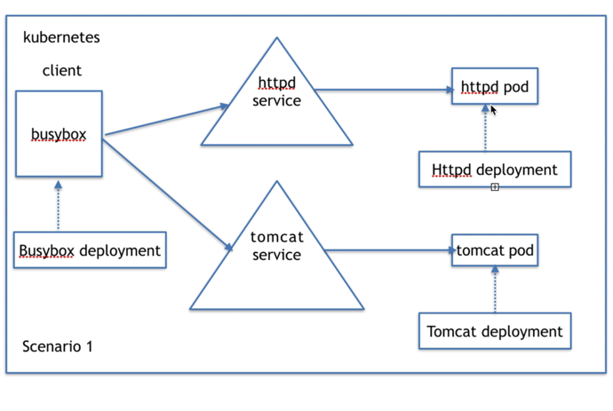
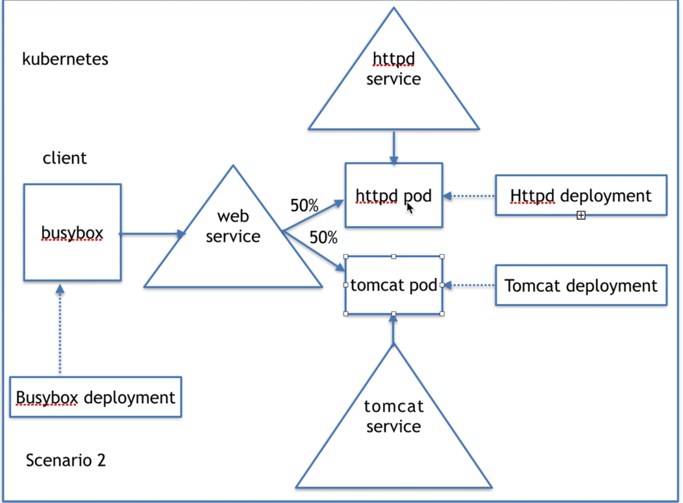
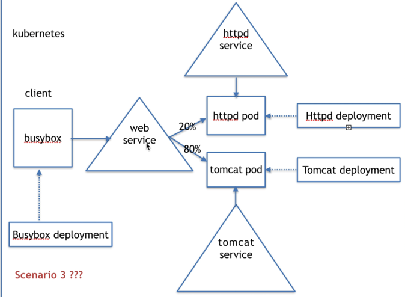
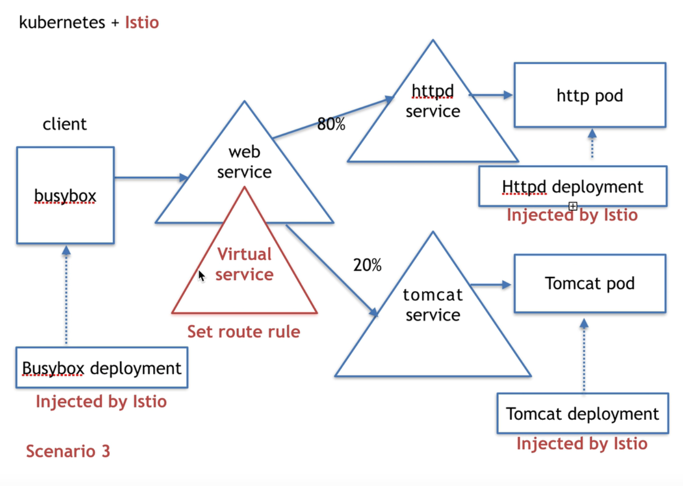

# 流量管理
流量管理的本质就是采用合适的策略控制流量的*方向*和*多少*。

## 流量管理model
方式一：传统


方式二：增加个反向代理


方式三：istio网格-->微服务交流变成代理的交流


istio流量管理指数据面的流量，不是控制面的流量。


## istio五种API资源管理流量
- virtual service虚拟服务
- Destination rules目标规则
- gateways网关：管理入站和出站流量，可以让您指定要进入或离开网格的流量
- service entries服务入口：配置服务入口允许您管理运行在网格外的服务的流量
- sidecars

## 案例
1. 客户端需要指定服务

   
2. 客户端不需要指定服务,只是多了个服务


   
```shell
(⎈ |teleport.gllue.com-test:danny-xia)➜  istio git:(feature/istio) ✗ kubectl exec -it client-9c4959766-bswl6 -- sh
/ # wget -q -O - http://web-svc:8080
hello httpd
/ # wget -q -O - http://web-svc:8080
hello httpd
/ # wget -q -O - http://web-svc:8080
hello httpd2
/ # wget -q -O - http://web-svc:8080
hello httpd2

```
   
3. 流量需要切割



istio:多了个虚拟服务插在webservice上，所有服务都需要在服务网格中


## virtual service操作
```shell
➜  kubernetes git:(master) istioctl version
client version: 1.13.2
control plane version: 1.10.2
data plane version: 1.10.2 (236 proxies)
```

看绑定情况
```shell
(⎈ |teleport.gllue.com-test:danny-xia)➜  istio git:(feature/istio) ✗ kubectl get endpoints -o wide        
NAME         ENDPOINTS            AGE
httpd-svc    172.22.11.205:8080   8s
tomcat-svc   172.22.11.206:8080   9s

```

```shell
(⎈ |teleport.gllue.com-test:danny-xia)➜  istio git:(feature/istio) ✗ kubectl get pods                     
NAME                            READY   STATUS             RESTARTS   AGE
client-69ccf79f77-mts4k         0/1     CrashLoopBackOff   5          3m43s
httpd-5756578db6-27xv7          1/1     Running            0          4m11s
nginx-deploy-75ddd4d4b4-56zdc   1/1     Running            0          46h
nginx-deploy-75ddd4d4b4-kdqbh   1/1     Running            0          46h
nginx-deploy-75ddd4d4b4-pbljl   1/1     Running            0          46h
tomcat-c5d54ff86-2sfgh          1/1     Running            0          4m10s

(⎈ |teleport.gllue.com-test:danny-xia)➜  istio git:(feature/istio) ✗ kubectl exec -it client-9c4959766-bswl6 -- sh
/ # wget -q -O -  http://tomcat-svc:8080
hello httpd2
/ # wget -q -O -  http://httpd-svc:8080
hello httpd

```
wget命令
* -O FILE         Save to FILE ('-' for stdout)

```shell
(⎈ |teleport.gllue.com-test:danny-xia)➜  istio git:(feature/istio) ✗ kubectl get virtualservices
NAME         GATEWAYS   HOSTS       AGE
web-svc-vs              [web-svc]   33m

```
在k8s svc中是看不到的

这时候注入资源


Destination中负载均衡选项
- 随机：请求以随机的方式转到池中的实例。
- 权重：请求根据指定的百分比转到实例。
- 最少请求：请求被转到最少被访问的实例

```shell
(⎈ |teleport.gllue.com-test:danny-xia)➜  Downloads kubectl get cm -n istio-system
NAME                                   DATA   AGE
istio-1-10-2                           2      281d
istio-ca-root-cert                     1      692d
istio-leader                           0      692d
istio-namespace-controller-election    0      281d
istio-sidecar-injector-1-10-2          2      281d
istio-validation-controller-election   0      281d
kiali                                  1      2y40d
prometheus                             1      2y40d
prometheus-istio-rulefiles-0           7      183d
ratelimit-config                       1      187d


(⎈ |teleport.gllue.com-test:danny-xia)➜  istio git:(feature/istio) ✗ kubectl -n istio-system get configmap istio-sidecar-injector-1-10-2 -o=jsonpath='{.data.config}' > inject-config.yaml
(⎈ |teleport.gllue.com-test:danny-xia)➜  istio git:(feature/istio) ✗ kubectl -n istio-system get configmap istio-sidecar-injector-1-10-2 -o=jsonpath='{.data.values}' > inject-values.yaml
(⎈ |teleport.gllue.com-test:danny-xia)➜  istio git:(feature/istio) ✗ kubectl -n istio-system get configmap istio-1-10-2 -o=jsonpath='{.data.mesh}' > mesh-config.yaml

```

开始注入
```shell
(⎈ |teleport.gllue.com-test:danny-xia)➜  istio git:(feature/istio) ✗ kubectl -n istio-system get configmap istio-sidecar-injector-1-10-2 -o=jsonpath='{.data.config}' > inject-config.yaml
(⎈ |teleport.gllue.com-test:danny-xia)➜  istio git:(feature/istio) ✗ kubectl -n istio-system get configmap istio-sidecar-injector-1-10-2 -o=jsonpath='{.data.values}' > inject-values.yaml
(⎈ |teleport.gllue.com-test:danny-xia)➜  istio git:(feature/istio) ✗ kubectl -n istio-system get configmap istio-1-10-2 -o=jsonpath='{.data.mesh}' > mesh-config.yaml
(⎈ |teleport.gllue.com-test:danny-xia)➜  istio git:(feature/istio) ✗ istioctl kube-inject --injectConfigFile inject-config.yaml --meshConfigFile mesh-config.yaml --valuesFile inject-values.yaml --filename client.yaml | kubectl apply -f -
deployment.apps/client configured
(⎈ |teleport.gllue.com-test:danny-xia)➜  istio git:(feature/istio) ✗ istioctl kube-inject --injectConfigFile inject-config.yaml --meshConfigFile mesh-config.yaml --valuesFile inject-values.yaml --filename deployment.yaml | kubectl apply -f - 
deployment.apps/httpd configured
deployment.apps/tomcat configured

```
注入后的情况
```shell
(⎈ |teleport.gllue.com-test:danny-xia)➜  istio git:(feature/istio) ✗ kubectl get pods -o wide
NAME                      READY   STATUS    RESTARTS   AGE     IP              NODE                                 NOMINATED NODE   READINESS GATES
client-687997489b-jqbl9   2/2     Running   0          6m59s   172.22.11.188   cn-hangzhou.i-bp1febvvnm07ajjgwnll   <none>           <none>
httpd-67f765c98d-2qhnv    2/2     Running   0          83s     172.22.11.194   cn-hangzhou.i-bp1febvvnm07ajjgwnll   <none>           <none>
tomcat-779d4649b6-8b9dm   2/2     Running   0          82s     172.22.11.196   cn-hangzhou.i-bp1febvvnm07ajjgwnll   <none>           <none>

```
验证流量：client在网格之内才生效
```shell
(⎈ |teleport.gllue.com-test:danny-xia)➜  istio git:(feature/istio) ✗ kubectl exec -it client-687997489b-jqbl9 -- sh                      
/ # wget -q -O - http://web-svc:8080
hello httpd
/ # wget -q -O - http://web-svc:8080
hello httpd2
/ # wget -q -O - http://web-svc:8080
hello httpd
/ # wget -q -O - http://web-svc:8080
hello httpd
/ # wget -q -O - http://web-svc:8080
hello httpd2
/ # wget -q -O - http://web-svc:8080
hello httpd
/ # wget -q -O - http://web-svc:8080
hello httpd
/ # wget -q -O - http://web-svc:8080
hello httpd
/ # wget -q -O - http://web-svc:8080
hello httpd
/ # wget -q -O - http://web-svc:8080
hello httpd
/ # wget -q -O - http://web-svc:8080
hello httpd
/ # wget -q -O - http://web-svc:8080
hello httpd

```

